# API Reference Overview

  
sip2json C++20 Reference

  
Generated from intermediate Doxygen XML

The `siddiqsoft` namespace provides data structures, stream parsing utilities, diagnostic error definitions, and serialization functions for SIP and SDP protocols.

## Namespaces

<table class="api-summary-table">
  <tr>
    <td class="memitemleft"><a href="#namespace-siddiqsoft"><strong>siddiqsoft</strong></a>
Core namespace containing the parser, message DTO, and protocol constants.
</td>
  </tr>
</table>

## Classes & Structures

<table class="api-summary-table">
  <tr>
    <td class="memtype"><code>class</code></td>
    <td class="memitemleft"><a href="sip2json.md"><strong>siddiqsoft::sip2json</strong></a>
Static utility class for streaming, parsing, and serializing SIP and SDP messages.
</td>
  </tr>
  <tr>
    <td class="memtype"><code>class</code></td>
    <td class="memitemleft"><a href="sipmessage.md"><strong>siddiqsoft::sipmessage</strong></a>
Primary message DTO inheriting <code>nlohmann::json</code>. Represents request and response packets.
</td>
  </tr>
  <tr>
    <td class="memtype"><code>class</code></td>
    <td class="memitemleft"><a href="errors.md#exception-class-hierarchy"><strong>siddiqsoft::sip2json_exception</strong></a>
Base exception class for parse syntax, framing, and serialization failures.
</td>
  </tr>
  <tr>
    <td class="memtype"><code>class</code></td>
    <td class="memitemleft"><a href="constants.md#header-key-sets--compact-aliases-hfs_"><strong>siddiqsoft::HeaderKeySet</strong></a>
Canonical header metadata and compact alias mapping descriptor.
</td>
  </tr>
</table>

## Enumerations & Constants

<table class="api-summary-table">
  <tr>
    <td class="memtype"><code>constants</code></td>
    <td class="memitemleft"><a href="constants.md"><strong>Protocol &amp; Header Constants</strong></a>
Complete dictionary of methods, JSON section keys, delimiters, and canonical headers.
</td>
  </tr>
  <tr>
    <td class="memtype"><code>enum class</code></td>
    <td class="memitemleft"><a href="errors.md#sip2jsonerrors-enumeration"><strong>siddiqsoft::sip2jsonErrors</strong></a>
Diagnostic error classification passed to <code>parseAsync</code> error callbacks.
</td>
  </tr>
  <tr>
    <td class="memtype"><code>enum class</code></td>
    <td class="memitemleft"><a href="sipmessage.md"><strong>siddiqsoft::SIPMessageType</strong></a>
Discriminator distinguishing request (1) from response (2) messages.
</td>
  </tr>
</table>

## Header Files

| Header File | Include Path | Description |
| :--- | :--- | :--- |
| **`sip2json.hpp`** | `#include <siddiqsoft/sip2json.hpp>` | Primary parser and serializer engine entry point. |
| **`sipmessage.hpp`** | `#include <siddiqsoft/sipmessage.hpp>` | Complete `sipmessage` container and field accessors. |
| **`sip2json_constants.hpp`** | `#include <siddiqsoft/private/sip2json_constants.hpp>` | Method names, URI schemes, and delimiters. [View Constants](constants.md) |
| **`sip2json_header_keys.hpp`** | `#include <siddiqsoft/private/sip2json_header_keys.hpp>` | Hash table dispatch and canonical header representations. [View Constants](constants.md) |
| **`sip2json_exception.hpp`** | `#include <siddiqsoft/private/sip2json_exception.hpp>` | `sip2jsonErrors` enumeration and derived exception types. |
| **`sip2json_sdp.hpp`** | `#include <siddiqsoft/private/sip2json_sdp.hpp>` | SDP line parser and serialization engine. |

## System UML Class Diagram

The following UML class diagram illustrates the primary classes, relationships, and exception hierarchy in `sip2json`. Each node links directly to its source header file on GitHub:

```mermaid
classDiagram
    direction TB

    classDef coreClass fill:rgba(35,73,109,0.08),stroke:#23496d,stroke-width:2px;
    classDef utilityClass fill:rgba(15,118,110,0.08),stroke:#0f766e,stroke-width:2px;
    classDef exceptionClass fill:rgba(185,28,28,0.06),stroke:#b91c1c,stroke-width:1.5px;
    classDef enumClass fill:rgba(109,40,217,0.06),stroke:#6d28d9,stroke-width:1.5px;
    classDef externalClass fill:rgba(100,116,139,0.06),stroke:#64748b,stroke-width:1.5px,stroke-dasharray: 4 3;
    classDef highlightClass fill:rgba(2,132,199,0.18),stroke:#0284c7,stroke-width:3px;

    class json["nlohmann::json"] {
        <<external DOM>>
    }
    class json:::externalClass

    class runtime_error["std::runtime_error"] {
        <<external exception>>
    }
    class runtime_error:::externalClass

    class sip2json["siddiqsoft::sip2json"] {
        <<final utility>>
        +parseAsync(string_view& buffer, onMsg, onErr)$ size_t
        +parse(string_view& buffer)$ vector~sipmessage~
        +parseFromBuffer(string_view& buffer)$ sipmessage
        +serialize(sipmessage& msg)$ string
    }
    class sip2json:::utilityClass

    class sipmessage["siddiqsoft::sipmessage"] {
        +sipmessage()
        +sipmessage(string_view method, string_view uri, string_view callId, uint32_t cseq)
        +sipmessage(const json& src)
        +getMethodView() string_view
        +getUriView() string_view
        +getCallIDView() string_view
        +getStatusCode() uint32_t
        +getReasonView() string_view
        +getHeader(string_view key) string
        +setHeader(string_view key, string_view val) sipmessage&
        +hasHeader(string_view key) bool
        +getContentTypeView() string_view
    }
    class sipmessage:::coreClass

    class HeaderKeySet["siddiqsoft::HeaderKeySet"] {
        +string_view canonicalKey
        +string_view canonicalUpper
        +char compactAlias
        +uint64_t hash
        +HeaderKeySet(string_view key)
        +canonical() string_view
        +lower() string_view
    }
    class HeaderKeySet:::coreClass

    class SIPMessageType["siddiqsoft::SIPMessageType"] {
        <<enumeration>>
        Request = 1
        Response = 2
    }
    class SIPMessageType:::enumClass

    class sip2jsonErrors["siddiqsoft::sip2jsonErrors"] {
        <<enumeration>>
        unknown = -1
        success = 0
        invalid_document = 1
        empty_message = 2
        invalid_startline = 3
        incomplete_buffer_for_header = 4
        incomplete_buffer_for_content = 5
        incomplete_buffer_for_parse = 6
        missing_required_element = 7
        unsupported_contenttype = 8
    }
    class sip2jsonErrors:::enumClass

    class sip2json_exception["siddiqsoft::sip2json_exception"] {
        +sip2jsonErrors errCode
        +sip2json_exception(string message, sip2jsonErrors code)
        +what() const char*
    }
    class sip2json_exception:::exceptionClass

    class empty_message_error["siddiqsoft::empty_message_error"]
    class empty_message_error:::exceptionClass
    class incomplete_buffer_for_content_error["siddiqsoft::incomplete_buffer_for_content_error"]
    class incomplete_buffer_for_content_error:::exceptionClass
    class incomplete_buffer_for_header_error["siddiqsoft::incomplete_buffer_for_header_error"]
    class incomplete_buffer_for_header_error:::exceptionClass
    class incomplete_buffer_for_parse_error["siddiqsoft::incomplete_buffer_for_parse_error"]
    class incomplete_buffer_for_parse_error:::exceptionClass
    class invalid_document_error["siddiqsoft::invalid_document_error"]
    class invalid_document_error:::exceptionClass
    class invalid_startline_error["siddiqsoft::invalid_startline_error"]
    class invalid_startline_error:::exceptionClass
    class missing_required_element["siddiqsoft::missing_required_element"]
    class missing_required_element:::exceptionClass
    class unsupported_contenttype_error["siddiqsoft::unsupported_contenttype_error"]
    class unsupported_contenttype_error:::exceptionClass

    json <|-- sipmessage : public inheritance
    runtime_error <|-- sip2json_exception : public inheritance
    sip2json_exception <|-- empty_message_error
    sip2json_exception <|-- incomplete_buffer_for_content_error
    sip2json_exception <|-- incomplete_buffer_for_header_error
    sip2json_exception <|-- incomplete_buffer_for_parse_error
    sip2json_exception <|-- invalid_document_error
    sip2json_exception <|-- invalid_startline_error
    sip2json_exception <|-- missing_required_element
    sip2json_exception <|-- unsupported_contenttype_error

    sip2json ..> sipmessage : produces / consumes
    sip2json ..> sip2json_exception : throws
    sipmessage ..> SIPMessageType : classifies
    sipmessage ..> HeaderKeySet : uses
    sip2json_exception ..> sip2jsonErrors : contains

    link sip2json "https://github.com/SiddiqSoft/sip2json/blob/master/include/siddiqsoft/sip2json.hpp" "Source: include/siddiqsoft/sip2json.hpp"
    link sipmessage "https://github.com/SiddiqSoft/sip2json/blob/master/include/siddiqsoft/sipmessage.hpp" "Source: include/siddiqsoft/sipmessage.hpp"
    link HeaderKeySet "https://github.com/SiddiqSoft/sip2json/blob/master/include/siddiqsoft/private/sip2json_header_keys.hpp" "Source: include/siddiqsoft/private/sip2json_header_keys.hpp"
    link SIPMessageType "https://github.com/SiddiqSoft/sip2json/blob/master/include/siddiqsoft/sipmessage.hpp" "Source: include/siddiqsoft/sipmessage.hpp"
    link sip2jsonErrors "https://github.com/SiddiqSoft/sip2json/blob/master/include/siddiqsoft/private/sip2json_exception.hpp" "Source: include/siddiqsoft/private/sip2json_exception.hpp"
    link sip2json_exception "https://github.com/SiddiqSoft/sip2json/blob/master/include/siddiqsoft/private/sip2json_exception.hpp" "Source: include/siddiqsoft/private/sip2json_exception.hpp"
    link empty_message_error "https://github.com/SiddiqSoft/sip2json/blob/master/include/siddiqsoft/private/sip2json_exception.hpp" "Source: include/siddiqsoft/private/sip2json_exception.hpp"
    link incomplete_buffer_for_content_error "https://github.com/SiddiqSoft/sip2json/blob/master/include/siddiqsoft/private/sip2json_exception.hpp" "Source: include/siddiqsoft/private/sip2json_exception.hpp"
    link incomplete_buffer_for_header_error "https://github.com/SiddiqSoft/sip2json/blob/master/include/siddiqsoft/private/sip2json_exception.hpp" "Source: include/siddiqsoft/private/sip2json_exception.hpp"
    link incomplete_buffer_for_parse_error "https://github.com/SiddiqSoft/sip2json/blob/master/include/siddiqsoft/private/sip2json_exception.hpp" "Source: include/siddiqsoft/private/sip2json_exception.hpp"
    link invalid_document_error "https://github.com/SiddiqSoft/sip2json/blob/master/include/siddiqsoft/private/sip2json_exception.hpp" "Source: include/siddiqsoft/private/sip2json_exception.hpp"
    link invalid_startline_error "https://github.com/SiddiqSoft/sip2json/blob/master/include/siddiqsoft/private/sip2json_exception.hpp" "Source: include/siddiqsoft/private/sip2json_exception.hpp"
    link missing_required_element "https://github.com/SiddiqSoft/sip2json/blob/master/include/siddiqsoft/private/sip2json_exception.hpp" "Source: include/siddiqsoft/private/sip2json_exception.hpp"
    link unsupported_contenttype_error "https://github.com/SiddiqSoft/sip2json/blob/master/include/siddiqsoft/private/sip2json_exception.hpp" "Source: include/siddiqsoft/private/sip2json_exception.hpp"
    link json "https://github.com/nlohmann/json" "External: nlohmann/json"
    link runtime_error "https://en.cppreference.com/w/cpp/error/runtime_error" "Standard Library: std::runtime_error"
```

### Source Code Mapping

| Component / Class | Header File | Source Link | Purpose & Architectural Role |
| :--- | :--- | :--- | :--- |
| [`siddiqsoft::sip2json`](sip2json.md) | `include/siddiqsoft/sip2json.hpp` | [`sip2json.hpp`](https://github.com/SiddiqSoft/sip2json/blob/master/include/siddiqsoft/sip2json.hpp) | Top-level static parser, stream deserializer, and wire serializer utility |
| [`siddiqsoft::sipmessage`](sipmessage.md) | `include/siddiqsoft/sipmessage.hpp` | [`sipmessage.hpp`](https://github.com/SiddiqSoft/sip2json/blob/master/include/siddiqsoft/sipmessage.hpp) | Core message container inheriting from `nlohmann::json` with zero-copy view accessors |
| [`siddiqsoft::HeaderKeySet`](constants.md) | `include/siddiqsoft/private/sip2json_header_keys.hpp` | [`sip2json_header_keys.hpp`](https://github.com/SiddiqSoft/sip2json/blob/master/include/siddiqsoft/private/sip2json_header_keys.hpp) | Canonical SIP header normalization, compact alias mapping, and compile-time hashing |
| [`siddiqsoft::SIPMessageType`](sipmessage.md) | `include/siddiqsoft/sipmessage.hpp` | [`sipmessage.hpp`](https://github.com/SiddiqSoft/sip2json/blob/master/include/siddiqsoft/sipmessage.hpp) | Protocol message discriminator (`Request = 1`, `Response = 2`) |
| [`siddiqsoft::sip2json_exception`](errors.md#exception-class-hierarchy) | `include/siddiqsoft/private/sip2json_exception.hpp` | [`sip2json_exception.hpp`](https://github.com/SiddiqSoft/sip2json/blob/master/include/siddiqsoft/private/sip2json_exception.hpp) | Base exception class inheriting from `std::runtime_error` with `sip2jsonErrors` payload |
| [`siddiqsoft::sip2jsonErrors`](errors.md#sip2jsonerrors-enumeration) | `include/siddiqsoft/private/sip2json_exception.hpp` | [`sip2json_exception.hpp`](https://github.com/SiddiqSoft/sip2json/blob/master/include/siddiqsoft/private/sip2json_exception.hpp) | Diagnostic error code enumeration for parser and syntax failures |
| Derived Exceptions | `include/siddiqsoft/private/sip2json_exception.hpp` | [`sip2json_exception.hpp`](https://github.com/SiddiqSoft/sip2json/blob/master/include/siddiqsoft/private/sip2json_exception.hpp) | Specialized exception hierarchy (`invalid_document_error`, `empty_message_error`, etc.) |
| Parser Engine (`raw_view`) | `include/siddiqsoft/private/sip2json_parser.hpp` | [`sip2json_parser.hpp`](https://github.com/SiddiqSoft/sip2json/blob/master/include/siddiqsoft/private/sip2json_parser.hpp) | High-throughput streaming parser, zero-copy buffer slicing, CRLF boundary scanning |
| Wire Serializer | `include/siddiqsoft/private/sip2json_serializer.hpp` | [`sip2json_serializer.hpp`](https://github.com/SiddiqSoft/sip2json/blob/master/include/siddiqsoft/private/sip2json_serializer.hpp) | RFC 3261 compliant text wire serializer |
| SDP Body Parser | `include/siddiqsoft/private/sip2json_sdp.hpp` | [`sip2json_sdp.hpp`](https://github.com/SiddiqSoft/sip2json/blob/master/include/siddiqsoft/private/sip2json_sdp.hpp) | RFC 4566 Session Description Protocol parser and structured JSON serialization |
| Response Codes | `include/siddiqsoft/private/sip2json_response_codes.hpp` | [`sip2json_response_codes.hpp`](https://github.com/SiddiqSoft/sip2json/blob/master/include/siddiqsoft/private/sip2json_response_codes.hpp) | SIP status codes, reason phrases, and classification ranges (1xx-6xx) |
| Protocol Constants | `include/siddiqsoft/private/sip2json_constants.hpp` | [`sip2json_constants.hpp`](https://github.com/SiddiqSoft/sip2json/blob/master/include/siddiqsoft/private/sip2json_constants.hpp) | SIP grammar tokens, method strings, whitespace matchers, CRLF constants |
| DateTime Parser | `include/siddiqsoft/private/sip2json_datetime.hpp` | [`sip2json_datetime.hpp`](https://github.com/SiddiqSoft/sip2json/blob/master/include/siddiqsoft/private/sip2json_datetime.hpp) | RFC 3261 / RFC 1123 HTTP-date timestamp parser and serializer |
| Utility Functions | `include/siddiqsoft/private/sip2json_utils.hpp` | [`sip2json_utils.hpp`](https://github.com/SiddiqSoft/sip2json/blob/master/include/siddiqsoft/private/sip2json_utils.hpp) | Internal whitespace trimming, view slicing, string conversion utilities |

## Detailed Topics

### [Constants Reference](constants.md)

Full documentation of methods (`METHOD_INVITE`), JSON keys, delimiters, and canonical header names.

[View Constants Reference :octicons-arrow-right-24:](constants.md)

### [JSON Schema & SDP](json_schema.md)

JSON document structure, field types, header conversions, and SDP attribute mapping.

[View Schema Reference :octicons-arrow-right-24:](json_schema.md)

### [Code Examples](examples/index.md)

Practical integration snippets: asynchronous stream parsing, message creation, and error handling.

[View Code Examples :octicons-arrow-right-24:](examples/index.md)

