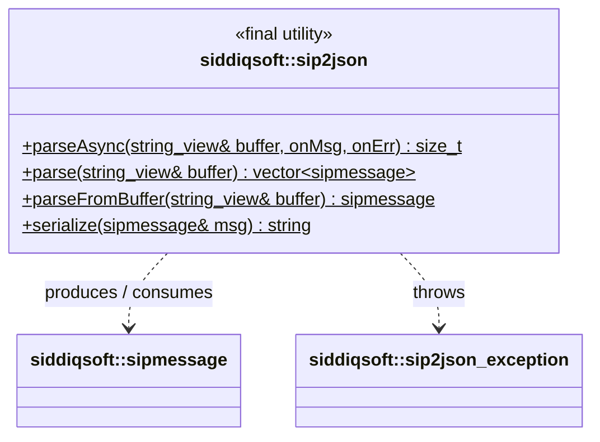

# siddiqsoft::sip2json Class Reference

<div class="api-header-block">
  <div class="api-module-name">Namespace siddiqsoft</div>
  <div class="api-header-file">#include &lt;siddiqsoft/sip2json.hpp&gt;</div>
</div>

Final utility class providing static routines for encoding, decoding, and streaming SIP and SDP payloads to and from `nlohmann::json` documents.

## Class Hierarchy & Inheritance

The following UML class diagram highlights `siddiqsoft::sip2json` within the system architecture. Each node links directly to its source header file on GitHub:



## Static Public Member Functions

<table class="api-summary-table">
  <tr>
    <td class="memtype"><code>size_t</code></td>
    <td class="memitemleft"><a href="#parseasync"><strong>parseAsync</strong></a> (<div class="param-wrap">std::string_view&amp; frameBuffer,</div><div class="param-wrap">std::function&lt;void(sipmessage&amp;&amp;)&gt; parseCallback,</div><div class="param-wrap"><div class="param-line">std::optional&lt;</div><div class="param-inner-wrap">std::function&lt;</div><div class="param-inner-lvl2">void(const sip2json_exception&amp;,</div><div class="param-inner-lvl2">std::string_view)&gt;&gt;</div><div class="param-inner-wrap">errorCallback = {}</div></div>) noexcept
      <div class="mdesc">Given a non-owning buffer view, parses each message and invokes the callback with the decoded sipmessage.</div>
    </td>
  </tr>
  <tr>
    <td class="memtype"><code>std::vector&lt;sipmessage&gt;</code></td>
    <td class="memitemleft"><a href="#parse"><strong>parse</strong></a> (std::string_view&amp; buffer)
      <div class="mdesc">Given a buffer view, parse all complete frames and return the vector of messages.</div>
    </td>
  </tr>
  <tr>
    <td class="memtype"><code>std::vector&lt;sipmessage&gt;</code></td>
    <td class="memitemleft"><a href="#parse-2"><strong>parse</strong></a> (<div class="param-wrap">std::string_view buffer,</div><div class="param-wrap">size_t&amp; bytesConsumed</div>)
      <div class="mdesc">Given a buffer view, parse all complete frames and return the vector of messages.</div>
    </td>
  </tr>
  <tr>
    <td class="memtype"><code>sipmessage</code></td>
    <td class="memitemleft"><a href="#parsefrombuffer"><strong>parseFromBuffer</strong></a> (std::string_view&amp; buffer)
      <div class="mdesc">De-serialize the first SIP message from the buffer view and advances the view past the message.</div>
    </td>
  </tr>
  <tr>
    <td class="memtype"><code>sipmessage</code></td>
    <td class="memitemleft"><a href="#parsefrombuffer-2"><strong>parseFromBuffer</strong></a> (<div class="param-wrap">std::string_view buffer,</div><div class="param-wrap">size_t&amp; bytesConsumed</div>)
      <div class="mdesc">De-serialize the first SIP message from the buffer view.</div>
    </td>
  </tr>
  <tr>
    <td class="memtype"><code>std::string&amp;</code></td>
    <td class="memitemleft"><a href="#parseasync-2"><strong>parseAsync</strong></a> (<div class="param-wrap">std::string&amp; frameBuffer,</div><div class="param-wrap">std::function&lt;void(sipmessage&amp;&amp;)&gt; parseCallback,</div><div class="param-wrap"><div class="param-line">std::optional&lt;</div><div class="param-inner-wrap">std::function&lt;</div><div class="param-inner-lvl2">void(const sip2json_exception&amp;,</div><div class="param-inner-lvl2">std::string::iterator&amp;,</div><div class="param-inner-lvl2">const std::string::iterator&amp;)&gt;&gt;</div><div class="param-inner-wrap">errorCallback = {}</div></div>) noexcept
      <div class="mdesc">Given a buffer, parse each message and invoke the callback with the decoded sipmessage object.</div>
    </td>
  </tr>
  <tr>
    <td class="memtype"><code>std::vector&lt;sipmessage&gt;</code></td>
    <td class="memitemleft"><a href="#parse-3"><strong>parse</strong></a> (<div class="param-wrap">std::string::iterator&amp; bufferStart,</div><div class="param-wrap">const std::string::iterator&amp; bufferEnd</div>)
      <div class="mdesc">Given a buffer, parse as many frames and return the vector of messages.</div>
    </td>
  </tr>
  <tr>
    <td class="memtype"><code>sipmessage</code></td>
    <td class="memitemleft"><a href="#parsefrombuffer-3"><strong>parseFromBuffer</strong></a> (<div class="param-wrap">std::string::iterator&amp; bufferStart,</div><div class="param-wrap">const std::string::iterator&amp; bufferEnd</div>)
      <div class="mdesc">Decodes or serializes SIP data.</div>
    </td>
  </tr>
  <tr>
    <td class="memtype"><code>std::string</code></td>
    <td class="memitemleft"><a href="#serialize"><strong>serialize</strong></a> (sipmessage&amp; sipm)
      <div class="mdesc">Serializes the sipmessage document.</div>
    </td>
  </tr>
</table>

## Detailed Description

The `sip2json` class contains static helper methods to parse continuous network buffers into `sipmessage` objects without intermediate copies, and to serialize `sipmessage` objects back into standard RFC 3261 wire format.

All methods operate on `std::string_view` for optimal throughput and zero heap allocations during the scanning phase.

## Member Function Documentation

<div class="memitem" id="parseasync" markdown="1">
<div class="memitem-header">
  <span class="memitem-diamond">&#9670;</span>
  <h3 class="memitem-title">parseAsync()</h3>
  <span class="memitem-badge">static noexcept</span>
</div>
<div class="memproto" markdown="1">

```cpp
static size_t siddiqsoft::sip2json::parseAsync(
    std::string_view& frameBuffer,
    std::function<void(sipmessage&&)> parseCallback,
    std::optional<
        std::function<
            void(const sip2json_exception&,
                 std::string_view)>>
        errorCallback = {}
) noexcept;
```

</div>
<div class="memdoc" markdown="1">

Given a non-owning buffer view, parses each message and invokes the callback with the decoded sipmessage.

Given a non-owning buffer view, parse each message and invoke the callback with the decoded sipmessage.

<div class="memdoc-section-title">Parameters</div>

<table class="params" markdown="0">
  <tr>
    <td class="paramtype"><code>std::string_view&amp;</code></td>
    <td class="paramname">frameBuffer</td>
    <td class="paramdesc">std::string_view reference; upon return, advanced past all successfully parsed messages.</td>
  </tr>
  <tr>
    <td class="paramtype"><span class="type-folded"><span class="type-line"><code>std::function&lt;</code></span><span class="type-inner-lvl1"><code>void(sipmessage&amp;&amp;)&gt;</code></span></span></td>
    <td class="paramname">parseCallback</td>
    <td class="paramdesc">Callback which takes a reference to the sipmessage just decoded.</td>
  </tr>
  <tr>
    <td class="paramtype"><span class="type-folded"><span class="type-line"><code>std::optional&lt;</code></span><span class="type-inner-lvl1"><code>std::function&lt;</code></span><span class="type-inner-lvl2"><code>void(const sip2json_exception&amp;,</code></span><span class="type-inner-lvl2"><code>std::string_view)&gt;&gt;</code></span></span></td>
    <td class="paramname">errorCallback</td>
    <td class="paramdesc">Optional callback to handle errors during parsing.</td>
  </tr>
</table>

<div class="memdoc-section-title">Returns</div>

<code>size_t</code> &mdash; Returns the total number of bytes consumed from the buffer. The <code>frameBuffer</code> view reference is advanced past all successfully parsed messages.

<div class="memdoc-section-title">Example</div>

```cpp
// Source: tests/regression/src/stress_tests.cpp:L239-L246
int                      parseCount = 0;
std::vector<std::string> callIds;

auto remaining = siddiqsoft::sip2json::parseAsync(buffer, [&](auto&& sipm) {
    parseCount++;
    callIds.push_back(sipm.getCallID());
});

EXPECT_EQ(msgCount, parseCount);
EXPECT_EQ(0u, remaining.length());
```

</div>
</div>

<div class="memitem" id="parse" markdown="1">
<div class="memitem-header">
  <span class="memitem-diamond">&#9670;</span>
  <h3 class="memitem-title">parse()</h3>
  <span class="memitem-badge">static</span>
</div>
<div class="memproto" markdown="1">

```cpp
static std::vector<sipmessage> siddiqsoft::sip2json::parse(
    std::string_view& buffer
);
```

</div>
<div class="memdoc" markdown="1">

Given a buffer view, parse all complete frames and return the vector of messages. Advances the view in-place.

Given a buffer view, parse as many frames and return the vector of messages. Advances view in-place.

<div class="memdoc-section-title">Parameters</div>

<table class="params" markdown="0">
  <tr>
    <td class="paramtype"><code>std::string_view&amp;</code></td>
    <td class="paramname">buffer</td>
    <td class="paramdesc">std::string_view reference; upon return, advanced past all successfully parsed messages.</td>
  </tr>
</table>

<div class="memdoc-section-title">Returns</div>

<code>std::vector&lt;sipmessage&gt;</code> &mdash; Vector containing all successfully decoded <code>sipmessage</code> objects parsed from the stream. The <code>buffer</code> view is advanced in-place past the parsed frames.

<div class="memdoc-section-title">Example</div>

```cpp
// Source: tests/validation/src/benchmark.cpp:L98-L102
std::string buffer   = loadSampleFile("NOTIFY_LegDrop");
std::string_view sv(buffer);

auto messages = siddiqsoft::sip2json::parse(sv);
EXPECT_FALSE(messages.empty());
EXPECT_EQ("NOTIFY", messages[0].getMethodView());
```

</div>
</div>

<div class="memitem" id="parse-2" markdown="1">
<div class="memitem-header">
  <span class="memitem-diamond">&#9670;</span>
  <h3 class="memitem-title">parse()</h3>
  <span class="memitem-badge">static</span>
</div>
<div class="memproto" markdown="1">

```cpp
static std::vector<sipmessage> siddiqsoft::sip2json::parse(
    std::string_view buffer,
    size_t& bytesConsumed
);
```

</div>
<div class="memdoc" markdown="1">

Given a buffer view, parse all complete frames and return the vector of messages.

<div class="memdoc-section-title">Parameters</div>

<table class="params" markdown="0">
  <tr>
    <td class="paramtype"><code>std::string_view</code></td>
    <td class="paramname">buffer</td>
    <td class="paramdesc">std::string_view buffer.</td>
  </tr>
  <tr>
    <td class="paramtype"><code>size_t&amp;</code></td>
    <td class="paramname">bytesConsumed</td>
    <td class="paramdesc">Output parameter populated with total bytes consumed.</td>
  </tr>
</table>

<div class="memdoc-section-title">Returns</div>

<code>std::vector&lt;sipmessage&gt;</code> &mdash; Vector of all complete decoded <code>sipmessage</code> objects. The <code>bytesConsumed</code> output parameter is populated with the total bytes parsed from the buffer.

<div class="memdoc-section-title">Example</div>

```cpp
// Source: tests/validation/src/benchmark.cpp
size_t bytesConsumed = 0;
auto   messages      = siddiqsoft::sip2json::parse(std::string_view(buffer), bytesConsumed);
EXPECT_GT(bytesConsumed, 0u);
EXPECT_EQ(messages.size(), 1u);
```

</div>
</div>

<div class="memitem" id="parsefrombuffer" markdown="1">
<div class="memitem-header">
  <span class="memitem-diamond">&#9670;</span>
  <h3 class="memitem-title">parseFromBuffer()</h3>
  <span class="memitem-badge">static</span>
</div>
<div class="memproto" markdown="1">

```cpp
static sipmessage siddiqsoft::sip2json::parseFromBuffer(
    std::string_view& buffer
);
```

</div>
<div class="memdoc" markdown="1">

De-serialize the first SIP message from the buffer view and advances the view past the message.

De-serialize the first SIP message (if present) from the buffer view and advances the view.

<div class="memdoc-section-title">Parameters</div>

<table class="params" markdown="0">
  <tr>
    <td class="paramtype"><code>std::string_view&amp;</code></td>
    <td class="paramname">buffer</td>
    <td class="paramdesc">std::string_view reference; upon return, advanced past the consumed message.</td>
  </tr>
</table>

<div class="memdoc-section-title">Returns</div>

<code>sipmessage</code> &mdash; A decoded <code>sipmessage</code> object representing the first SIP message in the buffer. The <code>buffer</code> view is advanced past the end of this message.

<div class="memdoc-section-title">Example</div>

```cpp
// Source: tests/validation/src/benchmark.cpp:L169
std::string_view bs(buffer);
auto msg = siddiqsoft::sip2json::parseFromBuffer(bs);
EXPECT_EQ(siddiqsoft::METHOD_INVITE, msg.getMethod());
```

</div>
</div>

<div class="memitem" id="parsefrombuffer-2" markdown="1">
<div class="memitem-header">
  <span class="memitem-diamond">&#9670;</span>
  <h3 class="memitem-title">parseFromBuffer()</h3>
  <span class="memitem-badge">static</span>
</div>
<div class="memproto" markdown="1">

```cpp
static sipmessage siddiqsoft::sip2json::parseFromBuffer(
    std::string_view buffer,
    size_t& bytesConsumed
);
```

</div>
<div class="memdoc" markdown="1">

De-serialize the first SIP message from the buffer view.

<div class="memdoc-section-title">Parameters</div>

<table class="params" markdown="0">
  <tr>
    <td class="paramtype"><code>std::string_view</code></td>
    <td class="paramname">buffer</td>
    <td class="paramdesc">std::string_view buffer.</td>
  </tr>
  <tr>
    <td class="paramtype"><code>size_t&amp;</code></td>
    <td class="paramname">bytesConsumed</td>
    <td class="paramdesc">Output parameter populated with bytes consumed by the message.</td>
  </tr>
</table>

<div class="memdoc-section-title">Returns</div>

<code>sipmessage</code> &mdash; A decoded <code>sipmessage</code> object representing the first SIP message in the buffer. Populates <code>bytesConsumed</code> with the exact byte count of the parsed message.

<div class="memdoc-section-title">Example</div>

```cpp
// Source: tests/validation/src/benchmark.cpp:L183
size_t bytesConsumed = 0;
auto   msg           = siddiqsoft::sip2json::parseFromBuffer(std::string_view(buffer), bytesConsumed);
EXPECT_GT(bytesConsumed, 0u);
```

</div>
</div>

<div class="memitem" id="parseasync-2" markdown="1">
<div class="memitem-header">
  <span class="memitem-diamond">&#9670;</span>
  <h3 class="memitem-title">parseAsync()</h3>
  <span class="memitem-badge">static noexcept</span>
</div>
<div class="memproto" markdown="1">

```cpp
static std::string& siddiqsoft::sip2json::parseAsync(
    std::string& frameBuffer,
    std::function<void(sipmessage&&)> parseCallback,
    std::optional<
        std::function<
            void(const sip2json_exception&,
                 std::string::iterator&,
                 const std::string::iterator&)>>
        errorCallback = {}
) noexcept;
```

</div>
<div class="memdoc" markdown="1">

Given a buffer, parse each message and invoke the callback with the decoded sipmessage object.

<div class="memdoc-section-title">Parameters</div>

<table class="params" markdown="0">
  <tr>
    <td class="paramtype"><code>std::string&amp;</code></td>
    <td class="paramname">frameBuffer</td>
    <td class="paramdesc">Buffer containing SIP messages.</td>
  </tr>
  <tr>
    <td class="paramtype"><span class="type-folded"><span class="type-line"><code>std::function&lt;</code></span><span class="type-inner-lvl1"><code>void(sipmessage&amp;&amp;)&gt;</code></span></span></td>
    <td class="paramname">parseCallback</td>
    <td class="paramdesc">Callback which takes a reference to the sipmessage just decoded.</td>
  </tr>
  <tr>
    <td class="paramtype"><span class="type-folded"><span class="type-line"><code>std::optional&lt;</code></span><span class="type-inner-lvl1"><code>std::function&lt;</code></span><span class="type-inner-lvl2"><code>void(const sip2json_exception&amp;,</code></span><span class="type-inner-lvl2"><code>std::string::iterator&amp;,</code></span><span class="type-inner-lvl2"><code>const std::string::iterator&amp;)&gt;&gt;</code></span></span></td>
    <td class="paramname">errorCallback</td>
    <td class="paramdesc">Optional callback to handle the error on the parse.</td>
  </tr>
</table>

<div class="memdoc-section-title">Returns</div>

<code>std::string&amp;</code> &mdash; Reference to the remaining buffer contents after parsing complete messages.

<div class="memdoc-section-title">Example</div>

```cpp
// Source: tests/regression/src/synthetics.cpp:L54-L60
bool passTest = false;
auto remainingBuffer = siddiqsoft::sip2json::parseAsync(
    buffer, {}, [&](const siddiqsoft::sip2json_exception& e, std::string::iterator&, const std::string::iterator&) {
        std::cerr << "errCode: " << e.errCode << " what: " << e.what() << std::endl;
        EXPECT_TRUE(e.errCode == siddiqsoft::sip2jsonErrors::invalid_startline);
        passTest = true;
    });
EXPECT_TRUE(passTest);
```

</div>
</div>

<div class="memitem" id="parse-3" markdown="1">
<div class="memitem-header">
  <span class="memitem-diamond">&#9670;</span>
  <h3 class="memitem-title">parse()</h3>
  <span class="memitem-badge">static</span>
</div>
<div class="memproto" markdown="1">

```cpp
static std::vector<sipmessage> siddiqsoft::sip2json::parse(
    std::string::iterator& bufferStart,
    const std::string::iterator& bufferEnd
);
```

</div>
<div class="memdoc" markdown="1">

Given a buffer, parse as many frames and return the vector of messages.

<div class="memdoc-section-title">Parameters</div>

<table class="params" markdown="0">
  <tr>
    <td class="paramtype"><code>std::string::iterator&amp;</code></td>
    <td class="paramname">bufferStart</td>
    <td class="paramdesc"></td>
  </tr>
  <tr>
    <td class="paramtype"><code>const std::string::iterator&amp;</code></td>
    <td class="paramname">bufferEnd</td>
    <td class="paramdesc"></td>
  </tr>
</table>

<div class="memdoc-section-title">Returns</div>

<code>std::vector&lt;sipmessage&gt;</code> &mdash; Vector of all complete decoded <code>sipmessage</code> objects found in the iterator range. <code>bufferStart</code> is advanced past the parsed frames.

<div class="memdoc-section-title">Example</div>

```cpp
// Source: tests/validation/src/benchmark.cpp:L98-L102
std::string buffer = sf.content;
auto        bs     = buffer.begin();
auto        messages = siddiqsoft::sip2json::parse(bs, buffer.end());
total_messages_parsed += messages.size();
```

</div>
</div>

<div class="memitem" id="parsefrombuffer-3" markdown="1">
<div class="memitem-header">
  <span class="memitem-diamond">&#9670;</span>
  <h3 class="memitem-title">parseFromBuffer()</h3>
  <span class="memitem-badge">static</span>
</div>
<div class="memproto" markdown="1">

```cpp
static sipmessage siddiqsoft::sip2json::parseFromBuffer(
    std::string::iterator& bufferStart,
    const std::string::iterator& bufferEnd
);
```

</div>
<div class="memdoc" markdown="1">

<div class="memdoc-section-title">Parameters</div>

<table class="params" markdown="0">
  <tr>
    <td class="paramtype"><code>std::string::iterator&amp;</code></td>
    <td class="paramname">bufferStart</td>
    <td class="paramdesc"></td>
  </tr>
  <tr>
    <td class="paramtype"><code>const std::string::iterator&amp;</code></td>
    <td class="paramname">bufferEnd</td>
    <td class="paramdesc"></td>
  </tr>
</table>

<div class="memdoc-section-title">Returns</div>

<code>sipmessage</code> &mdash; The decoded <code>sipmessage</code> object for the first message in the iterator range. <code>bufferStart</code> is updated to point past the message.

<div class="memdoc-section-title">Example</div>

```cpp
// Source: tests/regression/src/edge_tests.cpp:L66
auto bs = buffer.begin();
siddiqsoft::sipmessage sipm;
EXPECT_NO_THROW(sipm = siddiqsoft::sip2json::parseFromBuffer(bs, buffer.end()));
EXPECT_EQ("INVITE", sipm.getMethod());
```

</div>
</div>

<div class="memitem" id="serialize" markdown="1">
<div class="memitem-header">
  <span class="memitem-diamond">&#9670;</span>
  <h3 class="memitem-title">serialize()</h3>
  <span class="memitem-badge">static</span>
</div>
<div class="memproto" markdown="1">

```cpp
static std::string siddiqsoft::sip2json::serialize(
    sipmessage& sipm
);
```

</div>
<div class="memdoc" markdown="1">

Serializes the sipmessage document.

<div class="memdoc-section-title">Parameters</div>

<table class="params" markdown="0">
  <tr>
    <td class="paramtype"><code>sipmessage&amp;</code></td>
    <td class="paramname">sipm</td>
    <td class="paramdesc">Source sipmessage</td>
  </tr>
</table>

<div class="memdoc-section-title">Returns</div>

<code>std::string</code> &mdash; Serialized SIP message in standard RFC 3261 wire format, including CRLF line endings, canonical headers, and SDP payload.

<div class="memdoc-section-title">Example</div>

```cpp
// Source: tests/regression/src/stress_tests.cpp:L136-L144
siddiqsoft::sipmessage sipm(method, "sip:test@test.com", callId, i + 1);
sipm.setHeader(siddiqsoft::HF_TO, "sip:test@test.com");
sipm.setHeader(siddiqsoft::HF_FROM, "sip:sender@sender.com");

std::string serialized;
ASSERT_NO_THROW(serialized = siddiqsoft::sip2json::serialize(sipm));
ASSERT_TRUE(serialized.find(method) != std::string::npos);
```

</div>
</div>
