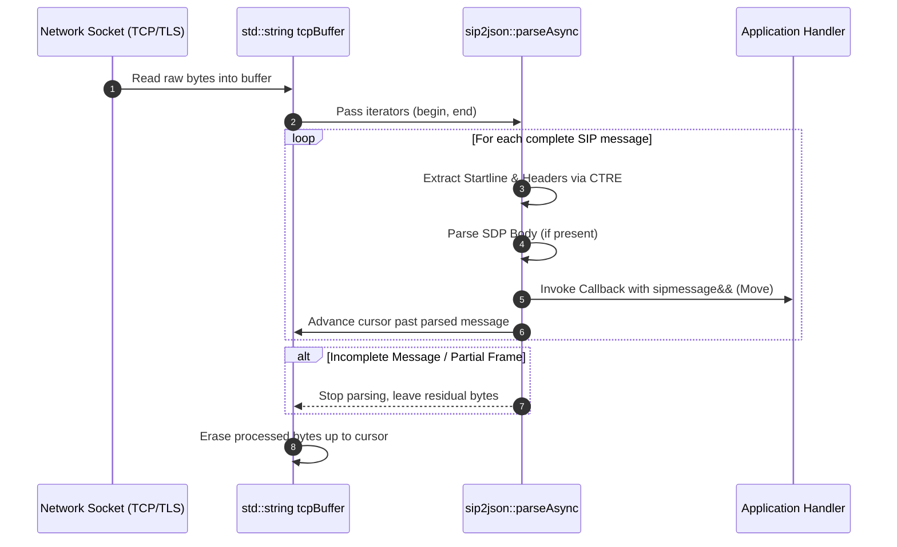

# Asynchronous & Stream Parsing

SIP traffic over TCP or TLS arrives in continuous stream buffers where multiple SIP frames can be packed together, or where a single frame might be partially received.

---

## Async Stream Processing Workflow



---

## Stream Processing Mechanics

`sip2json::parseAsync` operates directly over string iterators (`std::string::const_iterator` or `std::string::iterator`), advancing the start iterator as frames are successfully recognized.

```cpp
#include "siddiqsoft/sip2json.hpp"

using namespace siddiqsoft;

void onNetworkBufferReceived(std::string& tcpBuffer)
{
    auto cursor = tcpBuffer.begin();

    // Iterate through buffer and invoke callback for each complete SIP frame
    sip2json::parseAsync(
        cursor,
        tcpBuffer.end(),
        [](sipmessage&& msg) {
            // Processing valid message
            std::cout << "Method: " << msg.getMethod() << ", Call-ID: " << msg.getCallID() << "\n";
        },
        [](sip2json_exception& ex, std::string::iterator& start, const std::string::iterator& end) {
            std::cerr << "Parser warning: " << ex.what() << "\n";
        }
    );

    // Erase processed frames from front of buffer; incomplete frames remain for next packet
    tcpBuffer.erase(tcpBuffer.begin(), cursor);
}
```

---

## Performance & Ownership Highlights

1. **Move Semantics**: Messages passed to the success callback are moved (`sipmessage&&`), giving zero-copy ownership to the handler.
2. **Buffer Residuals**: If a partial frame remains at the end of the buffer, `parseAsync` stops without erasing it, allowing next read cycles to append data seamlessly.
3. **No Allocation Spikes**: Internal parsing uses Compile-Time Regular Expressions (CTRE) and 64-bit integer packed switch statement matching (`pack_key_4`) for ultra-fast header identification.
