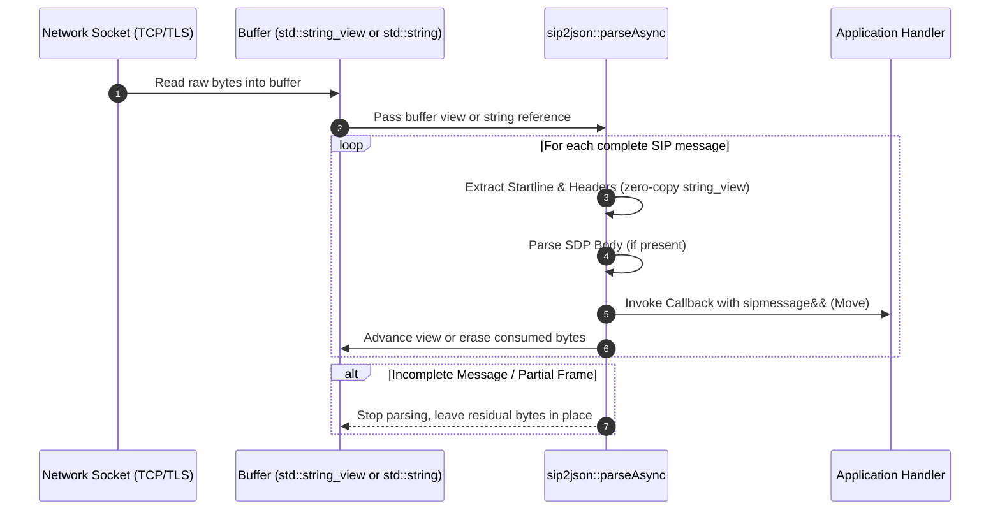

# Stream Parsing & Buffer Management

SIP traffic over TCP or TLS arrives in continuous stream buffers where multiple SIP frames can be packed together, or where a single frame might be partially received. `sip2json::parseAsync` processes frames directly off network read buffers with move semantics.

## 1. Stream Buffer Data Flow Workflow



## 2. Stream Processing Mechanics

`sip2json::parseAsync` provides two streaming modes:

### Zero-Copy Stream (`std::string_view&`)

Advances the non-owning view in-place past all successfully parsed messages and returns the total bytes consumed:

```cpp
#include <iostream>
#include <string_view>
#include "siddiqsoft/sip2json.hpp"

using namespace siddiqsoft;

void onNetworkBufferReceived(std::string_view& tcpReadBuffer)
{
    // Decodes frames and advances tcpReadBuffer past consumed bytes
    size_t consumed = sip2json::parseAsync(
        tcpReadBuffer,
        [](sipmessage&& msg) {
            std::cout << "Method: " << msg.getMethodView() 
                      << ", Call-ID: " << msg.getCallIDView() << "\n";
        },
        [](const sip2json_exception& ex, std::string_view remaining) {
            std::cerr << "Parser diagnostic: " << ex.what() << "\n";
        }
    );
}
```

### In-Place Buffer Drainage (`std::string&`)

For persistent `std::string` socket read buffers, `parseAsync` automatically erases consumed bytes from the front of the string, retaining incomplete frames for subsequent network `recv()` cycles:

```cpp
#include <iostream>
#include <string>
#include "siddiqsoft/sip2json.hpp"

using namespace siddiqsoft;

void onNetworkBufferReceived(std::string& tcpBuffer)
{
    // Automatically drains consumed frames; residual bytes remain in tcpBuffer
    sip2json::parseAsync(
        tcpBuffer,
        [](sipmessage&& msg) {
            std::cout << "Method: " << msg.getMethod() 
                      << ", Call-ID: " << msg.getCallID() << "\n";
        },
        [](const sip2json_exception& ex, std::string::iterator& start, const std::string::iterator& end) {
            std::cerr << "Parser diagnostic: " << ex.what() << "\n";
        }
    );
}
```

## 3. Memory Layout & Lifetime Rules

1. **Move Semantics (`std::move`)**: Messages passed to parsing callbacks are rvalue references (`sipmessage&&`). The parser constructs the object in-place and transfers ownership directly to the application callback. If you need to preserve message state beyond callback scope, explicitly copy or move the object.
2. **Buffer Residuals & In-Place Drainage**: If a partial frame remains at the end of the buffer, `parseAsync` stops and leaves `cursor` pointing to the beginning of the incomplete frame. Draining `tcpBuffer.erase(tcpBuffer.begin(), cursor)` retains residual bytes for subsequent network `recv()` cycles without reallocation.
3. **Zero Allocation Tokenization**: Header and startline identification uses `std::string_view` slices and 64-bit FNV-1a hash matching (`switch (h)`), completely eliminating intermediate string allocations or `std::transform` loops.
4. **Predictable Container Layout**: Headers and multi-value header arrays are stored using standard library vectors and maps for predictable memory alignment and cache locality.
