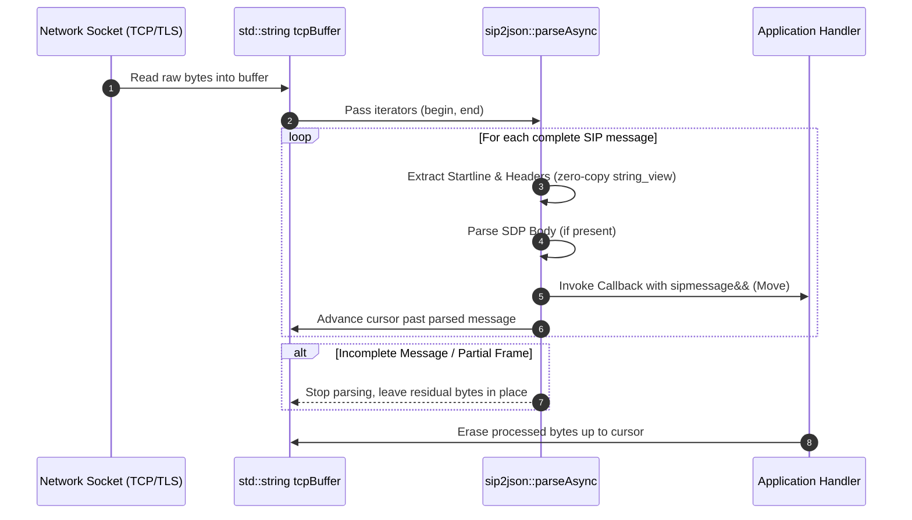

# Stream Parsing & Buffer Management

SIP traffic over TCP or TLS arrives in continuous stream buffers where multiple SIP frames can be packed together, or where a single frame might be partially received. `sip2json::parseAsync` processes frames directly off network read buffers with move semantics.

## 1. Stream Buffer Data Flow Workflow



## 2. Stream Processing Mechanics

`sip2json::parseAsync` operates directly over string iterators (`std::string::const_iterator` or `std::string::iterator`), advancing the start iterator as complete frames are successfully parsed.

```cpp
#include <iostream>
#include <string>
#include "siddiqsoft/sip2json.hpp"

using namespace siddiqsoft;

void onNetworkBufferReceived(std::string& tcpBuffer)
{
    auto cursor = tcpBuffer.begin();

    // Iterate through buffer and invoke callback for each complete SIP frame
    sip2json::parseAsync(
        cursor,
        tcpBuffer.end(),
        [](sipmessage&& msg) {
            // Zero-copy moved rvalue message
            std::cout << "Method: " << msg.getMethod() 
                      << ", Call-ID: " << msg.getCallID() << "\n";
        },
        [](sip2json_exception& ex, std::string::iterator& start, const std::string::iterator& end) {
            std::cerr << "Parser warning: " << ex.what() << "\n";
        }
    );

    // Erase processed frames from front of buffer; incomplete frames remain for next packet
    tcpBuffer.erase(tcpBuffer.begin(), cursor);
}
```

## 3. Memory Layout & Lifetime Rules

1. **Move Semantics (`std::move`)**: Messages passed to parsing callbacks are rvalue references (`sipmessage&&`). The parser constructs the object in-place and transfers ownership directly to the application callback. If you need to preserve message state beyond callback scope, explicitly copy or move the object.
2. **Buffer Residuals & In-Place Drainage**: If a partial frame remains at the end of the buffer, `parseAsync` stops and leaves `cursor` pointing to the beginning of the incomplete frame. Draining `tcpBuffer.erase(tcpBuffer.begin(), cursor)` retains residual bytes for subsequent network `recv()` cycles without reallocation.
3. **Zero Allocation Tokenization**: Header and startline identification uses `std::string_view` slices and 64-bit FNV-1a hash matching (`switch (h)`), completely eliminating intermediate string allocations or `std::transform` loops.
4. **Predictable Container Layout**: Headers and multi-value header arrays are stored using standard library vectors and maps for predictable memory alignment and cache locality.
