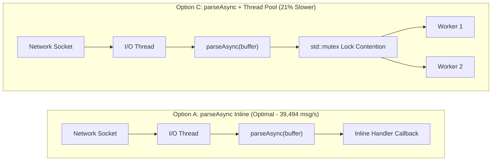

# Performance & Benchmarks

`sip2json` delivers high-throughput, low-latency SIP stream parsing engineered for high-concurrency VoIP edge proxies, SBCs, and WebRTC media gateways.

<div class="kpi-grid">
  <div class="kpi-card">
    <div class="kpi-value">39.5k</div>
    <div class="kpi-label">Stream msgs / sec</div>
    <span class="kpi-badge">+84.6% vs v2.4</span>
  </div>
  <div class="kpi-card">
    <div class="kpi-value">25.3 µs</div>
    <div class="kpi-label">Average Latency</div>
    <span class="kpi-badge">-45.8% Time</span>
  </div>
  <div class="kpi-card">
    <div class="kpi-value">104 MB/s</div>
    <div class="kpi-label">Wire Bandwidth</div>
    <span class="kpi-badge">Zero-Copy Stream</span>
  </div>
  <div class="kpi-card">
    <div class="kpi-value">~150</div>
    <div class="kpi-label">CTRE Template Depth</div>
    <span class="kpi-badge">>85% Reduction</span>
  </div>
</div>

<!-- PIPELINE_BENCHMARKS_START -->
## 1. Multi-Platform & Cross-Architecture Pipeline Benchmark Matrix

!!! note "Build Release & Runner Environment"
    **Build Release & Version**: `{ version }` | **Branch**: `release/2.6.0`
    **Host Runner Environment Legend (Derived at Build Time)**:
    - **Build Runner (Self-Hosted)**: macOS 26.6.2 (arm64, 11 CPU Cores)

*Empirical build pipeline measurements collected across matrix runners grouped by operating system platform:*

| Operating System | Architecture | Compiler | Stream Throughput (`parseAsync`) | Bandwidth | Per-Msg Latency | Single Message (`parseFromBuffer`) | Single Latency |
| :--- | :---: | :---: | :---: | :---: | :---: | :---: | :---: |
| *Awaiting Pipeline Run* | *x64 / arm64* | CI Runners | *Collected on CI* | *Collected on CI* | *Collected on CI* | *Collected on CI* | *Collected on CI* |

<!-- PIPELINE_BENCHMARKS_END -->

---

## 2. Visual Throughput & Latency Comparison

### Stream Parsing Throughput (Messages / Second — Higher is Better)

<div class="modern-chart">
  <div class="chart-row">
    <div class="chart-meta">
      <span class="chart-title">v2.6.0 (parseAsync) <span class="pill pill-success">Fastest</span></span>
      <span class="chart-val">39,494 msg/s</span>
    </div>
    <div class="chart-track">
      <div class="chart-bar chart-bar-primary" style="width: 100%;"></div>
    </div>
  </div>
  <div class="chart-row">
    <div class="chart-meta">
      <span class="chart-title">v2.6.0 (parse)</span>
      <span class="chart-val">36,293 msg/s</span>
    </div>
    <div class="chart-track">
      <div class="chart-bar chart-bar-secondary" style="width: 92%;"></div>
    </div>
  </div>
  <div class="chart-row">
    <div class="chart-meta">
      <span class="chart-title">v2.4.2 Release</span>
      <span class="chart-val">21,394 msg/s</span>
    </div>
    <div class="chart-track">
      <div class="chart-bar chart-bar-muted" style="width: 54%;"></div>
    </div>
  </div>
  <div class="chart-row">
    <div class="chart-meta">
      <span class="chart-title">v1.17.x Legacy</span>
      <span class="chart-val">14,250 msg/s</span>
    </div>
    <div class="chart-track">
      <div class="chart-bar chart-bar-muted" style="width: 36%;"></div>
    </div>
  </div>
</div>

### Per-Message Processing Latency (Microseconds — Lower is Better)

<div class="modern-chart">
  <div class="chart-row">
    <div class="chart-meta">
      <span class="chart-title">v2.6.0 (parseAsync) <span class="pill pill-success">Lowest Latency</span></span>
      <span class="chart-val">25.32 µs</span>
    </div>
    <div class="chart-track">
      <div class="chart-bar chart-bar-primary" style="width: 43%;"></div>
    </div>
  </div>
  <div class="chart-row">
    <div class="chart-meta">
      <span class="chart-title">v2.6.0 (parse)</span>
      <span class="chart-val">27.55 µs</span>
    </div>
    <div class="chart-track">
      <div class="chart-bar chart-bar-secondary" style="width: 47%;"></div>
    </div>
  </div>
  <div class="chart-row">
    <div class="chart-meta">
      <span class="chart-title">v2.4.2 Release</span>
      <span class="chart-val">46.74 µs</span>
    </div>
    <div class="chart-track">
      <div class="chart-bar chart-bar-muted" style="width: 80%;"></div>
    </div>
  </div>
  <div class="chart-row">
    <div class="chart-meta">
      <span class="chart-title">v1.17.x Legacy</span>
      <span class="chart-val">58.20 µs</span>
    </div>
    <div class="chart-track">
      <div class="chart-bar chart-bar-muted" style="width: 100%;"></div>
    </div>
  </div>
</div>

---

## 3. Milestone Comparison Matrix

| Performance Metric | v2.4.2 Baseline | v2.6.0 Current (`parse`) | v2.6.0 Current (`parseAsync`) | Net Improvement |
| :--- | :---: | :---: | :---: | :---: |
| **Stream Throughput** | 21,394 msg/s | 36,293 msg/s | **39,494 msg/s** | <span class="pill pill-success">+84.6% Faster</span> |
| **Per-Msg Latency** | 46.74 µs | 27.55 µs | **25.32 µs** | <span class="pill pill-success">-45.8% Time</span> |
| **Processing Bandwidth** | 56.39 MB/s | 95.08 MB/s | **104.08 MB/s** | <span class="pill pill-info">+47.7 MB/s</span> |
| **Single Message (`parseFromBuffer`)** | 24,771 msg/s | 43,977 msg/s | **46,983 msg/s** | <span class="pill pill-success">+89.7% Faster</span> |
| **MSVC Template Instantiation Depth** | > 1,500 | > 1,000 | **~150 Depth** | <span class="pill pill-info">>85% Reduction</span> |

---

## 4. Architectural Insight: Single Stream Callback vs. Worker Pool

When processing a single continuous TCP/TLS SIP stream on a network socket, **executing `parseAsync` inline on the I/O thread outperforms thread pool handoff by ~21%**:



!!! tip "Zero Mutex Contention"
    Because `sip2json` parses a message in **~25.3 microseconds**, queue locks (`std::mutex`), condition variable wakeups, and CPU cache invalidations take longer than parsing the message itself. Processing messages directly inside the callback preserves L1/L2 cache locality.

---

## 5. Resilience to Corrupted / Noisy Buffers

`sip2json` employs Compile-Time Regular Expression forward scanning to skip noise bytes and recover valid SIP start lines automatically:

| Stream Buffer Setup | Time / Batch | Effective Parse Rate | Processing Bandwidth |
| :--- | :--- | :--- | :--- |
| **10 Messages + Noise** | 29.83 µs | **335,255 msg/s** | 167.89 MiB/s |
| **100 Messages + Noise** | 45.62 µs | **2,191,860 msg/s** | 1.03 GiB/s |

---

## 6. Running Benchmarks Locally

```bash
cmake --preset Apple-Release
cmake --build --preset Apple-Release
./build/Apple-Release/tests/benchmark/sip2json_benchmark tests/validation/samples
```
