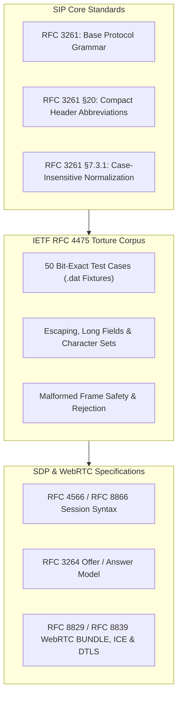

# SIP & SDP Standards Compliance

`sip2json` is designed and validated against official IETF Session Initiation Protocol (SIP) and Session Description Protocol (SDP) standards.

---

## Standards Conformance Architecture

---

## Automated Compliance & Torture Test Suite

The library includes an automated compliance module located in `tests/compliance/`. For a complete section-by-section mapping of all test runner files, line numbers, sample fixtures, and direct links to official IETF standard specifications, see [**Test Suite Sources & Standards Reference**](test_suite_sources.md).

| Test Suite File | Standards Covered | Key Verifications |
| :--- | :--- | :--- |
| [`tests/compliance/src/rfc3261_compliance_tests.cpp`](https://github.com/SiddiqSoft/sip2json/blob/master/tests/compliance/src/rfc3261_compliance_tests.cpp) | [**RFC 3261**](https://datatracker.ietf.org/doc/html/rfc3261) | Request line parsing for 14 RFC methods (`INVITE`, `ACK`, `OPTIONS`, `BYE`, `CANCEL`, `REGISTER`, `SUBSCRIBE`, `NOTIFY`, `REFER`, `PUBLISH`, `UPDATE`, `PRACK`, `INFO`, `MESSAGE`), status line classes (1xx-6xx), case-insensitive header key canonicalization, compact header field abbreviations (`v`, `f`, `t`, `i`, `c`, `l`, `m`, `s`, `k`, `e`), and body framing. |
| [`tests/compliance/src/rfc4475_torture_tests.cpp`](https://github.com/SiddiqSoft/sip2json/blob/master/tests/compliance/src/rfc4475_torture_tests.cpp) | [**RFC 4475**](https://datatracker.ietf.org/doc/html/rfc4475) | All **50 official bit-exact IETF torture test cases** (`.dat` files): `wsinv.dat` (§3.1.1.1: minimal valid request), `multi01.dat` (§3.1.1.2: character set variations), `esc01.dat`/`escnull.dat` (§3.1.1.3/4: URI escaping & escaped nulls), `lwsdisp.dat` (§3.1.1.6: no LWS before `<`), `longreq.dat` (§3.1.1.7: long header values), `unreason.dat`/`noreason.dat` (§3.1.1.12/13: non-ASCII & empty reason phrases), `ncl.dat` (§3.1.2.3: negative `Content-Length`), `badvers.dat` (§3.1.2.16: invalid protocol version), `mpart01.dat` (§3.1.1.11: multipart MIME rejection), and `shortbuf` (§3.1.2.5: incomplete buffer handling). |
| [`tests/compliance/src/sip_certification_suite.cpp`](https://github.com/SiddiqSoft/sip2json/blob/master/tests/compliance/src/sip_certification_suite.cpp) | [**RFC 3261**](https://datatracker.ietf.org/doc/html/rfc3261), [**3262**](https://datatracker.ietf.org/doc/html/rfc3262), [**6665**](https://datatracker.ietf.org/doc/html/rfc6665), [**3515**](https://datatracker.ietf.org/doc/html/rfc3515), [**3903**](https://datatracker.ietf.org/doc/html/rfc3903) | End-to-end certification for SIP Core (§7.1, §7.2, §7.3), PRACK reliability (`RAck`/`RSeq`), Event Notifications (`Event`/`Subscription-State`), Call Transfer (`Refer-To`), and Event Publication (`SIP-ETag`). |
| [`tests/compliance/src/sdp_compliance_tests.cpp`](https://github.com/SiddiqSoft/sip2json/blob/master/tests/compliance/src/sdp_compliance_tests.cpp) | [**RFC 4566**](https://datatracker.ietf.org/doc/html/rfc4566), [**8866**](https://datatracker.ietf.org/doc/html/rfc8866), [**3264**](https://datatracker.ietf.org/doc/html/rfc3264), [**8829**](https://datatracker.ietf.org/doc/html/rfc8829), [**8839**](https://datatracker.ietf.org/doc/html/rfc8839) | Complete Session Description Protocol parsing: RFC 4566 Section 9 reference session description, Offer/Answer direction attributes (`sendrecv`, `sendonly`, `recvonly`, `inactive`), WebRTC BUNDLE media grouping (`a=group:BUNDLE`), ICE candidates (`a=candidate`), ICE credentials (`a=ice-ufrag`, `a=ice-pwd`), DTLS fingerprints (`a=fingerprint:sha-256 ...`), RTCP multiplexing (`a=rtcp-mux`), multiple SDP sessions (`v=0` demarcation), and UNIX `\n` line endings. |

---

## Detailed Standard Verification Matrix

### 1. SIP Start Line Verification (RFC 3261 §7.1 & §7.2)
- **Supported Methods**: `INVITE`, `ACK`, `OPTIONS`, `BYE`, `CANCEL`, `REGISTER`, `SUBSCRIBE`, `NOTIFY`, `REFER`, `PUBLISH`, `UPDATE`, `PRACK`, `INFO`, `MESSAGE`.
- **Method Rejection**: Non-standard or custom method tokens (e.g. `BENCHMARK`, `CUSTOM`) are rejected during startline matching and serialization validation.
- **Protocol Version**: Rejects unsupported protocol versions (`SIP/1.0`, `SIP/3.0`, `HTTP/1.1`), enforcing strict `SIP/2.0` compliance.

### 2. Header Field Processing (RFC 3261 §7.3.1 & §20)
- **Case-Insensitive Normalization**: Normalizes incoming header field names (`vIa`, `fRoM`, `cALL-id`, `cONTENT-lENGTH`) to canonical Pascal-Kebab-Case keys (`Via`, `From`, `Call-ID`, `Content-Length`).
- **Compact Form Expansion**: Automatically maps single-letter abbreviations (`v`, `f`, `t`, `i`, `c`, `l`, `m`, `s`, `k`, `e`) to their canonical header field equivalents.
- **Multiline Header Folding**: Unfolds multiline header values continuation lines beginning with LWSP (`\r\n ` and `\r\n\t`) per RFC 3261 §7.3.1.
- **Multiple Headers**: Preserves multiple header occurrences (`Via`, `Record-Route`, `Route`, `Accept`) as JSON arrays.

### 3. SDP Body Processing (RFC 4566, RFC 8866, RFC 3264, WebRTC RFC 8829 / 8839)
- **Format Compliance**: Parses SDP session descriptions into structured `/b/sdp` JSON objects per RFC 4566 and RFC 8866.
- **WebRTC Extensions**: Full support for BUNDLE media grouping (`a=group:BUNDLE`), ICE credentials (`ice-ufrag`, `ice-pwd`), candidate lines (`a=candidate`), and DTLS fingerprint attributes (`a=fingerprint:sha-256 ...`).
- **Line Ending Flexibility**: Seamlessly parses SDP payloads formatted with internet CRLF (`\r\n`) or UNIX LF (`\n`).
