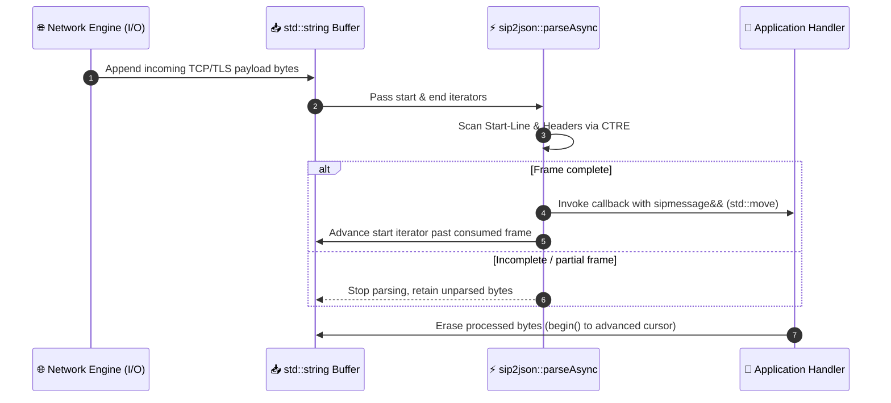

# Stream Architecture & Data Flow

`sip2json` is engineered for zero-copy streaming, predictable memory layout, and idiomatic Modern C++23 design patterns.

---

## 1. Stream Buffer Data Flow

When parsing live TCP or TLS sockets, data arrives incrementally. `sip2json::parseAsync` operates directly over string iterators (`std::string::iterator`), advancing the cursor without forcing buffer realignments or memory reallocations:



---

## 2. Core Design Patterns

### A. Builder Pattern & Fluent Chaining
The `sipmessage` class provides a fluent API for building requests and responses:

```cpp
sipmessage msg(METHOD_INVITE, "sip:alice@example.com", "call-id-100", 1);

msg.setHeader(HF_FROM, "sip:bob@example.com")
   .setHeader(HF_TO, "sip:alice@example.com")
   .setHeader(HF_CONTACT, "<sip:bob@192.168.1.10:5060>")
   .setUserAgent("VoIPGateway/2.0");
```

### B. Strategy / Inline Callback Pattern
`parseAsync` executes callbacks synchronously on the I/O thread, avoiding thread handoff latency:

```cpp
sip2json::parseAsync(
    startIt,
    endIt,
    [](sipmessage&& msg) {
        // Zero-copy rvalue message handler strategy
    },
    [](const sip2json_exception& ex, std::string::iterator&, const std::string::iterator&) {
        // Error handler strategy
    }
);
```

### C. First-Class JSON DTO Interoperability
`sipmessage` inherits directly from `nlohmann::json`, allowing native JSON pointer queries and zero-overhead NoSQL persistence:

```cpp
sipmessage msg = sip2json::parseFromBuffer(cursor, buffer.end());

// Native JSON access
nlohmann::json doc = msg;
std::string callId = doc["/meta/id"_json_pointer];
```

---

## 3. Memory & Lifetime Rules

1. **Rvalue Move Semantics (`sipmessage&&`)**: Messages passed to parsing callbacks are rvalue references. To retain the message outside the callback scope, move or copy it into your own state container.
2. **Buffer Preservation**: When partial messages remain at the end of a buffer, `parseAsync` leaves the cursor in-place, allowing subsequent network reads to append new bytes directly.
3. **Deterministic Memory Footprint**: Header maps and SDP array elements are constructed with standard containers, ensuring predictable cache locality and straightforward deallocation.

