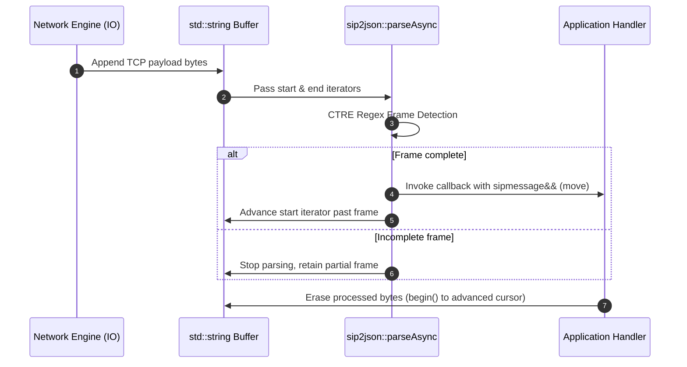

# Data Flow & Memory Layout

Understanding data flow and memory management in `sip2json`.

---

## Stream Buffer Data Flow

---

## Memory & Lifetime Rules

1. **Move Semantics (`std::move`)**: Messages passed to parsing callbacks are rvalue references (`sipmessage&&`). If you need to preserve message state beyond callback completion, make an explicit copy.
2. **Buffer Alignment**: `parseAsync` uses string iterators without forcing buffer realignments or memory reallocations.
3. **Container Allocation**: Headers and multi-value header arrays are stored using standard library vectors and maps for predictable memory layout.
