# Architecture & Design

`sip2json` is engineered around zero-copy `std::string_view` parsing, stateless execution, 64-bit constexpr FNV-1a hash matching, and modern C++20 type safety.

## Architectural Principles

1. **Stateless Operations**: No connection state or dialog state machine logic.
2. **First-Class JSON**: Serializes to and from `nlohmann::json` objects without transformation layers.
3. **Iterator Stream Parsing**: Processes non-owning string buffers directly, supporting non-blocking stream drains.
4. **Header-Only**: Single `#include <siddiqsoft/sip2json.hpp>`, zero compiled dependencies, zero regex dependencies.

## Subsystem Topology

The system is organized into distinct architectural layers with strict separation of concerns:

### 1. Public API Layer
Provides high-level developer interfaces and message domain models:

- **`siddiqsoft/sip2json.hpp`**: Primary facade providing static entry points:
    - `parse(std::string_view)`: Decodes single datagram frames.
    - `parseAsync(std::string_view&, onMsg, onErr)`: Continuous multi-frame stream scanner with callback dispatch and buffer progression.
    - `parseFromBuffer(std::string_view)`: Fast-path standalone buffer consumption.
    - `serialize(const sipmessage&)`: RFC 3261 compliance wire serializer.
- **`siddiqsoft/sipmessage.hpp`**: Primary message container extending `nlohmann::json`:
    - `/s`: Start line (`type`, `method`, `uri`, `version`, `statusCode`, `reason`).
    - `/h`: Canonical header map with compact alias lookup (`Call-ID`, `From`, `To`, `Via`, `CSeq`, etc.).
    - `/b`: Message payload and parsed SDP structure.
    - `/meta`: Provenance metadata (`version`, `time`, `ttx`).

### 2. Parser & Serializer Engines (`private/`)
Internal high-throughput token scanners and wire formatters:

- **`sip2json_parser.hpp`**: Linear-time non-backtracking scanner for start line, headers, and body boundary detection.
- **`sip2json_serializer.hpp`**: Canonical serializer formatting headers, parameters, and payloads into CRLF-separated byte streams.
- **`sip2json_sdp.hpp`**: RFC 4566 / RFC 8866 Session Description Protocol parser and JSON serializer.

### 3. Protocol Dictionaries & Token Tables (`private/`)
Precomputed mapping tables and constexpr hashing:

- **`sip2json_header_keys.hpp`**: 64-bit constexpr FNV-1a hash dispatch (`hash_header_key`) with case-folding and compact-to-canonical aliases (`i` -> `Call-ID`, `m` -> `Contact`, `c` -> `Content-Type`, `l` -> `Content-Length`).
- **`sip2json_constants.hpp`**: SIP method literals (`INVITE`, `ACK`, `BYE`, `CANCEL`), version strings, delimiters (`CRLF`, `SP`, `COLON`), and JSON field pointers.
- **`sip2json_response_codes.hpp`**: Numeric status codes (100-699) and RFC 3261 reason phrases.

### 4. Diagnostics & Utilities (`private/`)
Core utilities and diagnostic classifications:

- **`sip2json_exception.hpp`**: Exception type `siddiqsoft::sip2json_exception` (derives `std::runtime_error`) and error classifications `siddiqsoft::sip2jsonErrors`.
- **`sip2json_datetime.hpp`**: High-precision ISO 8601 UTC and RFC 1123 datetime generators for message metadata.
- **`sip2json_utils.hpp`**: Zero-copy string view trimming, pointer escaping, and delimiter scanner helpers.

### 5. External Dependencies
- **`nlohmann::json`**: Header-only JSON library serving as the base class for `sipmessage`.
- **`std::runtime_error`**: Standard C++ exception base for `sip2json_exception`.
- **C++20 Standard Library**: `std::string_view`, `std::functional`, `std::format`, `std::chrono`.

## Component Relationships & Data Flow

- **Class Inheritance**:
    - `siddiqsoft::sipmessage` inherits public `nlohmann::json`.
    - `siddiqsoft::sip2json_exception` inherits public `std::runtime_error`.
- **Inclusion & Orchestration**:
    - `siddiqsoft/sip2json.hpp` includes `sipmessage.hpp`, `sip2json_parser.hpp`, `sip2json_serializer.hpp`, and `sip2json_sdp.hpp`.
    - `siddiqsoft::sip2json` produces and consumes `siddiqsoft::sipmessage`.
- **Engine Delegation & Data Flow**:
    - `sip2json_parser.hpp` delegates payload parsing to `sip2json_sdp.hpp`, uses `sip2json_header_keys.hpp` for canonical hashing, uses `sip2json_utils.hpp` for delimiter scanning, and throws `sip2json_exception` on framing errors.
    - `sip2json_serializer.hpp` delegates SDP serialization to `sip2json_sdp.hpp`, references `sip2json_constants.hpp` for delimiters, and formats wire buffers.
    - `sipmessage.hpp` utilizes `sip2json_header_keys.hpp`, `sip2json_constants.hpp`, `sip2json_response_codes.hpp`, and `sip2json_datetime.hpp` for accessor helpers.


## UML Class Diagram

```mermaid
classDiagram
    direction TB

    classDef coreClass fill:rgba(35,73,109,0.08),stroke:#23496d,stroke-width:2px;
    classDef utilityClass fill:rgba(15,118,110,0.08),stroke:#0f766e,stroke-width:2px;
    classDef exceptionClass fill:rgba(185,28,28,0.06),stroke:#b91c1c,stroke-width:1.5px;
    classDef enumClass fill:rgba(109,40,217,0.06),stroke:#6d28d9,stroke-width:1.5px;
    classDef externalClass fill:rgba(100,116,139,0.06),stroke:#64748b,stroke-width:1.5px,stroke-dasharray: 4 3;
    classDef highlightClass fill:rgba(2,132,199,0.18),stroke:#0284c7,stroke-width:3px;

    class json["nlohmann::json"] {
        <<external DOM>>
    }
    class json:::externalClass

    class runtime_error["std::runtime_error"] {
        <<external exception>>
    }
    class runtime_error:::externalClass

    class sip2json["siddiqsoft::sip2json"] {
        <<final utility>>
        +parseAsync(string_view& buffer, onMsg, onErr)$ void
        +parse(string_view buffer)$ sipmessage
        +parseFromBuffer(string_view buffer)$ sipmessage
        +serialize(const sipmessage& msg)$ string
    }
    class sip2json:::utilityClass

    class sipmessage["siddiqsoft::sipmessage"] {
        +sipmessage()
        +sipmessage(string_view method, string_view uri, string_view callId, uint32_t cseq)
        +sipmessage(const json& src)
        +getMethodView() string_view
        +getUriView() string_view
        +getCallIDView() string_view
        +getStatusCode() int
        +getReasonView() string_view
        +getHeader(string_view key) string
        +setHeader(string_view key, string_view val) sipmessage&
        +hasHeader(string_view key) bool
        +getContentTypeView() string_view
    }
    class sipmessage:::coreClass

    class HeaderKeySet["siddiqsoft::HeaderKeySet"] {
        +string_view canonicalKey
        +string_view canonicalUpper
        +char compactAlias
        +uint64_t hash
        +HeaderKeySet(string_view key)
        +canonical() string_view
        +lower() string_view
    }
    class HeaderKeySet:::coreClass

    class SIPMessageType["siddiqsoft::SIPMessageType"] {
        <<enumeration>>
        Request = 1
        Response = 2
    }
    class SIPMessageType:::enumClass

    class sip2jsonErrors["siddiqsoft::sip2jsonErrors"] {
        <<enumeration>>
        unknown = -1
        success = 0
        invalid_document = 1
        empty_message = 2
        invalid_startline = 3
        incomplete_buffer_for_header = 4
        incomplete_buffer_for_content = 5
        incomplete_buffer_for_parse = 6
        missing_required_element = 7
        unsupported_contenttype = 8
    }
    class sip2jsonErrors:::enumClass

    class sip2json_exception["siddiqsoft::sip2json_exception"] {
        +sip2jsonErrors errCode
        +sip2json_exception(string message, sip2jsonErrors code)
        +what() const char*
    }
    class sip2json_exception:::exceptionClass

    class empty_message_error["siddiqsoft::empty_message_error"]
    class empty_message_error:::exceptionClass
    class incomplete_buffer_for_content_error["siddiqsoft::incomplete_buffer_for_content_error"]
    class incomplete_buffer_for_content_error:::exceptionClass
    class incomplete_buffer_for_header_error["siddiqsoft::incomplete_buffer_for_header_error"]
    class incomplete_buffer_for_header_error:::exceptionClass
    class incomplete_buffer_for_parse_error["siddiqsoft::incomplete_buffer_for_parse_error"]
    class incomplete_buffer_for_parse_error:::exceptionClass
    class invalid_document_error["siddiqsoft::invalid_document_error"]
    class invalid_document_error:::exceptionClass
    class invalid_startline_error["siddiqsoft::invalid_startline_error"]
    class invalid_startline_error:::exceptionClass
    class missing_required_element["siddiqsoft::missing_required_element"]
    class missing_required_element:::exceptionClass
    class unsupported_contenttype_error["siddiqsoft::unsupported_contenttype_error"]
    class unsupported_contenttype_error:::exceptionClass

    json <|-- sipmessage : public inheritance
    runtime_error <|-- sip2json_exception : public inheritance
    sip2json_exception <|-- empty_message_error
    sip2json_exception <|-- incomplete_buffer_for_content_error
    sip2json_exception <|-- incomplete_buffer_for_header_error
    sip2json_exception <|-- incomplete_buffer_for_parse_error
    sip2json_exception <|-- invalid_document_error
    sip2json_exception <|-- invalid_startline_error
    sip2json_exception <|-- missing_required_element
    sip2json_exception <|-- unsupported_contenttype_error

    sip2json ..> sipmessage : produces / consumes
    sip2json ..> sip2json_exception : throws
    sipmessage ..> SIPMessageType : classifies
    sipmessage ..> HeaderKeySet : uses
    sip2json_exception ..> sip2jsonErrors : contains

    link sip2json "https://github.com/SiddiqSoft/sip2json/blob/master/include/siddiqsoft/sip2json.hpp" "Source: include/siddiqsoft/sip2json.hpp"
    link sipmessage "https://github.com/SiddiqSoft/sip2json/blob/master/include/siddiqsoft/sipmessage.hpp" "Source: include/siddiqsoft/sipmessage.hpp"
    link HeaderKeySet "https://github.com/SiddiqSoft/sip2json/blob/master/include/siddiqsoft/private/sip2json_header_keys.hpp" "Source: include/siddiqsoft/private/sip2json_header_keys.hpp"
    link SIPMessageType "https://github.com/SiddiqSoft/sip2json/blob/master/include/siddiqsoft/sipmessage.hpp" "Source: include/siddiqsoft/sipmessage.hpp"
    link sip2jsonErrors "https://github.com/SiddiqSoft/sip2json/blob/master/include/siddiqsoft/private/sip2json_exception.hpp" "Source: include/siddiqsoft/private/sip2json_exception.hpp"
    link sip2json_exception "https://github.com/SiddiqSoft/sip2json/blob/master/include/siddiqsoft/private/sip2json_exception.hpp" "Source: include/siddiqsoft/private/sip2json_exception.hpp"
    link empty_message_error "https://github.com/SiddiqSoft/sip2json/blob/master/include/siddiqsoft/private/sip2json_exception.hpp" "Source: include/siddiqsoft/private/sip2json_exception.hpp"
    link incomplete_buffer_for_content_error "https://github.com/SiddiqSoft/sip2json/blob/master/include/siddiqsoft/private/sip2json_exception.hpp" "Source: include/siddiqsoft/private/sip2json_exception.hpp"
    link incomplete_buffer_for_header_error "https://github.com/SiddiqSoft/sip2json/blob/master/include/siddiqsoft/private/sip2json_exception.hpp" "Source: include/siddiqsoft/private/sip2json_exception.hpp"
    link incomplete_buffer_for_parse_error "https://github.com/SiddiqSoft/sip2json/blob/master/include/siddiqsoft/private/sip2json_exception.hpp" "Source: include/siddiqsoft/private/sip2json_exception.hpp"
    link invalid_document_error "https://github.com/SiddiqSoft/sip2json/blob/master/include/siddiqsoft/private/sip2json_exception.hpp" "Source: include/siddiqsoft/private/sip2json_exception.hpp"
    link invalid_startline_error "https://github.com/SiddiqSoft/sip2json/blob/master/include/siddiqsoft/private/sip2json_exception.hpp" "Source: include/siddiqsoft/private/sip2json_exception.hpp"
    link missing_required_element "https://github.com/SiddiqSoft/sip2json/blob/master/include/siddiqsoft/private/sip2json_exception.hpp" "Source: include/siddiqsoft/private/sip2json_exception.hpp"
    link unsupported_contenttype_error "https://github.com/SiddiqSoft/sip2json/blob/master/include/siddiqsoft/private/sip2json_exception.hpp" "Source: include/siddiqsoft/private/sip2json_exception.hpp"
    link json "https://github.com/nlohmann/json" "External: nlohmann/json"
    link runtime_error "https://en.cppreference.com/w/cpp/error/runtime_error" "Standard Library: std::runtime_error"
```

<!-- UML_CLASS_DIAGRAM_START -->


### Source Code Mapping

| Component / Class | Header File | Source Link | Purpose & Architectural Role |
| :--- | :--- | :--- | :--- |
| [`siddiqsoft::sip2json`](../api/sip2json.md) | `include/siddiqsoft/sip2json.hpp` | [`sip2json.hpp`](https://github.com/SiddiqSoft/sip2json/blob/master/include/siddiqsoft/sip2json.hpp) | Top-level static parser, stream deserializer, and wire serializer utility |
| [`siddiqsoft::sipmessage`](../api/sipmessage.md) | `include/siddiqsoft/sipmessage.hpp` | [`sipmessage.hpp`](https://github.com/SiddiqSoft/sip2json/blob/master/include/siddiqsoft/sipmessage.hpp) | Core message container inheriting from `nlohmann::json` with zero-copy view accessors |
| [`siddiqsoft::HeaderKeySet`](../api/constants.md) | `include/siddiqsoft/private/sip2json_header_keys.hpp` | [`sip2json_header_keys.hpp`](https://github.com/SiddiqSoft/sip2json/blob/master/include/siddiqsoft/private/sip2json_header_keys.hpp) | Canonical SIP header normalization, compact alias mapping, and compile-time hashing |
| [`siddiqsoft::SIPMessageType`](../api/sipmessage.md) | `include/siddiqsoft/sipmessage.hpp` | [`sipmessage.hpp`](https://github.com/SiddiqSoft/sip2json/blob/master/include/siddiqsoft/sipmessage.hpp) | Protocol message discriminator (`Request = 1`, `Response = 2`) |
| [`siddiqsoft::sip2json_exception`](../api/errors.md#exception-class-hierarchy) | `include/siddiqsoft/private/sip2json_exception.hpp` | [`sip2json_exception.hpp`](https://github.com/SiddiqSoft/sip2json/blob/master/include/siddiqsoft/private/sip2json_exception.hpp) | Base exception class inheriting from `std::runtime_error` with `sip2jsonErrors` payload |
| [`siddiqsoft::sip2jsonErrors`](../api/errors.md#sip2jsonerrors-enumeration) | `include/siddiqsoft/private/sip2json_exception.hpp` | [`sip2json_exception.hpp`](https://github.com/SiddiqSoft/sip2json/blob/master/include/siddiqsoft/private/sip2json_exception.hpp) | Diagnostic error code enumeration for parser and syntax failures |
| Derived Exceptions | `include/siddiqsoft/private/sip2json_exception.hpp` | [`sip2json_exception.hpp`](https://github.com/SiddiqSoft/sip2json/blob/master/include/siddiqsoft/private/sip2json_exception.hpp) | Specialized exception hierarchy (`invalid_document_error`, `empty_message_error`, etc.) |
| Parser Engine (`raw_view`) | `include/siddiqsoft/private/sip2json_parser.hpp` | [`sip2json_parser.hpp`](https://github.com/SiddiqSoft/sip2json/blob/master/include/siddiqsoft/private/sip2json_parser.hpp) | High-throughput streaming parser, zero-copy buffer slicing, CRLF boundary scanning |
| Wire Serializer | `include/siddiqsoft/private/sip2json_serializer.hpp` | [`sip2json_serializer.hpp`](https://github.com/SiddiqSoft/sip2json/blob/master/include/siddiqsoft/private/sip2json_serializer.hpp) | RFC 3261 compliant text wire serializer |
| SDP Body Parser | `include/siddiqsoft/private/sip2json_sdp.hpp` | [`sip2json_sdp.hpp`](https://github.com/SiddiqSoft/sip2json/blob/master/include/siddiqsoft/private/sip2json_sdp.hpp) | RFC 4566 Session Description Protocol parser and structured JSON serialization |
| Response Codes | `include/siddiqsoft/private/sip2json_response_codes.hpp` | [`sip2json_response_codes.hpp`](https://github.com/SiddiqSoft/sip2json/blob/master/include/siddiqsoft/private/sip2json_response_codes.hpp) | SIP status codes, reason phrases, and classification ranges (1xx-6xx) |
| Protocol Constants | `include/siddiqsoft/private/sip2json_constants.hpp` | [`sip2json_constants.hpp`](https://github.com/SiddiqSoft/sip2json/blob/master/include/siddiqsoft/private/sip2json_constants.hpp) | SIP grammar tokens, method strings, whitespace matchers, CRLF constants |
| DateTime Parser | `include/siddiqsoft/private/sip2json_datetime.hpp` | [`sip2json_datetime.hpp`](https://github.com/SiddiqSoft/sip2json/blob/master/include/siddiqsoft/private/sip2json_datetime.hpp) | RFC 3261 / RFC 1123 HTTP-date timestamp parser and serializer |
| Utility Functions | `include/siddiqsoft/private/sip2json_utils.hpp` | [`sip2json_utils.hpp`](https://github.com/SiddiqSoft/sip2json/blob/master/include/siddiqsoft/private/sip2json_utils.hpp) | Internal whitespace trimming, view slicing, string conversion utilities |
<!-- UML_CLASS_DIAGRAM_END -->

## Component Breakdown & File Mapping

| Component | File Path | Class / Responsibility |
| :--- | :--- | :--- |
| **Parser &amp; Serializer Facade** | [`siddiqsoft/sip2json.hpp`](../api/sip2json.md) | Static entry-point class [`siddiqsoft::sip2json`](../api/sip2json.md) for streaming, buffer consumption, and wire serialization. |
| **Message DTO** | [`siddiqsoft/sipmessage.hpp`](../api/sipmessage.md) | Document model [`siddiqsoft::sipmessage`](../api/sipmessage.md) extending `nlohmann::json` with typed accessors. |
| **Stream Parser Engine** | `siddiqsoft/private/sip2json_parser.hpp` | High-throughput linear token scanner for start line, headers, and payload dispatch. |
| **Wire Serializer Engine** | `siddiqsoft/private/sip2json_serializer.hpp` | RFC 3261 compliance serializer formatting headers and body into CRLF-separated byte streams. |
| **SDP Processor** | [`siddiqsoft/private/sip2json_sdp.hpp`](../api/json_schema.md) | RFC 4566 / RFC 8866 Session Description Protocol parser and JSON serializer. |
| **Diagnostic Errors** | [`siddiqsoft/private/sip2json_exception.hpp`](../api/errors.md) | Exception [`siddiqsoft::sip2json_exception`](../api/errors.md) (derives `std::runtime_error`) and [`sip2jsonErrors`](../api/errors.md). |
| **Header Key Dispatch** | `siddiqsoft/private/sip2json_header_keys.hpp` | Case-insensitive mapping and compact single-character alias expansion. |
| **Protocol Constants** | `siddiqsoft/private/sip2json_constants.hpp` | RFC 3261 standard method identifiers, version literals, and syntax delimiters. |
| **Status Codes** | `siddiqsoft/private/sip2json_response_codes.hpp` | Numeric status code definitions (100-699) and reason phrase lookup tables. |
| **Timestamp Utilities** | `siddiqsoft/private/sip2json_datetime.hpp` | High-precision ISO 8601 and RFC 1123 datetime generators for message metadata. |
| **Buffer Utilities** | `siddiqsoft/private/sip2json_utils.hpp` | Zero-copy string view trimming, token escaping, and delimiter searching helpers. |

## Modular Header Layout

`sip2json` separates public interfaces from private implementation details under `include/siddiqsoft/`:

```
include/siddiqsoft/
|-- sip2json.hpp                       # Public entry-point header
|-- sipmessage.hpp                     # Primary SIP message DTO class
\-- private/                           # Internal implementation headers
    |-- sip2json_exception.hpp         # Error code enums & exception classes
    |-- sip2json_parser.hpp            # Start-line, header & buffer parsing
    |-- sip2json_response_codes.hpp    # SIP status code to reason phrase mapping
    |-- sip2json_sdp.hpp               # SDP body parsing & serialization helpers
    |-- sip2json_serializer.hpp        # SIP message wire-format serialization
    \-- sip2json_utils.hpp             # Utilities, hashing & date formatters
```

## Out-of-Scope Capabilities

To maintain a zero-dependency header-only architecture and maximum runtime efficiency, `sip2json` deliberately excludes:

* **I/O Facilities**: Network sockets, event loops, and buffer management are handled by your host networking engine (ASIO, libuv, epoll, Windows Sockets).
* **Dialog State Machine & CSeq Tracking**: The parser is stateless; call states and dialog transactions are tracked at the application layer.
* **Encryption / TLS**: TLS termination is handled at the transport layer before passing cleartext stream buffers to `sip2json`.

## Architecture & Design Topics

<div class="grid" markdown="1">

<div class="card" markdown="1">

### [Performance & Benchmarks](benchmarks.md)

Multi-platform pipeline build benchmarks, per-message processing latency, and cross-platform comparative metrics.

[View Benchmarks :octicons-arrow-right-24:](benchmarks.md)

</div>

<div class="card" markdown="1">

### [Stream Parsing & Buffer Management](async.md)

Continuous TCP/TLS stream mechanics, iterator buffer progression, move semantics (`sipmessage&&`), and memory lifetime rules.

[Learn Stream Mechanics :octicons-arrow-right-24:](async.md)

</div>

<div class="card" markdown="1">

### [Optimization Choices](optimization_choices.md)

Clean JavaScript-like C++20 API design, FNV-1 header matching, and protocol-specific optimization choices.

[Read Design Choices :octicons-arrow-right-24:](optimization_choices.md)

</div>

<div class="card" markdown="1">

### [Standards Compliance](compliance.md)

Concurrence with RFC 3261, RFC 4475 (SIP Torture 50 test cases), RFC 4566/8866 (SDP), and WebRTC specifications.

[View Standards :octicons-arrow-right-24:](compliance.md)

</div>

<div class="card" markdown="1">

### [Test Suite & RFC Reference](test_suite_sources.md)

Section-by-section mapping of test runner files, sample fixtures, and direct links to official IETF specifications.

[View Test Sources :octicons-arrow-right-24:](test_suite_sources.md)

</div>

</div>
