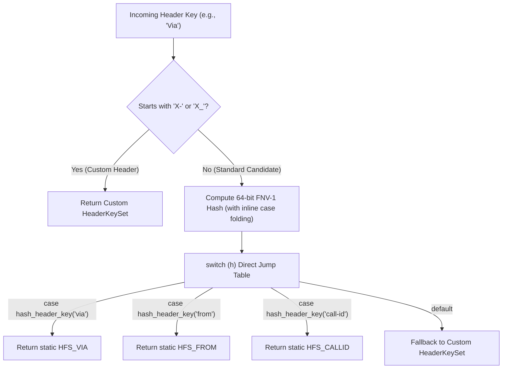

# Optimization Choices

This is not the best code or the most performant library. It features a very clean and JavaScript-like API inline with the modern C++20 model, designed to make handling SIP payloads intuitive without heavy ceremony.

Where optimizations are applied, they take advantage of the specific structure of the SIP protocol itself.

## 1. Header Matching: FNV-1 and the SIP Header Model

The SIP protocol has known, standard headers (RFC 3261) along with a well-defined custom header model. I took advantage of this to optimize header matching using the [FNV-1](https://en.wikipedia.org/wiki/Fowler-Noll-Vo_hash_function) algorithm.

In SIP traffic:

1. **Well-Defined Custom Headers**: Custom headers conventionally begin with `X-` or `X_` (such as `X-Call-Info`). Checking the first two characters allows immediate dispatch for custom headers without evaluating standard definitions.
2. **Known Standard Headers**: Core headers (`Via`, `From`, `To`, `Call-ID`, `CSeq`, `Contact`, `Content-Length`, `Content-Type`) and their 1-letter compact equivalents (`v`, `f`, `t`, `i`, `m`, `l`, `c`) form a well-known, finite set.
3. **In-Line Case Folding**: Header keys are case-insensitive (`via`, `Via`, `VIA` are identical). Rather than allocating a lowercased `std::string` copy, the FNV-1 hash routine converts ASCII case inline as characters are read.
4. **Compile-Time Jump Tables**: Because `hash_header_key` is `constexpr`, standard header names are hashed by the compiler at compile time:

```cpp
// Fast-path: Custom headers starting with X- / x- / X_ / x_
if (keyFromPayload.size() >= 2 && (keyFromPayload[0] == 'X' || keyFromPayload[0] == 'x') &&
    (keyFromPayload[1] == '-' || keyFromPayload[1] == '_'))
{
    thread_local HeaderKeySet customKey;
    customKey = HeaderKeySet(std::string(keyFromPayload));
    return customKey;
}

uint64_t h = hash_header_key(keyFromPayload.data(), keyFromPayload.size());

switch (h)
{
    case hash_header_key("from"):
    case hash_header_key("f"): return HFS_FROM;
    case hash_header_key("to"):
    case hash_header_key("t"): return HFS_TO;
    case hash_header_key("via"):
    case hash_header_key("v"): return HFS_VIA;
    case hash_header_key("call-id"):
    case hash_header_key("i"): return HFS_CALLID;
    case hash_header_key("cseq"): return HFS_CSEQ;
    case hash_header_key("content-length"):
    case hash_header_key("l"): return HFS_CONTENT_LENGTH;
    case hash_header_key("content-type"):
    case hash_header_key("c"): return HFS_CONTENT_TYPE;
    // ...
    default: return customKey;
}
```

This effectively reduces header identification to comparing integer values, allowing the compiler to generate a clean, direct jump table.

## 2. Header Lookup Flow



---

## 3. Pragmatic Modern C++20 Choices

A few other practical choices keep overhead low while preserving clean ergonomics:

* **Zero-Copy `std::string_view` Tokenization**: Start lines, methods, and header slices use string views where possible to avoid unnecessary temporary allocations.
This optimization may not have been completed if not for coding agents. One of the lessons I learnt is that `std::string_view` is good (other languages call these "slices") and actually better than `std::string&`. Once the benchmarks came in this was an easy switchover!
* **Move Semantics (`sipmessage&&`)**: Streaming callbacks pass decoded messages as rvalues so callers can move them directly into application containers.
* **Static Predefined Constants**: Canonical header key sets and method tokens are reused statically rather than constructed dynamically on each message.
