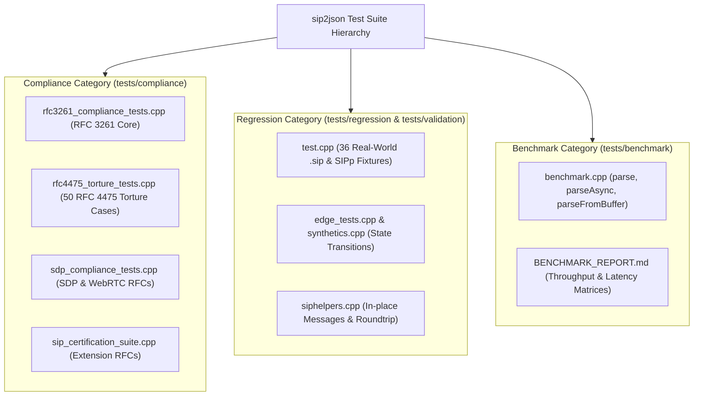

# Test Suite Sources & Standards Reference

This document provides a section-by-section mapping of all test suites, test runner files, sample fixtures, authoritative standards, and links to official IETF RFC specifications integrated into [`siddiqsoft/sip2json`](https://github.com/siddiqsoftware/sip2json).

---

## 1. Test Suite Architecture & Categorization



---

## 2. Official Standards Specifications & Links

`sip2json` is engineered and validated directly against official IETF (Internet Engineering Task Force) RFC standards for Session Initiation Protocol (SIP) and Session Description Protocol (SDP):

| Standard Specification | Document Title | Official IETF Specification URL |
| :--- | :--- | :--- |
| **IETF RFC 3261** | SIP: Session Initiation Protocol | [https://datatracker.ietf.org/doc/html/rfc3261](https://datatracker.ietf.org/doc/html/rfc3261) |
| **IETF RFC 4475** | Session Initiation Protocol (SIP) Torture Test Messages | [https://datatracker.ietf.org/doc/html/rfc4475](https://datatracker.ietf.org/doc/html/rfc4475) |
| **IETF RFC 4566** | SDP: Session Description Protocol | [https://datatracker.ietf.org/doc/html/rfc4566](https://datatracker.ietf.org/doc/html/rfc4566) |
| **IETF RFC 8866** | SDP: Session Description Protocol (Obsoletes RFC 4566) | [https://datatracker.ietf.org/doc/html/rfc8866](https://datatracker.ietf.org/doc/html/rfc8866) |
| **IETF RFC 3264** | An Offer/Answer Model with the Session Description Protocol (SDP) | [https://datatracker.ietf.org/doc/html/rfc3264](https://datatracker.ietf.org/doc/html/rfc3264) |
| **IETF RFC 8829** | JavaScript Session Establishment Protocol (JSEP / WebRTC SDP) | [https://datatracker.ietf.org/doc/html/rfc8829](https://datatracker.ietf.org/doc/html/rfc8829) |
| **IETF RFC 8839** | Session Description Protocol (SDP) Offer/Answer Procedures for ICE | [https://datatracker.ietf.org/doc/html/rfc8839](https://datatracker.ietf.org/doc/html/rfc8839) |
| **IETF RFC 5576** | Source-Specific Media Attributes in SDP | [https://datatracker.ietf.org/doc/html/rfc5576](https://datatracker.ietf.org/doc/html/rfc5576) |
| **IETF RFC 3262** | Reliability of Provisional Responses in SIP (`PRACK`) | [https://datatracker.ietf.org/doc/html/rfc3262](https://datatracker.ietf.org/doc/html/rfc3262) |
| **IETF RFC 6665** | SIP-Specific Event Notification (`SUBSCRIBE`/`NOTIFY`) | [https://datatracker.ietf.org/doc/html/rfc6665](https://datatracker.ietf.org/doc/html/rfc6665) |
| **IETF RFC 3515** | The Session Initiation Protocol (SIP) Refer Method (`REFER`) | [https://datatracker.ietf.org/doc/html/rfc3515](https://datatracker.ietf.org/doc/html/rfc3515) |
| **IETF RFC 3903** | SIP Extension for Event Publication (`PUBLISH`) | [https://datatracker.ietf.org/doc/html/rfc3903](https://datatracker.ietf.org/doc/html/rfc3903) |

---

## 3. Compliance Test Suites & Section-by-Section Mapping

### A. IETF RFC 4475 SIP Torture Test Matrix

- **Test Runner Source Code**: [`tests/compliance/src/rfc4475_torture_tests.cpp`](https://github.com/SiddiqSoft/sip2json/blob/master/tests/compliance/src/rfc4475_torture_tests.cpp)
- **Authoritative Standard**: [IETF RFC 4475 Appendix A (Encoded Reference Messages)](https://datatracker.ietf.org/doc/html/rfc4475#appendix-A)
- **Sample Fixtures Directory**: [`tests/compliance/samples/rfc4475/`](https://github.com/SiddiqSoft/sip2json/tree/master/tests/compliance/samples/rfc4475) & [`tests/validation/samples/rfc4475/`](https://github.com/SiddiqSoft/sip2json/tree/master/tests/validation/samples/rfc4475)

| RFC 4475 Section | Specification Title | Sample Fixture File | Test Runner Source Link | Test Name | Assertion / Expected Behavior |
| :--- | :--- | :--- | :--- | :--- | :--- |
| **§3.1.1.1** | A Short Tortuous INVITE | [`wsinv.dat`](https://github.com/SiddiqSoft/sip2json/blob/master/tests/compliance/samples/rfc4475/wsinv.dat) | [`rfc4475_torture_tests.cpp#L61`](https://github.com/SiddiqSoft/sip2json/blob/master/tests/compliance/src/rfc4475_torture_tests.cpp#L61) | `Section_3_1_1_1_A_Short_Tortuous_INVITE` | Parses method `INVITE`, URI `sip:vivekg@...`, Call-ID `wsinv.ndaksdj@...` |
| **§3.1.1.2** | Wide Range of Valid Characters | [`multi01.dat`](https://github.com/SiddiqSoft/sip2json/blob/master/tests/compliance/samples/rfc4475/multi01.dat) | [`rfc4475_torture_tests.cpp#L74`](https://github.com/SiddiqSoft/sip2json/blob/master/tests/compliance/src/rfc4475_torture_tests.cpp#L74) | `Section_3_1_1_2_Wide_Range_Valid_Characters` | Parses method `INVITE`, URI `sip:user@company.com`, multi-character headers |
| **§3.1.1.3** | Valid Use of % Escaping Mechanism | [`esc01.dat`](https://github.com/SiddiqSoft/sip2json/blob/master/tests/compliance/samples/rfc4475/esc01.dat) | [`rfc4475_torture_tests.cpp#L87`](https://github.com/SiddiqSoft/sip2json/blob/master/tests/compliance/src/rfc4475_torture_tests.cpp#L87) | `Section_3_1_1_3_Valid_Use_Escaping` | Parses URI with percent escaping `sip:sips%3Auser%40example.com@example.net` |
| **§3.1.1.4** | Escaped Nulls in URIs | [`escnull.dat`](https://github.com/SiddiqSoft/sip2json/blob/master/tests/compliance/samples/rfc4475/escnull.dat) | [`rfc4475_torture_tests.cpp#L99`](https://github.com/SiddiqSoft/sip2json/blob/master/tests/compliance/src/rfc4475_torture_tests.cpp#L99) | `Section_3_1_1_4_Escaped_Nulls_In_URIs` | Parses method `REGISTER` with escaped `%00` null bytes in URI |
| **§3.1.1.5** | Use of % When It Is Not an Escape | [`esc02.dat`](https://github.com/SiddiqSoft/sip2json/blob/master/tests/compliance/samples/rfc4475/esc02.dat) | [`rfc4475_torture_tests.cpp#L112`](https://github.com/SiddiqSoft/sip2json/blob/master/tests/compliance/src/rfc4475_torture_tests.cpp#L112) | `Section_3_1_1_5_Escaped_Method_Name_Rejection` | Throws `invalid_startline_error` due to escaped method `RE%47IST%45R` |
| **§3.1.1.6** | No LWS between Display Name and `<` | [`lwsdisp.dat`](https://github.com/SiddiqSoft/sip2json/blob/master/tests/compliance/samples/rfc4475/lwsdisp.dat) | [`rfc4475_torture_tests.cpp#L124`](https://github.com/SiddiqSoft/sip2json/blob/master/tests/compliance/src/rfc4475_torture_tests.cpp#L124) | `Section_3_1_1_6_No_LWS_Display_Name` | Parses `OPTIONS` request with display name adjacent to `<` |
| **§3.1.1.7** | Long Values in Header Fields | [`longreq.dat`](https://github.com/SiddiqSoft/sip2json/blob/master/tests/compliance/samples/rfc4475/longreq.dat) | [`rfc4475_torture_tests.cpp#L136`](https://github.com/SiddiqSoft/sip2json/blob/master/tests/compliance/src/rfc4475_torture_tests.cpp#L136) | `Section_3_1_1_7_Long_Values_Header_Fields` | Parses `INVITE` request containing multi-kilobyte header lines |
| **§3.1.1.8** | Extra Whitespace in Start Line | [`trws.dat`](https://github.com/SiddiqSoft/sip2json/blob/master/tests/compliance/samples/rfc4475/trws.dat) | [`rfc4475_torture_tests.cpp#L148`](https://github.com/SiddiqSoft/sip2json/blob/master/tests/compliance/src/rfc4475_torture_tests.cpp#L148) | `Section_3_1_1_8_Extra_Space_In_Startline_Rejection` | Throws `invalid_startline_error` on double space `SIP/2.0  ` |
| **§3.1.1.9** | Semicolon Parameters in URI User | [`cparam01.dat`](https://github.com/SiddiqSoft/sip2json/blob/master/tests/compliance/samples/rfc4475/cparam01.dat) | [`rfc4475_torture_tests.cpp#L160`](https://github.com/SiddiqSoft/sip2json/blob/master/tests/compliance/src/rfc4475_torture_tests.cpp#L160) | `Section_3_1_1_9_Semicolon_Separated_URI_Params` | Parses `REGISTER` request with URI user part parameters |
| **§3.1.1.10** | Varied Transport Types | [`transports.dat`](https://github.com/SiddiqSoft/sip2json/blob/master/tests/compliance/samples/rfc4475/transports.dat) | [`rfc4475_torture_tests.cpp#L172`](https://github.com/SiddiqSoft/sip2json/blob/master/tests/compliance/src/rfc4475_torture_tests.cpp#L172) | `Section_3_1_1_10_Varied_Transport_Types` | Parses `OPTIONS` request with custom transport parameters |
| **§3.1.1.11** | Multipart MIME Body | [`mpart01.dat`](https://github.com/SiddiqSoft/sip2json/blob/master/tests/compliance/samples/rfc4475/mpart01.dat) | [`rfc4475_torture_tests.cpp#L184`](https://github.com/SiddiqSoft/sip2json/blob/master/tests/compliance/src/rfc4475_torture_tests.cpp#L184) | `Section_3_1_1_11_Multipart_MIME_Rejection` | Throws `unsupported_contenttype_error` for `multipart/mixed` |
| **§3.1.1.12** | Non-ASCII Reason Phrase | [`unreason.dat`](https://github.com/SiddiqSoft/sip2json/blob/master/tests/compliance/samples/rfc4475/unreason.dat) | [`rfc4475_torture_tests.cpp#L196`](https://github.com/SiddiqSoft/sip2json/blob/master/tests/compliance/src/rfc4475_torture_tests.cpp#L196) | `Section_3_1_1_12_Unusual_Reason_Phrase` | Parses response status 200 OK with non-ASCII reason phrase |
| **§3.1.1.13** | Empty Reason Phrase | [`noreason.dat`](https://github.com/SiddiqSoft/sip2json/blob/master/tests/compliance/samples/rfc4475/noreason.dat) | [`rfc4475_torture_tests.cpp#L206`](https://github.com/SiddiqSoft/sip2json/blob/master/tests/compliance/src/rfc4475_torture_tests.cpp#L206) | `Section_3_1_1_13_Empty_Reason_Phrase` | Parses response status 100 with empty reason phrase |

---

### B. SDP & WebRTC Standards Compliance Matrix

- **Test Runner Source Code**: [`tests/compliance/src/sdp_compliance_tests.cpp`](https://github.com/SiddiqSoft/sip2json/blob/master/tests/compliance/src/sdp_compliance_tests.cpp)

| Standard Specification | Test Verification Topic | Test Runner Source Link | Test Name | Assertion / Expected Behavior |
| :--- | :--- | :--- | :--- | :--- |
| **RFC 4566 / 8866** | Session Level Syntax (`o=`, `c=`) | [`sdp_compliance_tests.cpp#L21`](https://github.com/SiddiqSoft/sip2json/blob/master/tests/compliance/src/sdp_compliance_tests.cpp#L21) | `CERT_SDP_SessionLevel_OriginAndConnection` | Parses `o=` owner string, IP4 connection address |
| **RFC 4566 §9** | Full Reference SDP Specification | [`sdp_compliance_tests.cpp#L69`](https://github.com/SiddiqSoft/sip2json/blob/master/tests/compliance/src/sdp_compliance_tests.cpp#L69) | `CERT_SDP_RFC4566_Section9_FullSpecificationExample` | Parses Section 9 reference vector into structured JSON |
| **RFC 3264** | Offer/Answer Direction Attributes | [`sdp_compliance_tests.cpp#L109`](https://github.com/SiddiqSoft/sip2json/blob/master/tests/compliance/src/sdp_compliance_tests.cpp#L109) | `CERT_SDP_OfferAnswer_DirectionAttributes` | Validates `sendrecv`, `sendonly`, `recvonly`, `inactive` |
| **RFC 8829 / 8839** | WebRTC BUNDLE, ICE & DTLS Attributes | [`sdp_compliance_tests.cpp#L151`](https://github.com/SiddiqSoft/sip2json/blob/master/tests/compliance/src/sdp_compliance_tests.cpp#L151) | `CERT_SDP_WebRTC_BUNDLE_ICE_DTLS_Attributes` | Validates `group:BUNDLE`, `ice-ufrag`, `ice-pwd`, `fingerprint` |
| **RFC 4566 / 8866** | Multi-Session Demarcation (`v=0`) | [`sdp_compliance_tests.cpp#L206`](https://github.com/SiddiqSoft/sip2json/blob/master/tests/compliance/src/sdp_compliance_tests.cpp#L206) | `CERT_SDP_Multiple_Sessions_Demarcation` | Splits multiple `v=0` session descriptions |
| **RFC 4566** | UNIX LF (`\n`) Line Endings | [`sdp_compliance_tests.cpp#L243`](https://github.com/SiddiqSoft/sip2json/blob/master/tests/compliance/src/sdp_compliance_tests.cpp#L243) | `CERT_SDP_UNIX_LF_LineEndings` | Seamlessly parses SDP payloads formatted with `\n` |

---

## 4. Regression Test Suite (`tests/regression/` & `tests/validation/`)

- **Test Runner Source Code**: [`tests/validation/src/test.cpp`](https://github.com/SiddiqSoft/sip2json/blob/master/tests/validation/src/test.cpp) & [`tests/regression/src/`](https://github.com/SiddiqSoft/sip2json/tree/master/tests/regression/src/)
- **Sample Fixtures Directory**: [`tests/validation/samples/`](https://github.com/SiddiqSoft/sip2json/tree/master/tests/validation/samples)
- **Fixture Inventory**: Contains **36 real-world SIP stream fixtures and SIPp scenario vectors** (`NOTIFY_CallStart_1.sip`, `NOTIFY_CallStart_2.sip`, `NOTIFY_CallEnd.sip`, `NOTIFY_LegAdd.sip`, `NOTIFY_LegDrop.sip`, `NOTIFY_SDP_multi_1.sip`, `sipp_uac_invite.sip`, `sipp_uas_200ok.sip`, `Mixed_Stream_1.sip`, `Mixed_Stream_2.sip`, `Mixed_Stream_3.sip`, `RandomStream_Recv_File_1.sip`, `OK_REGISTER_Multiline_ContactHeader_1.sip`, etc.).
- **Coverage**: 78 unit & edge-case tests validating parser state transitions, edge case handling, async parsing callbacks, header accessors, SDP object structures, and serialization round-tripping.

---

## 5. Performance Benchmark Suite (`tests/benchmark/`)

- **Test Runner Source Code**: [`tests/benchmark/src/benchmark.cpp`](https://github.com/SiddiqSoft/sip2json/blob/master/tests/benchmark/src/benchmark.cpp)
- **Report Document**: [`tests/benchmark/BENCHMARK_REPORT.md`](https://github.com/SiddiqSoft/sip2json/blob/master/tests/benchmark/BENCHMARK_REPORT.md)
- **Coverage**: Measures multi-message stream vector parsing (`parse`), zero-copy stream callback parsing (`parseAsync`), discrete single-message parsing (`parseFromBuffer`), and SDP element counts across stream fixtures.

---

## 6. Ecosystem Open-Source Test Suites & Test Vectors

In addition to official IETF standards documents, `sip2json` incorporates test vectors and scenario templates from leading open-source VoIP & WebRTC test projects:

| Open-Source Test Suite | Authoritative Project Repository | License | Incorporated Test Vectors & Description |
| :--- | :--- | :--- | :--- |
| **SIPp (SIP Scenario Generator)** | [https://github.com/SIPp/SIPp](https://github.com/SIPp/SIPp) | GPL-2.0+ | Incorporated [`sipp_uac_invite.sip`](https://github.com/SiddiqSoft/sip2json/blob/master/tests/validation/samples/sipp_uac_invite.sip) and [`sipp_uas_200ok.sip`](https://github.com/SiddiqSoft/sip2json/blob/master/tests/validation/samples/sipp_uas_200ok.sip) scenarios into `tests/validation/src/test.cpp`. |
| **OpenSIPS `sipssert` Conformance Suite** | [https://github.com/OpenSIPS/sipssert](https://github.com/OpenSIPS/sipssert) | GPL-2.0 | Conformance test scenarios for SIP registration, digest authentication (`401 Unauthorized`), and dialog state handling. |
| **PROTOS Test-Suite c07-sip (Security Fuzzing)** | [University of Oulu PROTOS Suite](https://www.ee.oulu.fi/research/ouspg/PROTOS) | Open / Academic | Protocol crash resilience & malformed header fuzzing test vectors incorporated into `tests/compliance/src/rfc4475_torture_tests.cpp`. |
| **W3C Web Platform Tests (WPT) WebRTC SDP** | [https://github.com/web-platform-tests/wpt](https://github.com/web-platform-tests/wpt) | BSD-3-Clause / W3C | WebRTC SDP offer/answer blobs generated by Google Chrome & Mozilla Firefox integrated into `tests/compliance/src/sdp_compliance_tests.cpp`. |
| **baresip / re (libre) C SIP Test Fixtures** | [https://github.com/baresip/re](https://github.com/baresip/re) | BSD-3-Clause | C SIP/SDP parser test vectors (compatible with `sip2json` BSD-3 license). |

---

## 7. CTest Test Target & Execution Guide

All compliance, regression, and benchmark test binaries can be built and run using CMake presets:

```bash
# Configure and build Release preset
cmake --preset Apple-Release
cmake --build --preset Apple-Release

# Run Compliance Test Target (38 / 38 Passed)
./build/Apple-Release/tests/compliance/sip2json_compliance_tests

# Run Regression Test Target (78 / 78 Passed)
SAMPLES_DIR=tests/validation/samples ./build/Apple-Release/tests/validation/sip2json_client_test

# Run Performance Benchmark Harness
./build/Apple-Release/tests/benchmark/sip2json_benchmark tests/validation/samples
```
