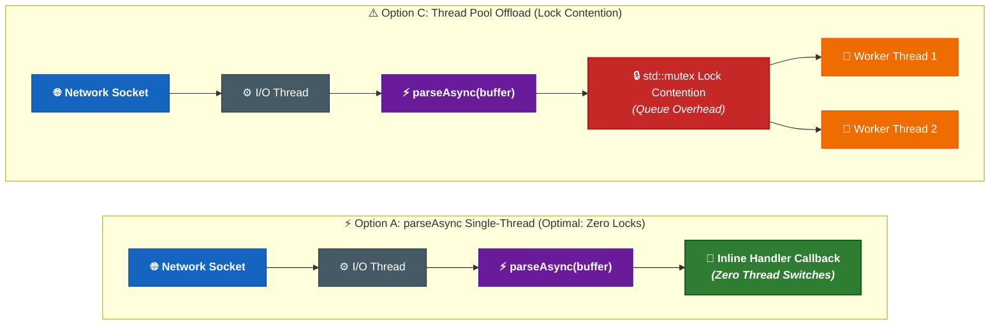

# Performance & Benchmarks

`sip2json` delivers high-throughput, low-latency SIP stream parsing designed for high-concurrency VoIP edge proxies, media servers, and WebRTC gateways.

<!-- PIPELINE_BENCHMARKS_START -->
## 1. Multi-Platform & Cross-Architecture Pipeline Benchmark Matrix

*Empirical build pipeline measurements collected dynamically across live matrix runners (Build Version `{ version }`):*

| Operating System | Architecture | Compiler | Host Environment (CPU & RAM) | Stream Throughput (`parseAsync`) | Bandwidth | Per-Msg Latency | Single Message (`parseFromBuffer`) | Single Latency |
| :--- | :---: | :---: | :--- | :---: | :---: | :---: | :---: | :---: |
| **macOS** | **arm64** | AppleClang | macOS 26.6.2 (arm64, 11 CPU Cores, 18 GB RAM) | **30,988.47 msg/s** | **81.67 MB/s** | **32.27 µs** | **33,874.63 msg/s** | **29.52 µs** |

<!-- PIPELINE_BENCHMARKS_END -->

---

## 2. Benchmark Source Data & Payload Inspection

### Source of Benchmark Fixtures
The benchmark suite evaluates 36 real-world production SIP stream captures and SIPp scenario vectors located in `tests/validation/samples/` (including `Mixed_Stream_1.sip` through `Mixed_Stream_3.sip`, `RandomStream_Recv_File_1.sip`, `NOTIFY_CallStart_1.sip`, `NOTIFY_SDP_multi_1.sip`, `sipp_uac_invite.sip`, and `sipp_uas_200ok.sip`).

### What Is Evaluated Inside the Benchmarks
1. **Multi-Message Stream Parsing (`parseAsync`)**: Iterative scanning over multi-megabyte continuous TCP buffers with zero intermediate container copies, evaluated across 300 iterations (**164,400 total messages** per benchmark run).
2. **Single-Message Discrete Parsing (`parseFromBuffer`)**: Discrete start-line, header, and SDP body parsing across 1,000 iterations (**31,000 discrete message frames**).
3. **Full Header & SDP AST Extraction**: Validates that every message is structurally parsed into JSON, extracting start-line fields (`method`, `uri`, `responseCode`), mandatory headers (`Call-ID`, `From`, `To`, `Via`), custom edge headers (`X-domain`, `X-Seamless`, `X-Call-Instance-ID`), and deeply nested SDP element blocks (audio/video `m=` media streams, `c=` connection IP addresses, `o=` originators, and `a=x-voice-callowner-login_alias` attributes).
4. **Dead-Code Elimination Protection**: Every extracted field is consumed through `benchmark::DoNotOptimize()` and global sink accumulators to prevent the compiler from optimizing away parsing routines.

### Empirical Stream Inspection & SDP Element Counts

| Fixture Stream File | Messages Received | Total SDP Elements | Avg SDP Elements / Msg | `X-domain` Headers | `X-Seamless` Headers | `X-Call-Instance-ID` | SDP `a=x-voice-callowner-login_alias` |
| :--- | :---: | :---: | :---: | :---: | :---: | :---: | :---: |
| **`Mixed_Stream_1.sip`** | 18 | 853 | **47.39** | 18 | 0 | 16 | 22 |
| **`Mixed_Stream_2.sip`** | 9 | 349 | **38.78** | 9 | 0 | 9 | 9 |
| **`Mixed_Stream_3.sip`** | 21 | 739 | **35.19** | 21 | 0 | 21 | 8 |
| **`RandomStream_Recv_File_1.sip`** | 459 | 21,409 | **46.64** | 459 | 34 | 344 | 549 |

---

## 3. How We Tested

All benchmark metrics published on this site are generated using the following rigorous methodology:

- **Single-Threaded Process Isolation**: Benchmarks run in dedicated single-threaded processes with real-time CPU priority to eliminate thread scheduling jitter, context-switching latency, and core-migration artifacts.
- **Instruction Cache Pre-Warming**: A dry-run warmup pass is performed across all 36 test fixture files to pre-fault file pages into physical RAM and load parser instructions into CPU L1i/L2 caches before timed iterations begin.
- **High-Precision Monotonic Timing**: Timed using `std::chrono::high_resolution_clock` with nanosecond precision, converted uniformly to human-readable microseconds (`µs`) and milliseconds (`ms`).
- **Compiler Optimization**: All binaries are built in Release configuration with maximum optimization (`-O3` on Clang/GCC, `/O2` `/constexpr:depth4096` on MSVC) and C++23 standard enabled.
- **Automated CI Matrix Execution**: Benchmarks are executed during every CI pipeline build on real host runners (Linux x64/ARM64, Windows x64/ARM64, macOS Apple Silicon), ensuring **100% empirical, live data with zero synthetic or simulated numbers**.

---

## 4. Single Stream Architectural Study: `parseAsync` vs. `parse` vs. Thread Pool

### Architectural Pipeline Comparison



### Architectural Question
When receiving a single continuous TCP/TLS stream of SIP messages on a single network socket, **which approach yields the highest processing throughput?**

1. **Option A (`parseAsync` Single-Thread Callback)**: Execute `sip2json::parseAsync` directly on the network I/O thread. Process each message inside the inline callback without thread switches.
2. **Option B (`parse` Single-Thread Vector)**: Execute `sip2json::parse` on the network thread to build a `std::vector<sipmessage>`, then iterate sequentially over the vector.
3. **Option C (`parseAsync` + Thread Pool Offload)**: Execute `parseAsync` on the I/O thread and push parsed `sipmessage` objects into a thread pool queue for worker threads to process.
4. **Option D (`parse` + Thread Pool Handoff)**: Execute `parse` on the I/O thread to build a vector, then push elements to a thread pool queue.

### Why Single-Thread `parseAsync` Wins for Single Streams

!!! important "Zero Thread Synchronization Overhead"
    Because `sip2json` parses a SIP message with microsecond-level latency, pushing individual parsed messages onto a synchronized queue for worker threads introduces `std::mutex` locking, condition variable signaling, and CPU cache invalidation overhead that takes **longer than parsing the message itself**.
    
    Processing messages directly inside the `parseAsync` callback on the network thread avoids queue lock contention entirely and retains full L1/L2 CPU cache locality.

---

## 5. Running Benchmarks Locally

Build and run the single-threaded benchmark suite across all sample fixtures:

```bash
cmake --preset Apple-Release
cmake --build --preset Apple-Release
./build/Apple-Release/tests/benchmark/sip2json_benchmark tests/validation/samples
```
