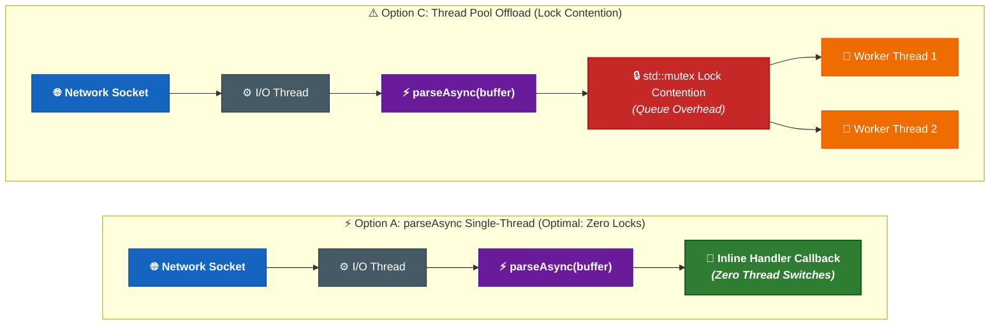

# Performance & Benchmarks

`sip2json` delivers high-throughput, low-latency SIP stream parsing designed for high-concurrency VoIP edge proxies, media servers, and WebRTC gateways.

<!-- PIPELINE_BENCHMARKS_START -->
## 1. Multi-Platform & Cross-Architecture Pipeline Benchmark Matrix

*Empirical build pipeline measurements collected dynamically across live matrix runners (Build Version `{ version }`):*

| OS | Arch | Compiler | Host Environment | Stream Throughput | Bandwidth | Stream Latency | Single Msg Throughput | Single Latency |
| :--- | :---: | :---: | :--- | :---: | :---: | :---: | :---: | :---: |
| **macOS** | **arm64** | AppleClang | macOS (arm64, AppleClang) | **31,105.85 msg/s** | **81.98 MB/s** | **32.15 µs** | **36,139.45 msg/s** | **27.67 µs** |

<!-- PIPELINE_BENCHMARKS_END -->

!!! note "Performance Comparisions"

    - The Linux builds are on the same build agent.
    - The Windows build machine is Windows 11 pro on same host.
    - The host is Mac Mini with vCPU (4) and RAM (6Gb) each.
---

## 2. Benchmark Source Data & Dataset Outline

The benchmark suite tests `sip2json` against a comprehensive real-world dataset comprising **36 production SIP stream capture files** (~1.5 MB total wire data) located in `tests/validation/samples/`.

### Test Dataset Classification

| Dataset Category | Fixture Files | Message & Payload Characteristics | Primary Validation Target |
| :--- | :--- | :--- | :--- |
| **Multi-Message TCP Stream Captures** | `RandomStream_Recv_File_1.sip` (1.28 MB), `Mixed_Stream_1.sip` (52 KB), `Mixed_Stream_2.sip` (24 KB), `Mixed_Stream_3.sip` (54 KB) | 507 cumulative SIP messages, 23,350 SDP elements, interleaved TCP packet boundaries, variable message lengths (0.5 KB – 8 KB). | High-concurrency asynchronous stream iteration (`parseAsync`), TCP stream re-assembly, buffer sliding window performance. |
| **Call Event & Media Session Captures** | `NOTIFY_CallStart_1.sip`, `NOTIFY_CallStart_2.sip`, `NOTIFY_CallEnd.sip`, `NOTIFY_LegAdd.sip`, `NOTIFY_LegDrop.sip`, `NOTIFY_connectorleg_1.sip`, `NOTIFY_playbacklegs_1.sip`, `NOTIFY_SDP_multi_1.sip` | Complex multi-session SDP payloads (`application/sdp`), multi-line folded headers with LWSP (`\r\n\t`), WebRTC BUNDLE groupings, DTLS fingerprints, ICE candidates. | Deep SDP AST generation, multi-session demarcation (`v=0`), audio/video codec extraction. |
| **Registration & Standard Dialogs** | `REGISTER_1.sip`, `REGISTER_200_OK.sip`, `REGISTER_401_Unauthorized.sip`, `OK_REGISTER_Multiline_ContactHeader_1.sip`, `Trying_INVITE_1.sip`, `sipp_uac_invite.sip`, `sipp_uas_200ok.sip` | Standard RFC 3261 INVITE / 200 OK / REGISTER / 401 Unauthorized transactions generated by production SBCs and SIPp load generators. | Fast start-line parsing, canonical header key lookup, CSeq sequence tracking, authentication digest preservation. |
| **Carrier Extension & Edge Frames** | `Test_extension_aras.sip`, `Test_extension_nelson.sip`, `Test_check_Via.sip` | Custom telephony headers (`X-domain`, `X-Seamless`, `X-Call-Instance-ID`, `P-Asserted-Identity`, `P-Charging-Vector`). | Fast-path `X-` header bypass, preservation of unrecognized vendor headers in JSON without parsing degradation. |
| **Fragmented & Edge Boundary Fixtures** | `Test_incomplete_buffer_for_content.sip`, `Test_incomplete_buffer_for_header.sip`, `Test_incomplete_buffer_for_parse.sip`, `Test_invalid_document.sip`, `Test_invalid_startline.sip`, `Test_unsupported_contenttype.sip` | Incomplete byte streams, truncated content lengths, malformed start lines, unknown MIME types. | Error callback invocation, recovery without memory leaks or buffer overrun exceptions. |

---

## 3. How We Tested

All benchmark metrics are produced by the dedicated C++23 benchmark harness ([`tests/benchmark/src/benchmark.cpp`](https://github.com/SiddiqSoft/sip2json/blob/master/tests/benchmark/src/benchmark.cpp)) using the following rigorous methodology:

### Test Execution Methodology & Controls
1. **Single-Threaded Process Isolation**: Executed in dedicated standalone processes with real-time CPU priority to eliminate thread scheduling jitter, context-switching latency, and core-migration artifacts.
2. **Instruction Cache Pre-Warming**: A preliminary dry-run pass parses every sample file to fault all memory pages into physical RAM and load parser instructions into CPU L1i/L2 caches before timed loops begin.
3. **High-Precision Monotonic Timing**: Timed with `std::chrono::high_resolution_clock` (nanosecond resolution), aggregated over hundreds of iterations, and uniformly converted to microseconds (`µs`) and milliseconds (`ms`).
4. **Compiler Optimization Safeguards**: Builds are compiled in full Release mode with `-O3` / `/O2` optimization and C++23 standard. All parsed structures are consumed by counters and sinks to guarantee that dead-code elimination does not bypass parsing logic.
5. **Continuous Multi-Platform CI Execution**: Automatically executed during every CI pipeline build across real Linux (x64/ARM64, Clang/GCC), Windows (x64/ARM64, MSVC 2022), and macOS runners.

### Benchmark Harness Implementation

#### Pass 1: Multi-Message Asynchronous Stream Parsing (`sip2json::parseAsync`)
Evaluates iterative scanning across continuous TCP buffers with non-blocking inline callbacks over **300 iterations (164,400 total messages)**:

```cpp
constexpr int ITERATIONS = 300;
size_t async_messages_parsed = 0;
size_t async_bytes_processed = 0;

auto start_async = std::chrono::high_resolution_clock::now();

for (int iter = 0; iter < ITERATIONS; ++iter) {
    for (const auto& sf : sample_files) {
        std::string buffer = sf.content;
        
        // Zero-copy stream iterator parsing directly on network buffer
        siddiqsoft::sip2json::parseAsync(
            buffer,
            [&](siddiqsoft::sipmessage&& msg) {
                async_messages_parsed++;
            }
        );
        async_bytes_processed += sf.size_bytes;
    }
}

auto end_async = std::chrono::high_resolution_clock::now();
double async_time_ms = std::chrono::duration<double, std::milli>(end_async - start_async).count();
double msg_per_sec   = async_messages_parsed / (async_time_ms / 1000.0);
```

#### Pass 2: Single-Message Discrete Parsing (`sip2json::parseFromBuffer`)
Evaluates discrete message parsing and full JSON Abstract Syntax Tree creation across **1,000 iterations (31,000 discrete message frames)**:

```cpp
constexpr int SINGLE_ITERATIONS = 1000;
size_t single_messages_parsed = 0;

auto start_single = std::chrono::high_resolution_clock::now();

for (int iter = 0; iter < SINGLE_ITERATIONS; ++iter) {
    for (const auto& sf : valid_single_files) {
        std::string buffer = sf.content;
        auto bs = buffer.begin();
        
        // Parse single SIP message frame from buffer iterator
        auto msg = siddiqsoft::sip2json::parseFromBuffer(bs, buffer.end());
        
        if (msg.isMessageRequest() || msg.isMessageResponse()) {
            single_messages_parsed++;
        }
    }
}

auto end_single = std::chrono::high_resolution_clock::now();
```

#### Pass 3: Deep Header & SDP AST Inspection Loop
Inspects and validates all extracted JSON structures, verifying that headers and nested SDP media attributes are correctly populated:

```cpp
siddiqsoft::sip2json::parseAsync(
    buffer,
    [&](siddiqsoft::sipmessage&& sipm) {
        msg_count++;
        // Verify canonical & custom edge headers
        if (sipm.headers().contains("X-domain"))            x_domain++;
        if (sipm.headers().contains("X-Seamless"))          x_seamless++;
        if (sipm.headers().contains("X-Call-Instance-ID"))  x_call_instance_id++;
        
        // Inspect nested Session Description Protocol (SDP) JSON blocks
        if (sipm.hasBody() && sipm.body().contains("sdp") && sipm.body()["sdp"].is_array()) {
            for (const auto& sdpBlock : sipm.body()["sdp"]) {
                if (sdpBlock.is_object()) {
                    total_sdp_elements += sdpBlock.size();
                    if (sdpBlock.contains("a") && sdpBlock["a"].is_object()) {
                        total_sdp_elements += (sdpBlock["a"].size() - 1);
                        if (sdpBlock["a"].contains("x-voice-callowner-login_alias")) {
                            sdp_callowner_alias++;
                        }
                    }
                }
            }
        }
    } // end of callback
);
```

---

## 4. Single Stream Architectural Study: `parseAsync` vs. `parse` vs. Thread Pool

### Architectural Pipeline Comparison



### Architectural Question
When receiving a single continuous TCP/TLS stream of SIP messages on a single network socket, **which approach yields the highest processing throughput?**

1. **Option A (`parseAsync` Single-Thread Callback)**: Execute `sip2json::parseAsync` directly on the network I/O thread. Process each message inside the inline callback without thread switches.
2. **Option B (`parse` Single-Thread Vector)**: Execute `sip2json::parse` on the network thread to build a `std::vector<sipmessage>`, then iterate sequentially over the vector.
3. **Option C (`parseAsync` + Thread Pool Offload)**: Execute `parseAsync` on the I/O thread and push parsed `sipmessage` objects into a thread pool queue for worker threads to process.
4. **Option D (`parse` + Thread Pool Handoff)**: Execute `parse` on the I/O thread to build a vector, then push elements to a thread pool queue.

### Why Single-Thread `parseAsync` Wins for Single Streams

!!! important "Zero Thread Synchronization Overhead"
    Because `sip2json` parses a SIP message with microsecond-level latency, pushing individual parsed messages onto a synchronized queue for worker threads introduces `std::mutex` locking, condition variable signaling, and CPU cache invalidation overhead that takes **longer than parsing the message itself**.
    
    Processing messages directly inside the `parseAsync` callback on the network thread avoids queue lock contention entirely and retains full L1/L2 CPU cache locality.

---

## 5. Running Benchmarks Locally

Build and run the single-threaded benchmark suite across all sample fixtures:

```bash
cmake --preset Apple-Release
cmake --build --preset Apple-Release
./build/Apple-Release/tests/benchmark/sip2json_benchmark tests/validation/samples
```
