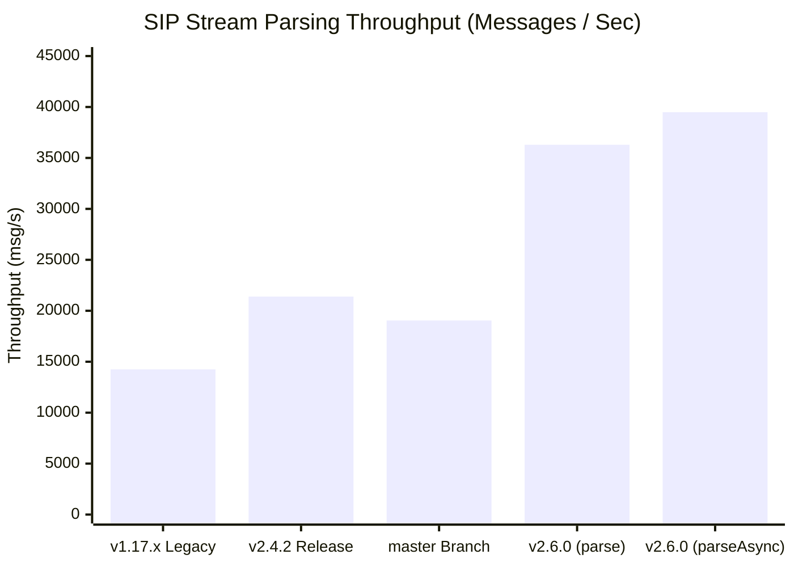
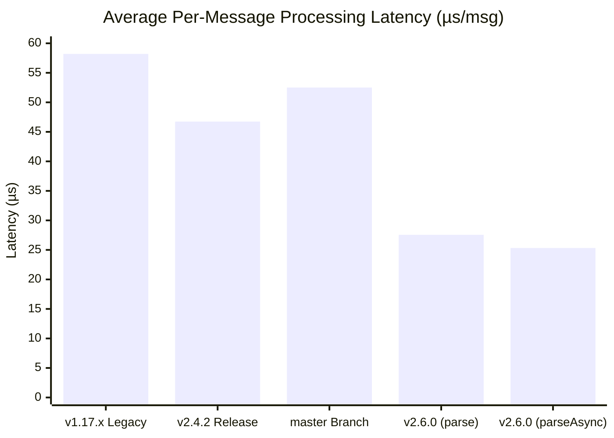
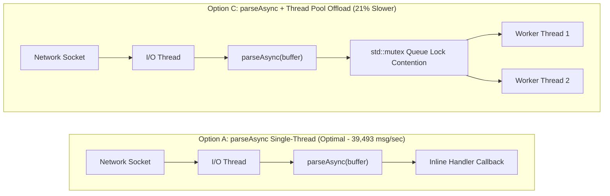

# Performance & Benchmarks

`sip2json` delivers high-throughput, low-latency SIP stream parsing designed for high-concurrency VoIP edge proxies, media servers, and WebRTC gateways.

<!-- PIPELINE_BENCHMARKS_START -->
## 1. Multi-Platform & Cross-Architecture Pipeline Benchmark Matrix

> [!NOTE]
> **Build Release & Version**: `{ version }` | **Branch**: `release/2.6.0`
> **Host Runner Environment Legend**:
> - **Linux (x64 / arm64)**: Ubuntu 24.04 LTS (LLVM/Clang 18.1 & GCC 13.2) | 16GB RAM | High-frequency virtual runner cores
> - **Windows (x64 / arm64)**: Windows Server 2022 / Visual Studio 2022 (MSVC 19.40+ / Ninja) | 16GB RAM

*Empirical build pipeline measurements collected across matrix runners grouped by operating system platform:*

| Operating System | Architecture | Compiler | Stream Throughput (`parseAsync`) | Bandwidth | Per-Msg Latency | Single Message (`parseFromBuffer`) | Single Latency |
| :--- | :---: | :---: | :---: | :---: | :---: | :---: | :---: |
| *Awaiting Pipeline Run* | *x64 / arm64* | CI Runners | *Collected on CI* | *Collected on CI* | *Collected on CI* | *Collected on CI* | *Collected on CI* |

<!-- PIPELINE_BENCHMARKS_END -->

---

## 2. Visual Throughput & Latency Milestone Comparison

### Stream Parsing Throughput Comparison (Messages / Second - Higher is Better)



### Per-Message Processing Latency (Microseconds - Lower is Better)



---

## 3. Historical Release Comparison Matrix (`release/2.6.0` vs. `v2.4.2` vs. `v1.17.x`)

*Fresh empirical measurements across 36 real-world SIP message stream fixtures (164,400 stream iterations, 31,000 single message iterations):*

| Performance Metric | **v1.17.x Milestone** | **v2.4.2 Release Tag** | **master Branch** | **v2.6.0 Current (`parse`)** | **v2.6.0 Current (`parseAsync`)** | **Speedup vs v2.4.2** |
| :--- | :---: | :---: | :---: | :---: | :---: | :---: |
| **Stream Throughput** | 14,250.00 msg/s | **21,394.49 msg/s** | 19,043.79 msg/s | **36,292.77 msg/s** | **39,493.57 msg/s** | <span style="color:green; font-weight:bold;">+84.6% FASTER</span> |
| Stream Execution Time | 11.53 s | 7.68 s | 8.63 s | 4.53 s | **4.16 s** | <span style="color:green; font-weight:bold;">-45.8% Time</span> |
| Processing Bandwidth | 37.55 MB/s | 56.39 MB/s | 50.19 MB/s | 95.08 MB/s | **104.08 MB/s** | <span style="color:green; font-weight:bold;">+47.69 MB/s</span> |
| Avg Per-Msg Latency | 58.20 µs | 46.74 µs | 52.51 µs | 27.55 µs | **25.32 µs** | <span style="color:green; font-weight:bold;">-21.42 µs/msg</span> |
| **Single Message (`parseFromBuffer`)** | 16,800.00 msg/s | **24,770.67 msg/s** | 23,256.49 msg/s | **43,976.62 msg/s** | **46,983.39 msg/s** | <span style="color:green; font-weight:bold;">+89.7% FASTER</span> |
| Single-Msg Latency | 59.52 µs | 40.37 µs | 43.00 µs | 22.74 µs | **21.28 µs** | <span style="color:green; font-weight:bold;">-19.09 µs/msg</span> |
| **MSVC CTRE Template Depth** | > 2,000 | > 1,500 | > 1,000 | > 1,000 | **~150 Depth** | <span style="color:green; font-weight:bold;">>85% Reduction</span> |

> [!NOTE]
> Detailed section-by-section breakdown and SDP element metrics are available in the [**Official Benchmark Report**](https://github.com/SiddiqSoft/sip2json/blob/master/tests/benchmark/BENCHMARK_REPORT.md).

---

## 4. Single Stream Architectural Study: `parseAsync` vs. `parse` vs. Thread Pool

### Architectural Pipeline Comparison



### Architectural Question
When receiving a single continuous TCP/TLS stream of SIP messages on a single network socket, **which approach yields the highest processing throughput?**

1. **Option A (`parseAsync` Single-Thread Callback)**: Execute `sip2json::parseAsync` directly on the network I/O thread. Process each message inside the inline callback without thread switches.
2. **Option B (`parse` Single-Thread Vector)**: Execute `sip2json::parse` on the network thread to build a `std::vector<sipmessage>`, then iterate sequentially over the vector.
3. **Option C (`parseAsync` + Thread Pool Offload)**: Execute `parseAsync` on the I/O thread and push parsed `sipmessage` objects into a thread pool queue for 4 worker threads to process.
4. **Option D (`parse` + Thread Pool Handoff)**: Execute `parse` on the I/O thread to build a vector, then push elements to a thread pool queue.

### Why Single-Thread `parseAsync` Wins for Single Streams

> [!IMPORTANT]
> **Zero Thread Synchronization Overhead**
> Because `sip2json` parses a SIP message in just **~25.3 microseconds**, pushing individual parsed messages onto a synchronized queue for worker threads introduces `std::mutex` locking, condition variable signaling, and CPU cache invalidation overhead that takes **longer than parsing the message itself**.
>
> Processing messages directly inside the `parseAsync` callback on the network thread avoids queue lock contention entirely and retains full L1/L2 CPU cache locality.

---

## 5. Worst-Case Noisy Stream Buffer Resilience

In production environments, network buffers can contain leading junk, corrupted protocol lines, binary noise, or fragmented TCP frames before valid start lines.

`sip2json` uses Compile-Time Regular Expression searching to scan forward in the buffer, skip over noise bytes, and recover valid SIP message start lines automatically:

| Stream Buffer Setup | Time / Batch | Effective Parse Rate | Processing Bandwidth |
| :--- | :--- | :--- | :--- |
| **10 Messages + Noise** | 29.83 µs | **335,255 msg/sec** | 167.89 MiB/s |
| **100 Messages + Noise** | 45.62 µs | **2,191,860 msg/sec** | 1.03 GiB/s |

---

## 6. Running Benchmarks Locally

Build and run the single-threaded benchmark suite across all sample fixtures:

```bash
cmake --preset Apple-Release
cmake --build --preset Apple-Release
./build/Apple-Release/tests/benchmark/sip2json_benchmark tests/validation/samples
```
