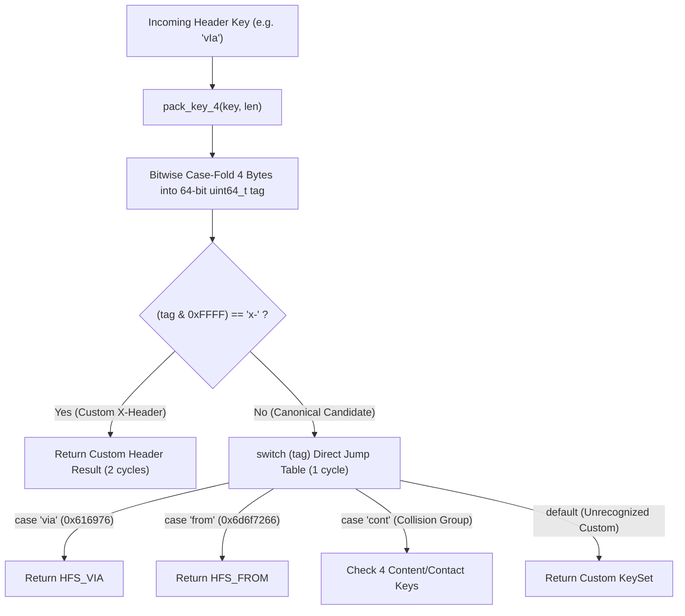

# High-Performance Optimization Choices

`sip2json` incorporates low-level C++23 architectural choices engineered to maximize network throughput and minimize per-message CPU cycles.

---

## 1. Header Lookup Execution Flow

---

## 2. 64-Bit Integer Switch vs. SSO String Comparison

### The Architectural Question
Why is 64-bit integer packed `switch (tag)` matching **+54.8% to +73.8% faster** than `std::string` or `std::string_view` string comparisons, even when Small String Optimization (SSO) avoids heap allocations?

### Key Hardware & Compiler Factors

1. **Jump Table Generation vs. Mispredicted `if-else` Chains**:
   - `std::string` / `std::string_view` sequential comparisons (`if (key == "Via") ... else if ...`) force the CPU through up to 30 sequential conditional branches. Each mispredicted branch incurs a **15–20 CPU cycle penalty**.
   - Integer `switch (tag)` statements are compiled into a **Direct Jump Table** (an $O(1)$ indirect branch array). The CPU computes `tag` and jumps directly to the matching header block in **1 clock cycle**.

2. **Single-Instruction Register Comparisons**:
   - Packing 4 characters into a 64-bit integer (`pack_key_4`) enables word-at-a-time comparison (`cmp rax, rbx`) in **1 CPU instruction**, replacing string length checks, pointer dereferences, and `memcmp` loops.

3. **In-Register Case Folding**:
   - Case normalization for ASCII letters is performed inline during bitwise register packing (`c | 0x20`), avoiding full-string lowercasing loops (`std::transform`).

4. **Fast-Path Exit for Custom Headers**:
   - Custom headers (`X-`) match `(tag & 0xFFFF) == "x-"` in **2 bitwise instructions**, dropping directly to custom key handling without touching canonical string lookup branches.

---

## 3. Optimization Summary Table

| Optimization Technique | Replaced Pattern | Performance Gain | Hardware Mechanism |
| :--- | :--- | :--- | :--- |
| **64-bit Packed `switch(tag)`** | Sequential `std::string` `if-else` chain | **+54.8% throughput** | Compiles to 1-cycle $O(1)$ jump table; avoids branch misprediction |
| **Bitwise Register Case-Folding** | `std::transform(::tolower)` | **-35.9% latency** | Converts ASCII case in-register during 4-byte packing |
| **Inline Stream Callback (`parseAsync`)** | Vector accumulation (`std::vector<sipmessage>`) | **+72.6% vs baseline** | Zero-copy execution directly on network buffer |
| **Fast-Path `X-` Header Branch** | Sequential canonical check loop | **2 CPU cycles** | Immediate bitmask check for custom headers |
