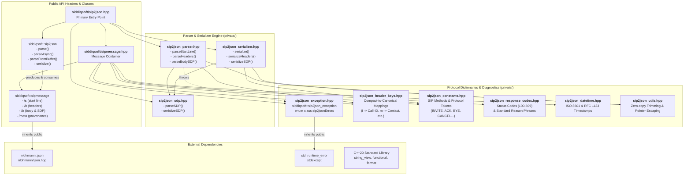

# sip2json

<div class="hero-section">
  <div class="hero-tagline">Fast, zero-copy SIP &amp; SDP parser and serializer for Modern C++</div>
  <div class="hero-badges">
    <a href="https://dev.azure.com/siddiqsoft/siddiqsoft/_build/latest?definitionId=21&amp;branchName=master"></a>
    <a href="https://www.nuget.org/packages/SiddiqSoft.sip2json/"></a>
    <a href="https://www.nuget.org/packages/SiddiqSoft.sip2json/"></a>
    <a href="https://dev.azure.com/siddiqsoft/siddiqsoft/_build/latest?definitionId=21&amp;branchName=master"></a>
    <a href="https://en.cppreference.com/w/cpp/20"></a>
    <a href="license/"></a>
    <a href="https://datatracker.ietf.org/doc/html/rfc3261"></a>
    <a href="https://datatracker.ietf.org/doc/html/rfc4475"></a>
    <a href="https://datatracker.ietf.org/doc/html/rfc8866"></a>
  </div>
</div>

<div class="feature-grid" markdown="1">

<div class="feature-col-left" markdown="1">

### Overview

`sip2json` parses Session Initiation Protocol (SIP, RFC 3261) and Session Description Protocol (SDP, RFC 4566 / RFC 8866) streams into structured `nlohmann::json` documents.

Designed for high-throughput telecom proxies, log analysis, event streaming, and modern document databases.

- **Header-only**: Single `#include <siddiqsoft/sip2json.hpp>`, zero compilation units
- **Zero-copy views**: Parses non-owning `std::string_view` buffers with zero intermediate allocations
- **Native JSON**: `sipmessage` extends `nlohmann::json` for direct schema mapping
- **Streaming parser**: `parseAsync` processes multiple frames in one call, advancing the view past consumed data
- **Zero regex**: Linear-time delimiter scanning eliminates backtracking overhead
- **Multi-platform**: Verified on Windows (MSVC), macOS (AppleClang), and Linux (GCC, Clang)

</div>

<div class="feature-col-right" markdown="1">

### Quick Integration

=== "CPM.cmake"

    ```cmake
    include(cmake/CPM.cmake)
    CPMAddPackage("gh:SiddiqSoft/sip2json#{ tag_version }")
    target_link_libraries(my_target PRIVATE sip2json::sip2json)
    ```

=== "FetchContent"

    ```cmake
    include(FetchContent)
    FetchContent_Declare(
        sip2json
        GIT_REPOSITORY https://github.com/SiddiqSoft/sip2json.git
        GIT_TAG        { tag_version }
    )
    FetchContent_MakeAvailable(sip2json)
    target_link_libraries(my_target PRIVATE sip2json::sip2json)
    ```

=== "NuGet"

    ```powershell
    Install-Package SiddiqSoft.sip2json
    ```

<table class="quick-info-table">
  <tbody>
    <tr>
      <td><strong>Language</strong></td>
      <td>C++20 minimum (<code>/std:c++20</code> or <code>-std=c++20</code>)</td>
    </tr>
    <tr>
      <td><strong>Core Dependency</strong></td>
      <td><a href="https://github.com/nlohmann/json"><code>nlohmann/json</code></a> v3.12.0 (<code>INTERFACE</code>)</td>
    </tr>
    <tr>
      <td><strong>Standards</strong></td>
      <td>RFC 3261 (SIP), RFC 4566/8866 (SDP), RFC 4475 (Torture 50/50)</td>
    </tr>
  </tbody>
</table>

</div>

<div class="feature-span-all" markdown="1">

### Usage Examples

=== "Parse Stream (std::string_view)"

    ```cpp
    #include <iostream>
    #include <string_view>
    #include <siddiqsoft/sip2json.hpp>

    void handleIncomingBuffer(std::string_view& buffer) {
        // Asynchronously decodes frames; advances buffer view past consumed data
        siddiqsoft::sip2json::parseAsync(
            buffer,
            [](siddiqsoft::sipmessage&& msg) {
                std::cout << msg.getMethodView() << " " << msg.getUriView() << "\n"
                          << "Call-ID: " << msg.getCallIDView() << "\n";
            }
        );
    }
    ```

=== "JSON Document Metaphor"

    ```json
    {
      "s": {
        "type": "request",
        "method": "INVITE",
        "uri": "sip:user@example.com",
        "version": "SIP/2.0"
      },
      "h": {
        "Call-ID": "c30382-990-12@10.0.0.1",
        "CSeq": "1 INVITE",
        "From": "sip:caller@example.com;tag=991a",
        "To": "sip:user@example.com",
        "Via": [
          "SIP/2.0/TCP 10.0.0.1:5060;branch=z9hG4bK776"
        ],
        "Content-Length": 0
      },
      "meta": {
        "version": "sip2json/{ semver }/1.0.2",
        "time": "2026-09-07T12:00:00.000Z",
        "ttx": 0
      }
    }
    ```

=== "Serialize Message"

    ```cpp
    #include <iostream>
    #include <siddiqsoft/sip2json.hpp>

    int main() {
        siddiqsoft::sipmessage msg(
            siddiqsoft::METHOD_INVITE,
            "sip:user@example.com",
            "call-id-998",
            1
        );
        msg.setHeader(siddiqsoft::HF_FROM, "sip:caller@example.com")
           .setHeader(siddiqsoft::HF_TO, "sip:user@example.com");

        std::string wire = siddiqsoft::sip2json::serialize(msg);
        std::cout << wire << "\n";
    }
    ```

=== "Single Datagram (`parseFromBuffer`)"

    ```cpp
    #include <iostream>
    #include <string_view>
    #include <siddiqsoft/sip2json.hpp>

    int main() {
        std::string_view datagram =
            "SIP/2.0 200 OK\r\n"
            "Via: SIP/2.0/UDP 192.168.1.1:5060;branch=z9hG4bK-1\r\n"
            "Call-ID: reg-101\r\n"
            "CSeq: 1 REGISTER\r\n"
            "Content-Length: 0\r\n\r\n";

        auto msg = siddiqsoft::sip2json::parseFromBuffer(datagram);
        std::cout << msg.getStatusCode() << " " << msg.getReasonView() << "\n";
    }
    ```

</div>

</div>

## Architecture & Component Relationships

Relationship topology connecting public API entry points, domain models, internal parsing and serialization engines, and protocol dictionaries:



| Component | File Path | Class / Responsibility |
| :--- | :--- | :--- |
| **Parser &amp; Serializer Facade** | [`siddiqsoft/sip2json.hpp`](api/sip2json.md) | Static entry-point class [`siddiqsoft::sip2json`](api/sip2json.md) for streaming, buffer consumption, and wire serialization. |
| **Message DTO** | [`siddiqsoft/sipmessage.hpp`](api/sipmessage.md) | Document model [`siddiqsoft::sipmessage`](api/sipmessage.md) extending `nlohmann::json` with typed accessors. |
| **Stream Parser Engine** | `siddiqsoft/private/sip2json_parser.hpp` | High-throughput linear token scanner for start line, headers, and payload dispatch. |
| **Wire Serializer Engine** | `siddiqsoft/private/sip2json_serializer.hpp` | RFC 3261 compliance serializer formatting headers and body into CRLF-separated byte streams. |
| **SDP Processor** | [`siddiqsoft/private/sip2json_sdp.hpp`](api/json_schema.md) | RFC 4566 / RFC 8866 Session Description Protocol parser and JSON serializer. |
| **Diagnostic Errors** | [`siddiqsoft/private/sip2json_exception.hpp`](api/errors.md) | Exception [`siddiqsoft::sip2json_exception`](api/errors.md) (derives `std::runtime_error`) and [`sip2jsonErrors`](api/errors.md). |
| **Header Key Dispatch** | `siddiqsoft/private/sip2json_header_keys.hpp` | Case-insensitive mapping and compact single-character alias expansion. |
| **Protocol Constants** | `siddiqsoft/private/sip2json_constants.hpp` | RFC 3261 standard method identifiers, version literals, and syntax delimiters. |
| **Status Codes** | `siddiqsoft/private/sip2json_response_codes.hpp` | Numeric status code definitions (100-699) and reason phrase lookup tables. |
| **Timestamp Utilities** | `siddiqsoft/private/sip2json_datetime.hpp` | High-precision ISO 8601 and RFC 1123 datetime generators for message metadata. |
| **Buffer Utilities** | `siddiqsoft/private/sip2json_utils.hpp` | Zero-copy string view trimming, token escaping, and delimiter searching helpers. |

## Documentation Sections

<div class="grid" markdown="1">

<div class="card" markdown="1">

### [Getting Started](quickstart/index.md)

Integration instructions for CPM, CMake FetchContent, and NuGet. Includes verified system requirements, compiler targets, and dependencies breakdown.

[Go to Getting Started :octicons-arrow-right-24:](quickstart/index.md)

</div>

<div class="card" markdown="1">

### [API Reference](api/index.md)

Complete Doxygen-derived API reference for `siddiqsoft::sip2json`, `siddiqsoft::sipmessage`, diagnostic error codes, and JSON schema.

[Go to API Reference :octicons-arrow-right-24:](api/index.md)

</div>

<div class="card" markdown="1">

### [Related Pages](architecture/benchmarks.md)

Project architecture, multi-platform pipeline benchmarks, stream mechanics, standards compliance, and maintainer guide.

[Go to Related Pages :octicons-arrow-right-24:](architecture/benchmarks.md)

</div>

</div>
