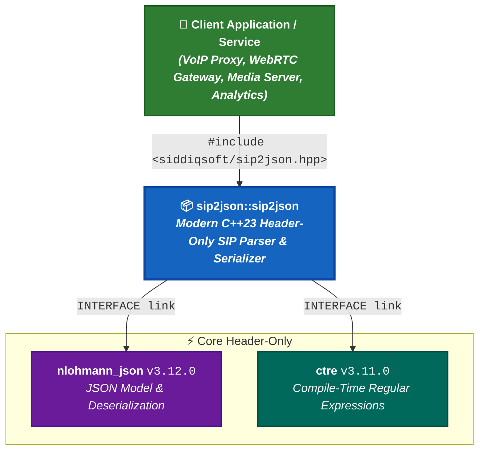

# Project Dependencies & Architecture Hierarchy

`sip2json` is a lightweight, zero-binary-bloat, **header-only Modern C++23 library**. Dependencies are managed declaratively via [CPM.cmake](https://github.com/cpm-cmake/CPM.cmake) and cached automatically across local and CI builds.

## Dependency Architecture Diagram

---

## Detailed Dependency Breakdown

As of Version `{ version }`

| Dependency | Version | CPM Scope / Target | Description |
| :--------- | :-----: | :------------- | :--- |
| [**nlohmann_json**](https://github.com/nlohmann/json) | `v3.12.0` | All Platforms (`INTERFACE`) | First-class JSON object model and DOM serialization |
| [**ctre**](https://github.com/hanickadot/compile-time-regular-expressions) | `v3.11.0` | All Platforms (`INTERFACE`) | Fast compile-time regular expression evaluation engine |
