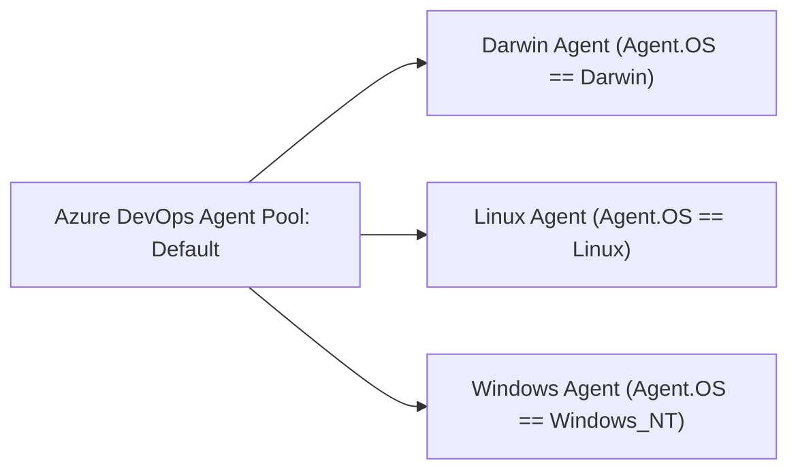

# Self-Hosted Build Agent Requirements

Requirements, toolchain dependencies, and operating system configuration for self-hosted CI build agents.

---

## Agent Pool & Demand Mapping

All build agents must be registered in the `Default` pool and expose the required `Agent.OS` demand:



---

## 1. Darwin (macOS) Agents

* **Demand**: `Agent.OS -equals Darwin`
* **Operating System**: macOS Sonoma (14+) on Apple Silicon (`arm64`) or Intel (`x64`).
* **Toolchain**: Xcode 15+ / Command Line Tools (`AppleClang 15+`). Presets and build files automatically resolve direct compiler binaries, coexisting seamlessly with any `xcode-select` setting.
* **Utilities**:
  * CMake 3.29+
  * Ninja 1.11+
  * Python 3.10+
  * Doxygen (for XML generation)
  * MkDocs (`pip install -r docs/requirements.txt`)
* *Note: No external Homebrew LLVM installation required.*

---

## 2. Linux Agents

* **Demand**: `Agent.OS -equals Linux`
* **Operating System**: Red Hat Enterprise Linux (RHEL 9+), Rocky Linux 9+, or Ubuntu 22.04+ on `x64` or `arm64`.
* **Toolchain**:
  * GCC 13+ (`/usr/bin/gcc`, `/usr/bin/g++`)
  * Clang 17+ (`/usr/bin/clang`, `/usr/bin/clang++`)
* **Utilities**:
  * CMake 3.29+
  * Ninja 1.11+
  * Python 3.10+
  * `gcovr` (for test coverage reports)
  * Doxygen
  * MkDocs (`pip install -r docs/requirements.txt`)
* *Note: Documentation publication (`PublishDocs`) executes on Linux or macOS agents, skipping gracefully if MkDocs is not installed.*

---

## 3. Windows Agents

* **Demand**: `Agent.OS -equals Windows_NT`
* **Operating System**: Windows 11 or Windows Server 2022 (`x64` or `arm64`).
* **Toolchain**: Visual Studio 2022 (MSVC v143+), Windows 11 SDK.
* **Prerequisites**:
  Execute [`scripts/prep_windows_machine.ps1`](https://github.com/SiddiqSoft/sip2json/blob/master/scripts/prep_windows_machine.ps1) as Administrator to configure long path support:
  ```powershell
  Set-ItemProperty -Path "HKLM:\SYSTEM\CurrentControlSet\Control\FileSystem" -Name "LongPathsEnabled" -Value 1
  git config --system core.longpaths true
  ```
* **Environment Helper**:
  For local command-line shells, initialize MSVC tools via [`scripts/init_msvc_env.ps1`](https://github.com/SiddiqSoft/sip2json/blob/master/scripts/init_msvc_env.ps1) or [`scripts/init_msvc_env.bat`](https://github.com/SiddiqSoft/sip2json/blob/master/scripts/init_msvc_env.bat).

---

## Related Topics

* [**CI/CD Pipelines**](pipelines.md): Pipeline stages and trigger matrix
* [**CMake Presets**](cmake_presets.md): Presets executed on each agent
* [**Release & Publication**](releases.md): Package and documentation publication flow
