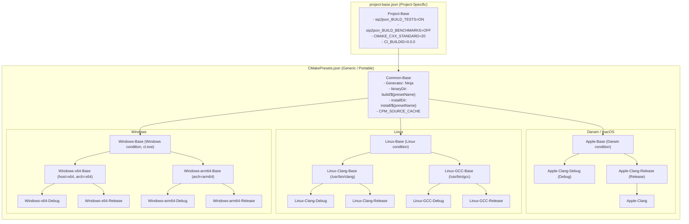

# CMake Presets Architecture

CMake Presets organization, separation of concerns, and comprehensive reference for `siddiqsoft::sip2json`.

---

## Presets Hierarchy

The repository employs a decoupled, highly reusable CMake Presets structure separated across two files:



---

## Architectural Separation of Concerns

1. **[`project-base.json`](https://github.com/SiddiqSoft/sip2json/blob/master/project-base.json)**:
   - Holds all **per-project settings** (e.g. `sip2json_BUILD_TESTS`, `CMAKE_CXX_STANDARD: 20`, `CI_BUILDID: 0.0.0`).
   - Project maintainers configure project-specific variables here without altering toolchain presets.

2. **[`CMakePresets.json`](https://github.com/SiddiqSoft/sip2json/blob/master/CMakePresets.json)**:
   - Contains **zero project-specific names or flags**.
   - Fully portable and reusable across any C++20/23 library or service repository.
   - Defines platform bases (`Apple-Base`, `Linux-Base`, `Windows-Base`) and standardized `Test-Base` execution rules.

---

## Available Presets Quick Reference

### Configure Presets

| Preset Name | Platform | Compiler | Build Type | Notes |
| :--- | :--- | :--- | :--- | :--- |
| `Apple-Clang-Debug` | macOS | AppleClang | Debug | Native Xcode / Command Line Tools (enables clang-format) |
| `Apple-Clang-Release` | macOS | AppleClang | Release | Native Xcode / Command Line Tools |
| `Apple-Clang` | macOS | AppleClang | Release | Default Apple release alias |
| `Linux-Clang-Debug` | Linux | Clang (`/usr/bin/clang++`) | Debug | Clang toolchain |
| `Linux-Clang-Release` | Linux | Clang (`/usr/bin/clang++`) | Release | Clang toolchain |
| `Linux-Clang` | Linux | Clang (`/usr/bin/clang++`) | Release | Clang release alias |
| `Linux-GCC-Debug` | Linux | GCC (`/usr/bin/g++`) | Debug | GCC toolchain |
| `Linux-GCC-Release` | Linux | GCC (`/usr/bin/g++`) | Release | GCC toolchain |
| `Linux-GCC` | Linux | GCC (`/usr/bin/g++`) | Release | GCC release alias |
| `Windows-x64-Debug` | Windows | MSVC (`cl.exe`) | Debug | x64 architecture, host=x64 |
| `Windows-x64-Release` | Windows | MSVC (`cl.exe`) | Release | x64 architecture, host=x64 |
| `Windows-x64` | Windows | MSVC (`cl.exe`) | Release | Windows x64 release alias |
| `Windows-arm64-Debug` | Windows | MSVC (`cl.exe`) | Debug | ARM64 cross/native compilation |
| `Windows-arm64-Release` | Windows | MSVC (`cl.exe`) | Release | ARM64 cross/native compilation |
| `Windows-arm64` | Windows | MSVC (`cl.exe`) | Release | Windows ARM64 release alias |

---

## CLI Usage Examples

```bash
# 1. Configure with your platform preset:
cmake --preset Apple-Clang-Release

# 2. Build all targets:
cmake --build --preset Apple-Clang-Release

# 3. Run unit tests with parallel worker threads:
ctest --preset Apple-Clang-Release -j 4 --output-on-failure
```

---

## Related Topics

* [**Maintainer Guide**](maintainer_guide.md): Codebase architecture, source mapping, and bulk formatting
* [**Development Workflow**](workflow.md): Step-by-step local workflow and macOS toolchain configuration
* [**CI/CD Pipelines**](pipelines.md): Automated CI builds using these presets
