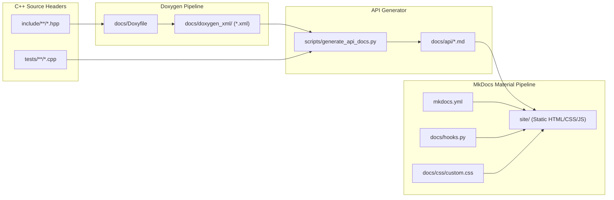

# Documentation Architecture & Customization Guide

Architecture, Doxygen XML extraction pipeline, design tokens, syntax highlighting, and local preview workflow.

---

## 1. Documentation Pipeline Architecture

The documentation system implements a standardized, accessible architecture powered by **Doxygen XML**, **MkDocs Material**, and a tokenized **CSS Design System**. It is designed to be extractable and reusable across all projects via the [`cxxtemplate`](https://github.com/SiddiqSoft/cxxtemplate) repository.



---

## 2. Building & Previewing Documentation Locally

Maintainers can preview and validate documentation changes locally before pushing:

### Live-Reload Development Server

```bash
# Activate Python environment and install requirements
source venv/bin/activate
pip install -r docs/requirements.txt

# Start live-reloading server
mkdocs serve
```

* **Local URL**: Open [`http://127.0.0.1:8000/`](http://127.0.0.1:8000/) in your browser.
* **Live Reload**: Any edits saved in `docs/` files update automatically in real time.

---

### Strict Build Validation

Verify there are zero broken links or markdown syntax issues:

```bash
mkdocs build --strict
```

The output compiles into `site/`. Open `site/index.html` directly in any browser.

---

### Updating Benchmark Data Prior to Serving

```bash
python3 scripts/publish_benchmarks.py
mkdocs serve
```

---

## 3. Typography & Sizing Tokens

Primary typeface families are declared in [`mkdocs.yml`](https://github.com/SiddiqSoft/sip2json/blob/master/mkdocs.yml) under `theme.font`. Material for MkDocs fetches these via Google Fonts:

```yaml
theme:
  font:
    text: Roboto         # Primary prose typeface
    code: JetBrains Mono # Monospace code & signature typeface
```

All typography dimensions, line heights, and element bindings are centralized at the top of [`docs/css/custom.css`](https://github.com/SiddiqSoft/sip2json/blob/master/docs/css/custom.css):

```css
:root {
  /* Typefaces: Inherits mkdocs.yml font with cross-platform system fallbacks */
  --font-family-main: var(--md-text-font, Roboto), -apple-system, BlinkMacSystemFont, "Segoe UI", "Helvetica Neue", Arial, sans-serif;
  --font-family-code: var(--md-code-font, "JetBrains Mono"), SFMono-Regular, Consolas, Menlo, Monaco, monospace;

  /* Standard Display Sizing (Default base: 0.94rem) */
  --font-size-base: 0.94rem;    /* Body copy, member documentation, descriptions */
  --font-size-code: 0.82rem;    /* Inline code, pre blocks, signatures, types */
  --font-size-nav: 0.84rem;     /* Sidebar navigation items and tabs */
  --font-size-table: 0.82rem;   /* API summary matrices and parameter tables */
  --font-size-h1: 1.55rem;      /* Page title */
  --font-size-h2: 1.25rem;      /* Section headings */
  --font-size-h3: 1.02rem;      /* Subsection headings */
  --font-size-h4: 0.92rem;      /* Detail headings */
  --line-height-base: 1.55;
  --line-height-code: 1.48;

  /* Material for MkDocs Typography Variable Bindings */
  --md-font-main: var(--font-family-main);
  --md-font-code: var(--font-family-code);
  --md-typeset-font-size: var(--font-size-base);
  --md-typeset-line-height: var(--line-height-base);
}
```

### Browser Accessibility & Native Zoom Compatibility
* **Relative Units Only (`rem`/`em`)**: All typography properties strictly reference `rem` or `em`. Root `html` is never hardcoded with fixed pixel dimensions (e.g. `16px`).
* **Preserves User Zoom**: If a user increases their browser default font size or zooms the viewport (`Cmd` / `Ctrl` + `+`), the base `1rem` scales proportionately without layout breakage.
* **Zero Runtime DOM Scripting**: Font sizing is handled 100% in CSS without client-side JavaScript overrides.

### High-DPI / Retina Desktop Scaling
High-resolution desktop displays (Apple Retina 4.5K/5K iMacs, Studio Displays, MacBook Pros, and 4K/UHD monitors on Windows with 150%&ndash;200% OS scaling) pack physical subpixels densely. A dedicated media query ensures the `0.94rem` base typography remains crisp and comfortable on desktop screens with device pixel ratios `DPR >= 1.5`:

```css
@media screen and (min-width: 960px) and (-webkit-min-device-pixel-ratio: 1.5),
       screen and (min-width: 960px) and (min-resolution: 144dpi),
       screen and (min-width: 960px) and (min-resolution: 1.5dppx) {
  :root {
    --font-size-base: 0.94rem;
    --font-size-code: 0.82rem;
    --font-size-nav: 0.84rem;
    --font-size-table: 0.82rem;
    --font-size-h1: 1.55rem;
    --font-size-h2: 1.25rem;
    --font-size-h3: 1.02rem;
    --font-size-h4: 0.92rem;
    --md-typeset-font-size: var(--font-size-base);
  }
}
```

---

## 4. Brand Colors & Light / Dark Themes

The color system partitions brand identities, API reference cards, and surface backgrounds across light and dark palettes:

| CSS Variable | Light Mode (`default`) | Dark Mode (`slate`) | Role & Usage |
| :--- | :--- | :--- | :--- |
| `--api-primary` | `#23496d` (Deep Navy) | `#38bdf8` (Vibrant Sky Blue) | Member titles, class headers, primary accents |
| `--api-primary-light` | `#2e5e8c` | `#7dd3fc` | Hover states, interactive highlights |
| `--api-primary-dark` | `#1b3854` | `#0284c7` | Active tab headers, pressed states |
| `--api-accent` | `#0284c7` (Cerulean) | `#38bdf8` (Sky Blue) | Hyperlinks, active navigation indicators |
| `--api-border` | `#cbd5e1` (Slate 300) | `#334155` (Slate 700) | Card boundaries, table dividers |
| `--api-bg-subtle` | `#f1f5f9` (Slate 100) | `#1e293b` (Slate 800) | Member item header strips, table alternate rows |
| `--api-bg-card` | `#ffffff` (Pure White) | `#0f172a` (Slate 900) | Member item card body, code container cards |
| `--api-text-muted` | `#64748b` (Slate 500) | `#94a3b8` (Slate 400) | Header file annotations, table descriptions |
| `--api-proto-bg` | `#f8fafc` (Slate 50) | `#1e293b` (Slate 800) | Function prototype container background |

To customize brand colors project-wide, modify the `--api-primary` and `--api-accent` tokens in [`docs/css/custom.css`](https://github.com/SiddiqSoft/sip2json/blob/master/docs/css/custom.css).

---

## 5. Standard C++ Syntax Highlighting Tokens

Both light and dark themes configure semantic token coloring to mirror modern IDE syntax highlighting:

| Token Variable | Light Mode | Dark Mode | Semantic Target |
| :--- | :--- | :--- | :--- |
| `--md-code-hl-keyword-color` | `#cf222e` (Crimson) | `#ff7b72` (Coral) | `static`, `const`, `void`, `auto`, `template` |
| `--md-code-hl-type-color` | `#0550ae` (Deep Blue) | `#79c0ff` (Sky Blue) | `size_t`, `uint32_t`, `bool`, `sipmessage` |
| `--md-code-hl-function-color` | `#8250df` (Purple) | `#d2a8ff` (Lilac) | Function & method names (`parseAsync`) |
| `--md-code-hl-string-color` | `#0a3069` (Navy) | `#a5d6ff` (Light Cyan) | String literals (`"INVITE"`) |
| `--md-code-hl-number-color` | `#0550ae` (Blue) | `#79c0ff` (Sky Blue) | Numeric literals (`200`, `0u`) |
| `--md-code-hl-comment-color` | `#6e7781` (Slate Gray) | `#8b949e` (Muted Gray) | Source citations & code comments |
| `--md-code-hl-constant-color`| `#953800` (Amber) | `#ffa657` (Warm Orange) | Enum values & protocol constants |
| `--md-code-hl-special-color` | `#cf222e` (Crimson) | `#ff7b72` (Coral) | `#include`, preprocessor macros |
| `--md-code-hl-operator-color`| `#24292f` (Charcoal) | `#e6edf3` (Off-white) | Operators (`=`, `::`, `->`, `+`) |
| `--md-code-hl-punctuation-color`| `#57606a` (Gray) | `#c9d1d9` (Light Gray) | Delimiters (`;`, `,`, `(`, `)`) |

---

## 6. Doxygen XML Pipeline Configuration

Doxygen operates strictly as an AST/XML extraction engine without generating HTML or LaTeX:

* **Configuration File**: [`docs/Doxyfile`](https://github.com/SiddiqSoft/sip2json/blob/master/docs/Doxyfile)
* **Key Directives**:
  ```ini
  PROJECT_NAME           = "sip2json"
  INPUT                  = include/siddiqsoft
  RECURSIVE              = YES
  FILE_PATTERNS          = *.hpp *.h
  EXCLUDE_PATTERNS       = */tests/* */benchmarks/* */build/*
  GENERATE_XML           = YES
  XML_OUTPUT             = doxygen_xml
  GENERATE_HTML          = NO
  GENERATE_LATEX         = NO
  EXTRACT_ALL            = YES
  EXTRACT_STATIC         = YES
  ENABLE_PREPROCESSING   = YES
  MACRO_EXPANSION        = YES
  BUILTIN_STL_SUPPORT    = YES
  ```
* **Project Variables**: Only `PROJECT_NAME`, `PROJECT_BRIEF`, and `INPUT` require adjustment per repository; all other settings are 100% portable.

---

## 7. API Reference Generator & Parameter Folding Rules

[`scripts/generate_api_docs.py`](https://github.com/SiddiqSoft/sip2json/blob/master/scripts/generate_api_docs.py) transforms Doxygen XML into terse, OpenCV-style markdown references:

1. **Member Function Boxes (`.memitem`)**:
   - Header strip with class diamond (`&#9670;`), method title, and badge (`static`, `static noexcept`).
   - Clean C++ prototype block (`.memproto`) with full namespace scoping.
   - Terse method description, parameter table, explicit return documentation, and authentic test snippets.

2. **Parameter Wrapping & Folding Rules**:
   - **Fold Just After `>`, Never Before**: Closing angle brackets (`>` / `>>`) always attach to the preceding token (e.g. `std::string_view)>>`). If followed by a parameter name or default value (`errorCallback = {}`), the fold occurs *just after* `>` on whitespace.
   - **Type Modifiers Attached to Types**: Reference and pointer modifiers (`&`, `&&`, `*`) attach directly to their type name (`std::string_view&`, `sipmessage&&`, `const sip2json_exception&`, `size_t&`), followed by a single space before the identifier.
   - **Break on Whitespace**: All folded lines cleanly break on whitespace following delimiters (after `,` or after `>>`).
   - **Continuation Indentation**: Wrapped parameter names indent with standard continuation indent (8 spaces in prototypes; `param-inner-wrap` in summary tables).

3. **Authentic Test Snippets**:
   - Example code blocks are extracted directly from live regression and benchmark tests (`tests/regression/`, `tests/validation/`) with file path and line citations. Zero manufactured examples.

4. **UML Class Diagram & Source Links**:
   - Class hierarchies, method signatures, and exception taxonomies are dynamically derived from Doxygen XML AST.
   - Generates interactive Mermaid class diagrams with clickable links targeting the source header files on GitHub.
   - Automatically injected into [`docs/maintainers/maintainer_guide.md`](maintainer_guide.md), [`docs/architecture/index.md`](../architecture/index.md), and [`docs/api/index.md`](../api/index.md) on every build.

---

## 8. Dynamic Build Hooks (`docs/hooks.py`)

The MkDocs build lifecycle executes [`docs/hooks.py`](https://github.com/SiddiqSoft/sip2json/blob/master/docs/hooks.py):

1. **`on_config`**:
   - Resolves SemVer version from `GITVERSION_SEMVER`, `CI_BUILDID`, `GitVersion.yml`, or `git describe`.
   - Executes `generate_dependencies_md.py` to document active CPM dependencies.
   - Executes `generate_api_docs.py` to regenerate API reference from Doxygen XML.
   - Executes `publish_benchmarks.py` to update architecture benchmark metrics.
   - Injects the resolved version into `config['extra']['version']`.
2. **`on_page_markdown`**:
   - Dynamically replaces `{{ version }}` and `{{ tag_version }}` placeholders across all markdown pages at build time.

---

## 9. Multi-Platform CI/CD Documentation Pipeline

The documentation build pipeline supports **Linux and macOS (Darwin)** runners:

* **Graceful Skip Logic**:
  - Both [`.azure/az-publish-docs.yml`](https://github.com/SiddiqSoft/sip2json/blob/master/.azure/az-publish-docs.yml) and [`.azure/az-build-unix.yml`](https://github.com/SiddiqSoft/sip2json/blob/master/.azure/az-build-unix.yml) check for `mkdocs` and `doxygen` availability:
    ```bash
    if ! command -v mkdocs &> /dev/null; then
        echo "##[warning] mkdocs not installed on this runner. Skipping documentation build."
        exit 0
    fi
    ```
  - If tools are absent on a runner, the pipeline logs a warning and proceeds without failing the job.
* **Local Build Scripts**:
  - macOS / Linux: [`docs/rebuild-docs.sh`](https://github.com/SiddiqSoft/sip2json/blob/master/docs/rebuild-docs.sh)
  - Windows: [`docs/rebuild-docs.ps1`](https://github.com/SiddiqSoft/sip2json/blob/master/docs/rebuild-docs.ps1)

---

## 10. Porting to Other Repositories via `cxxtemplate`

To apply this standardized documentation system to any downstream C++ repository:

1. Copy `mkdocs.yml`, `docs/Doxyfile`, `docs/hooks.py`, `docs/css/custom.css`, and `scripts/generate_api_docs.py`.
2. In `mkdocs.yml`, update `site_name`, `site_description`, `repo_url`, and `theme.font`.
3. In `docs/Doxyfile`, update `PROJECT_NAME`, `PROJECT_BRIEF`, and `INPUT`.
4. In `docs/css/custom.css`, adjust `--api-primary` and `--api-accent` to match project branding.
5. In `docs/css/custom.css`, keep `--font-size-base: 0.94rem` (or adjust once in `:root` and in the retina `@media` query). All headings, tables, and nav items will scale in harmony.

---

## Related Topics

* [**Maintainer Guide**](maintainer_guide.md): Core maintainer guide and bulk clang-formatting
* [**CI/CD Pipelines**](pipelines.md): Automated CI pipeline that builds and publishes docs
* [**Release & Publication**](releases.md): GitVersion and release publication flow
