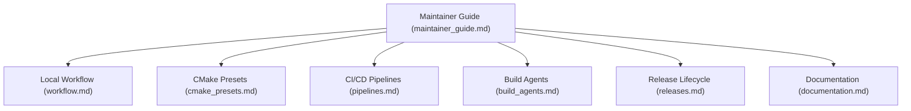

# Maintainer Documentation

Comprehensive documentation, workflows, build matrix, and release procedures for `siddiqsoft::sip2json` maintainers and contributors.

---

## Maintainer Topics

---

## Directory of Guides

| Guide | Description |
| :--- | :--- |
| [**Maintainer Guide**](maintainer_guide.md) | Codebase architecture, UML directive grammar (`@@uml-diag:`), class diagrams, and bulk clang-format instructions |
| [**CI/CD Pipelines**](pipelines.md) | Multi-platform pipeline architecture, platform matrix, and parameters reference |
| [**CMake Presets**](cmake_presets.md) | Decoupled presets hierarchy, `project-base.json`, and preset reference |
| [**Development Workflow**](workflow.md) | Local building, testing, standalone validation subproject, and macOS toolchain management |
| [**Build Agent Requirements**](build_agents.md) | Prerequisites and configuration for macOS, Linux, and Windows self-hosted agents |
| [**Release & Publication Lifecycle**](releases.md) | GitVersion, SemVer tagging, GitHub Releases, and NuGet package publishing |
| [**Documentation Architecture**](documentation.md) | MkDocs Material, Doxygen XML, custom CSS tokens, hooks, and local preview |
