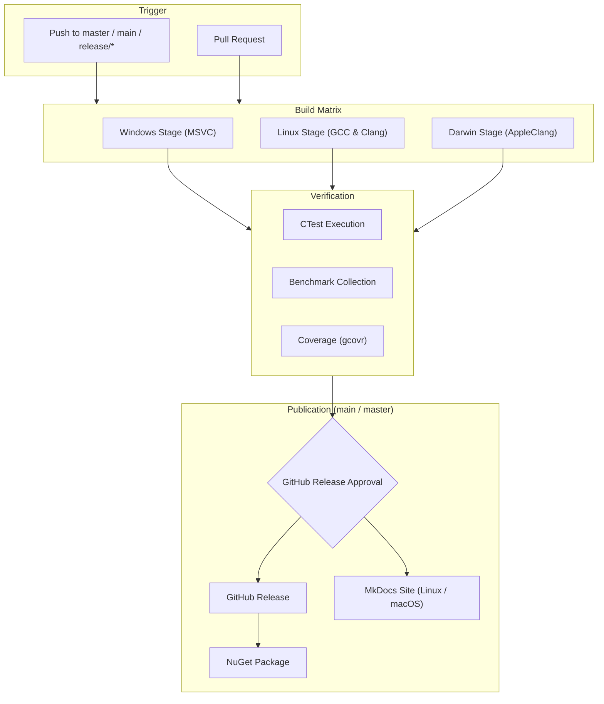
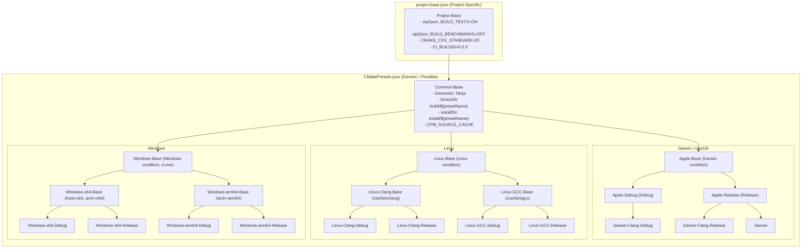
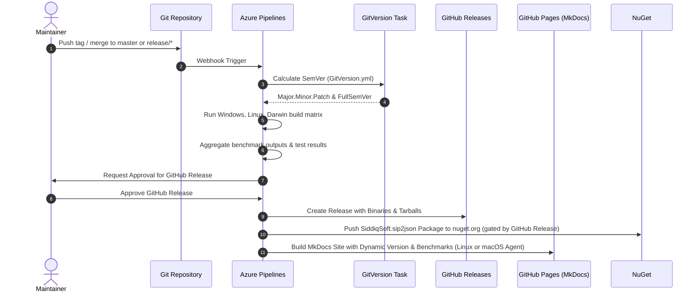
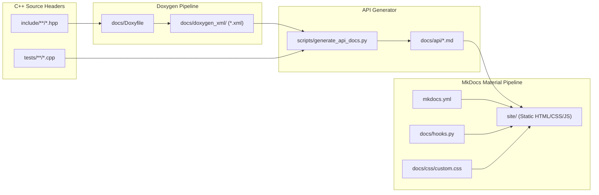

# Maintainer Guide

Codebase architecture, CI/CD pipelines, CMake presets, and release workflows.

## Codebase Architecture & UML Class Diagram

<!-- UML_CLASS_DIAGRAM_START -->
The following UML class diagram illustrates the primary classes, relationships, and exception hierarchy in `siddiqsoft::sip2json`. The diagram is auto-generated from the C++ source AST via Doxygen XML. Each node in the diagram links directly to its source header file on GitHub.

```mermaid
classDiagram
    direction TB

    classDef coreClass fill:rgba(35,73,109,0.08),stroke:#23496d,stroke-width:2px;
    classDef utilityClass fill:rgba(15,118,110,0.08),stroke:#0f766e,stroke-width:2px;
    classDef exceptionClass fill:rgba(185,28,28,0.06),stroke:#b91c1c,stroke-width:1.5px;
    classDef enumClass fill:rgba(109,40,217,0.06),stroke:#6d28d9,stroke-width:1.5px;
    classDef externalClass fill:rgba(100,116,139,0.06),stroke:#64748b,stroke-width:1.5px,stroke-dasharray: 4 3;
    classDef highlightClass fill:rgba(2,132,199,0.18),stroke:#0284c7,stroke-width:3px;

    class json["nlohmann::json"] {
        <<external DOM>>
    }
    class json:::externalClass

    class runtime_error["std::runtime_error"] {
        <<external exception>>
    }
    class runtime_error:::externalClass

    class sip2json["siddiqsoft::sip2json"] {
        <<final utility>>
        +parseAsync(string_view& buffer, onMsg, onErr)$ void
        +parse(string_view buffer)$ sipmessage
        +parseFromBuffer(string_view buffer)$ sipmessage
        +serialize(const sipmessage& msg)$ string
    }
    class sip2json:::utilityClass

    class sipmessage["siddiqsoft::sipmessage"] {
        +sipmessage()
        +sipmessage(string_view method, string_view uri, string_view callId, uint32_t cseq)
        +sipmessage(const json& src)
        +getMethodView() string_view
        +getUriView() string_view
        +getCallIDView() string_view
        +getStatusCode() int
        +getReasonView() string_view
        +getHeader(string_view key) string
        +setHeader(string_view key, string_view val) sipmessage&
        +hasHeader(string_view key) bool
        +getContentTypeView() string_view
    }
    class sipmessage:::coreClass

    class HeaderKeySet["siddiqsoft::HeaderKeySet"] {
        +string_view canonicalKey
        +string_view canonicalUpper
        +char compactAlias
        +uint64_t hash
        +HeaderKeySet(string_view key)
        +canonical() string_view
        +lower() string_view
    }
    class HeaderKeySet:::coreClass

    class SIPMessageType["siddiqsoft::SIPMessageType"] {
        <<enumeration>>
        Request = 1
        Response = 2
    }
    class SIPMessageType:::enumClass

    class sip2jsonErrors["siddiqsoft::sip2jsonErrors"] {
        <<enumeration>>
        unknown = -1
        success = 0
        invalid_document = 1
        empty_message = 2
        invalid_startline = 3
        incomplete_buffer_for_header = 4
        incomplete_buffer_for_content = 5
        incomplete_buffer_for_parse = 6
        missing_required_element = 7
        unsupported_contenttype = 8
    }
    class sip2jsonErrors:::enumClass

    class sip2json_exception["siddiqsoft::sip2json_exception"] {
        +sip2jsonErrors errCode
        +sip2json_exception(string message, sip2jsonErrors code)
        +what() const char*
    }
    class sip2json_exception:::exceptionClass

    class empty_message_error["siddiqsoft::empty_message_error"]
    class empty_message_error:::exceptionClass
    class incomplete_buffer_for_content_error["siddiqsoft::incomplete_buffer_for_content_error"]
    class incomplete_buffer_for_content_error:::exceptionClass
    class incomplete_buffer_for_header_error["siddiqsoft::incomplete_buffer_for_header_error"]
    class incomplete_buffer_for_header_error:::exceptionClass
    class incomplete_buffer_for_parse_error["siddiqsoft::incomplete_buffer_for_parse_error"]
    class incomplete_buffer_for_parse_error:::exceptionClass
    class invalid_document_error["siddiqsoft::invalid_document_error"]
    class invalid_document_error:::exceptionClass
    class invalid_startline_error["siddiqsoft::invalid_startline_error"]
    class invalid_startline_error:::exceptionClass
    class missing_required_element["siddiqsoft::missing_required_element"]
    class missing_required_element:::exceptionClass
    class unsupported_contenttype_error["siddiqsoft::unsupported_contenttype_error"]
    class unsupported_contenttype_error:::exceptionClass

    json <|-- sipmessage : public inheritance
    runtime_error <|-- sip2json_exception : public inheritance
    sip2json_exception <|-- empty_message_error
    sip2json_exception <|-- incomplete_buffer_for_content_error
    sip2json_exception <|-- incomplete_buffer_for_header_error
    sip2json_exception <|-- incomplete_buffer_for_parse_error
    sip2json_exception <|-- invalid_document_error
    sip2json_exception <|-- invalid_startline_error
    sip2json_exception <|-- missing_required_element
    sip2json_exception <|-- unsupported_contenttype_error

    sip2json ..> sipmessage : produces / consumes
    sip2json ..> sip2json_exception : throws
    sipmessage ..> SIPMessageType : classifies
    sipmessage ..> HeaderKeySet : uses
    sip2json_exception ..> sip2jsonErrors : contains

    link sip2json "https://github.com/SiddiqSoft/sip2json/blob/master/include/siddiqsoft/sip2json.hpp" "Source: include/siddiqsoft/sip2json.hpp"
    link sipmessage "https://github.com/SiddiqSoft/sip2json/blob/master/include/siddiqsoft/sipmessage.hpp" "Source: include/siddiqsoft/sipmessage.hpp"
    link HeaderKeySet "https://github.com/SiddiqSoft/sip2json/blob/master/include/siddiqsoft/private/sip2json_header_keys.hpp" "Source: include/siddiqsoft/private/sip2json_header_keys.hpp"
    link SIPMessageType "https://github.com/SiddiqSoft/sip2json/blob/master/include/siddiqsoft/sipmessage.hpp" "Source: include/siddiqsoft/sipmessage.hpp"
    link sip2jsonErrors "https://github.com/SiddiqSoft/sip2json/blob/master/include/siddiqsoft/private/sip2json_exception.hpp" "Source: include/siddiqsoft/private/sip2json_exception.hpp"
    link sip2json_exception "https://github.com/SiddiqSoft/sip2json/blob/master/include/siddiqsoft/private/sip2json_exception.hpp" "Source: include/siddiqsoft/private/sip2json_exception.hpp"
    link empty_message_error "https://github.com/SiddiqSoft/sip2json/blob/master/include/siddiqsoft/private/sip2json_exception.hpp" "Source: include/siddiqsoft/private/sip2json_exception.hpp"
    link incomplete_buffer_for_content_error "https://github.com/SiddiqSoft/sip2json/blob/master/include/siddiqsoft/private/sip2json_exception.hpp" "Source: include/siddiqsoft/private/sip2json_exception.hpp"
    link incomplete_buffer_for_header_error "https://github.com/SiddiqSoft/sip2json/blob/master/include/siddiqsoft/private/sip2json_exception.hpp" "Source: include/siddiqsoft/private/sip2json_exception.hpp"
    link incomplete_buffer_for_parse_error "https://github.com/SiddiqSoft/sip2json/blob/master/include/siddiqsoft/private/sip2json_exception.hpp" "Source: include/siddiqsoft/private/sip2json_exception.hpp"
    link invalid_document_error "https://github.com/SiddiqSoft/sip2json/blob/master/include/siddiqsoft/private/sip2json_exception.hpp" "Source: include/siddiqsoft/private/sip2json_exception.hpp"
    link invalid_startline_error "https://github.com/SiddiqSoft/sip2json/blob/master/include/siddiqsoft/private/sip2json_exception.hpp" "Source: include/siddiqsoft/private/sip2json_exception.hpp"
    link missing_required_element "https://github.com/SiddiqSoft/sip2json/blob/master/include/siddiqsoft/private/sip2json_exception.hpp" "Source: include/siddiqsoft/private/sip2json_exception.hpp"
    link unsupported_contenttype_error "https://github.com/SiddiqSoft/sip2json/blob/master/include/siddiqsoft/private/sip2json_exception.hpp" "Source: include/siddiqsoft/private/sip2json_exception.hpp"
    link json "https://github.com/nlohmann/json" "External: nlohmann/json"
    link runtime_error "https://en.cppreference.com/w/cpp/error/runtime_error" "Standard Library: std::runtime_error"
```



### Source Code Mapping

| Component / Class | Header File | Source Link | Purpose & Architectural Role |
| :--- | :--- | :--- | :--- |
| [`siddiqsoft::sip2json`](../api/sip2json.md) | `include/siddiqsoft/sip2json.hpp` | [`sip2json.hpp`](https://github.com/SiddiqSoft/sip2json/blob/master/include/siddiqsoft/sip2json.hpp) | Top-level static parser, stream deserializer, and wire serializer utility |
| [`siddiqsoft::sipmessage`](../api/sipmessage.md) | `include/siddiqsoft/sipmessage.hpp` | [`sipmessage.hpp`](https://github.com/SiddiqSoft/sip2json/blob/master/include/siddiqsoft/sipmessage.hpp) | Core message container inheriting from `nlohmann::json` with zero-copy view accessors |
| [`siddiqsoft::HeaderKeySet`](../api/constants.md) | `include/siddiqsoft/private/sip2json_header_keys.hpp` | [`sip2json_header_keys.hpp`](https://github.com/SiddiqSoft/sip2json/blob/master/include/siddiqsoft/private/sip2json_header_keys.hpp) | Canonical SIP header normalization, compact alias mapping, and compile-time hashing |
| [`siddiqsoft::SIPMessageType`](../api/sipmessage.md) | `include/siddiqsoft/sipmessage.hpp` | [`sipmessage.hpp`](https://github.com/SiddiqSoft/sip2json/blob/master/include/siddiqsoft/sipmessage.hpp) | Protocol message discriminator (`Request = 1`, `Response = 2`) |
| [`siddiqsoft::sip2json_exception`](../api/errors.md#exception-class-hierarchy) | `include/siddiqsoft/private/sip2json_exception.hpp` | [`sip2json_exception.hpp`](https://github.com/SiddiqSoft/sip2json/blob/master/include/siddiqsoft/private/sip2json_exception.hpp) | Base exception class inheriting from `std::runtime_error` with `sip2jsonErrors` payload |
| [`siddiqsoft::sip2jsonErrors`](../api/errors.md#sip2jsonerrors-enumeration) | `include/siddiqsoft/private/sip2json_exception.hpp` | [`sip2json_exception.hpp`](https://github.com/SiddiqSoft/sip2json/blob/master/include/siddiqsoft/private/sip2json_exception.hpp) | Diagnostic error code enumeration for parser and syntax failures |
| Derived Exceptions | `include/siddiqsoft/private/sip2json_exception.hpp` | [`sip2json_exception.hpp`](https://github.com/SiddiqSoft/sip2json/blob/master/include/siddiqsoft/private/sip2json_exception.hpp) | Specialized exception hierarchy (`invalid_document_error`, `empty_message_error`, etc.) |
| Parser Engine (`raw_view`) | `include/siddiqsoft/private/sip2json_parser.hpp` | [`sip2json_parser.hpp`](https://github.com/SiddiqSoft/sip2json/blob/master/include/siddiqsoft/private/sip2json_parser.hpp) | High-throughput streaming parser, zero-copy buffer slicing, CRLF boundary scanning |
| Wire Serializer | `include/siddiqsoft/private/sip2json_serializer.hpp` | [`sip2json_serializer.hpp`](https://github.com/SiddiqSoft/sip2json/blob/master/include/siddiqsoft/private/sip2json_serializer.hpp) | RFC 3261 compliant text wire serializer |
| SDP Body Parser | `include/siddiqsoft/private/sip2json_sdp.hpp` | [`sip2json_sdp.hpp`](https://github.com/SiddiqSoft/sip2json/blob/master/include/siddiqsoft/private/sip2json_sdp.hpp) | RFC 4566 Session Description Protocol parser and structured JSON serialization |
| Response Codes | `include/siddiqsoft/private/sip2json_response_codes.hpp` | [`sip2json_response_codes.hpp`](https://github.com/SiddiqSoft/sip2json/blob/master/include/siddiqsoft/private/sip2json_response_codes.hpp) | SIP status codes, reason phrases, and classification ranges (1xx-6xx) |
| Protocol Constants | `include/siddiqsoft/private/sip2json_constants.hpp` | [`sip2json_constants.hpp`](https://github.com/SiddiqSoft/sip2json/blob/master/include/siddiqsoft/private/sip2json_constants.hpp) | SIP grammar tokens, method strings, whitespace matchers, CRLF constants |
| DateTime Parser | `include/siddiqsoft/private/sip2json_datetime.hpp` | [`sip2json_datetime.hpp`](https://github.com/SiddiqSoft/sip2json/blob/master/include/siddiqsoft/private/sip2json_datetime.hpp) | RFC 3261 / RFC 1123 HTTP-date timestamp parser and serializer |
| Utility Functions | `include/siddiqsoft/private/sip2json_utils.hpp` | [`sip2json_utils.hpp`](https://github.com/SiddiqSoft/sip2json/blob/master/include/siddiqsoft/private/sip2json_utils.hpp) | Internal whitespace trimming, view slicing, string conversion utilities |
<!-- UML_CLASS_DIAGRAM_END -->

## Pipeline Architecture

Defined in [`azure-pipelines.yml`](https://github.com/SiddiqSoft/sip2json/blob/master/azure-pipelines.yml) on self-hosted agents (`Default` pool):



## Build Stages & Platform Matrix

The build matrix targets Windows, Linux, and macOS (Darwin) across `x64` and `arm64` architectures:

| Platform Stage | Target Architectures | Compilers | CMake Presets Prefix | CI Template | Artifacts Published |
| :--- | :--- | :--- | :--- | :--- | :--- |
| **Windows** | `x64`, `arm64` | MSVC (Visual Studio 2022) | `Windows-${arch}-${buildType}` | `.azure/az-build-windows.yml` | Binaries, CTest JUnit XML, Benchmarks |
| **Linux** | `x64`, `arm64` | Clang (17+), GCC (13+) | `Linux-${compiler}-${buildType}` | `.azure/az-build-unix.yml` | Binaries, CTest JUnit XML, Benchmarks, Coverage XML |
| **Darwin (macOS)** | `x64`, `arm64` | AppleClang (Xcode / CLT) | `Darwin-Clang-${buildType}` | `.azure/az-build-unix.yml` | Binaries, CTest JUnit XML, Benchmarks |

!!! note "Unified Unix Pipeline"
    The Linux and Darwin stages share the parameterized template `.azure/az-build-unix.yml`. It dynamically adapts agent OS demands, compiler flags, and preset names based on the target platform.

## CMake Presets Architecture

The repository employs a decoupled, highly reusable CMake Presets structure separated across two files:



### Architectural Separation of Concerns

1. **[`project-base.json`](https://github.com/SiddiqSoft/sip2json/blob/master/project-base.json)**:
   - Holds all **per-project settings** (e.g. `sip2json_BUILD_TESTS`, `CMAKE_CXX_STANDARD: 20`, `CI_BUILDID: 0.0.0`).
   - Project maintainers configure project-specific variables here without altering toolchain presets.

2. **[`CMakePresets.json`](https://github.com/SiddiqSoft/sip2json/blob/master/CMakePresets.json)**:
   - Contains **zero project-specific names or flags**.
   - Fully portable and reusable across any C++20/23 library or service repository.
   - Defines platform bases (`Apple-Base`, `Linux-Base`, `Windows-Base`) and standardized `Test-Base` execution rules.

## Available Presets Quick Reference

### Configure Presets

| Preset Name | Platform | Compiler | Build Type | Notes |
| :--- | :--- | :--- | :--- | :--- |
| `Apple-Debug` | macOS | AppleClang | Debug | Native Xcode / Command Line Tools |
| `Apple-Release` | macOS | AppleClang | Release | Native Xcode / Command Line Tools |
| `Darwin-Clang-Debug` | macOS | AppleClang | Debug | Inherits `Apple-Debug` |
| `Darwin-Clang-Release` | macOS | AppleClang | Release | Inherits `Apple-Release` |
| `Darwin` | macOS | AppleClang | Release | Default macOS alias (inherits `Apple-Release`) |
| `Linux-Clang-Debug` | Linux | Clang (`/usr/bin/clang++`) | Debug | Clang toolchain |
| `Linux-Clang-Release` | Linux | Clang (`/usr/bin/clang++`) | Release | Clang toolchain |
| `Linux-Clang` | Linux | Clang (`/usr/bin/clang++`) | Release | Clang release alias |
| `Linux-GCC-Debug` | Linux | GCC (`/usr/bin/g++`) | Debug | GCC toolchain |
| `Linux-GCC-Release` | Linux | GCC (`/usr/bin/g++`) | Release | GCC toolchain |
| `Linux-GCC` | Linux | GCC (`/usr/bin/g++`) | Release | GCC release alias |
| `Windows-x64-Debug` | Windows | MSVC (`cl.exe`) | Debug | x64 architecture, host=x64 |
| `Windows-x64-Release` | Windows | MSVC (`cl.exe`) | Release | x64 architecture, host=x64 |
| `Windows-x64` | Windows | MSVC (`cl.exe`) | Release | Windows x64 release alias |
| `Windows-arm64-Debug` | Windows | MSVC (`cl.exe`) | Debug | ARM64 cross/native compilation |
| `Windows-arm64-Release` | Windows | MSVC (`cl.exe`) | Release | ARM64 cross/native compilation |
| `Windows-arm64` | Windows | MSVC (`cl.exe`) | Release | Windows ARM64 release alias |

## Local Development & Maintainer Workflow

### 1. Configure, Build, and Test

Maintainers can build and execute the full test suite (320+ unit and compliance tests) with standard CMake commands:

```bash
# Configure with desired preset (e.g. Darwin-Clang-Release, Linux-GCC-Release, Windows-x64-Release)
cmake --preset <preset-name>

# Build all targets
cmake --build --preset <preset-name>

# Execute test suite (use -j 4 or higher for fast parallel execution)
ctest --preset <preset-name> -j 4
```

!!! tip "Test Execution Parallelism"
    Specifying `-j <num_workers>` (e.g. `-j 4`) with `ctest` runs tests efficiently across worker threads without hitting operating system process limits.

### 2. Standalone Validation Subproject Testing

To test `sip2json` against historical versions or external CPM consumers, use the subproject located in `tests/validation/`:

```bash
# Configure standalone validation client
cd tests/validation
cmake --preset Apple-Release

# Build and run client test suite
cmake --build --preset Apple-Release
ctest --preset Apple-Release -j 4
```

### 3. macOS Toolchain & xcode-select Coexistence

!!! tip "Zero-Flipping Workflow: Developing with Xcode and CLI Concurrently"
    Maintainers frequently develop native macOS/iOS applications in Xcode IDE while simultaneously working on `sip2json` via terminal, VS Code, or CLion. You can leave `xcode-select` permanently set to `/Applications/Xcode.app/Contents/Developer` without encountering CLI build failures or having to toggle `xcode-select`.

#### The Problem: xcrun, xcodebuild, and Exit Code 65280
On macOS, running generic compiler shims such as `/usr/bin/c++`, `/usr/bin/clang++`, or `/usr/bin/make` triggers Apple's `/usr/bin/xcrun` dispatcher. When `xcode-select` points to `/Applications/Xcode.app`, `xcrun` invokes:
```bash
xcodebuild -sdk macosx -find clang++
```
If there is a version mismatch between macOS system frameworks and installed Xcode system resources (for example, a dyld missing symbol error such as `Symbol not found: _XPCTypeBool` in `Mercury.framework` referenced by `/Library/Developer/PrivateFrameworks/CoreDevice.framework`), `xcodebuild` crashes with exit code 255 (which the shell surfaces as `c++: error: ... failed with exit code 65280`).

Historically, developers were forced to repeatedly flip `xcode-select`:
```bash
# Flipping to Command Line Tools for CLI CMake builds:
sudo xcode-select -s /Library/Developer/CommandLineTools

# Flipping back to Xcode for GUI/iOS/simulator development:
sudo xcode-select -s /Applications/Xcode.app/Contents/Developer
```

#### How sip2json Eliminates Toolchain Flipping
`sip2json` handles toolchain resolution automatically through two complementary mechanisms:

1. **Direct Compiler Paths in Presets**:
   The `Apple-Debug`, `Apple-Release`, and `Darwin` presets in `CMakePresets.json` explicitly configure `CMAKE_C_COMPILER` and `CMAKE_CXX_COMPILER` to direct binary paths (e.g. `/Library/Developer/CommandLineTools/usr/bin/clang++`). Because the binary path is fully qualified, CMake and Ninja invoke the compiler directly, completely bypassing `/usr/bin/xcrun` and `xcodebuild`.

2. **Automatic Toolchain Discovery in `CMakeLists.txt`**:
   If you configure CMake outside presets (e.g. `cmake -B build` or using IDE plugins), `CMakeLists.txt` inspects candidate toolchains before `project()`:
   * Standalone Command Line Tools (`/Library/Developer/CommandLineTools/usr/bin/clang++`)
   * Xcode Default Toolchain (`/Applications/Xcode.app/Contents/Developer/Toolchains/XcodeDefault.xctoolchain/usr/bin/clang++`)
   * Homebrew LLVM (`/opt/homebrew/opt/llvm/bin/clang++`)

   If a developer has only Xcode installed (without standalone CLT), CMake falls back to the internal Xcode toolchain binary automatically.

#### Caveats & Best Practices
* **Environment Override with `DEVELOPER_DIR`**: If you need to temporarily direct Apple toolchains to a specific location for a single terminal session without modifying system-wide settings with `sudo xcode-select`, export `DEVELOPER_DIR`:
  ```bash
  export DEVELOPER_DIR=/Library/Developer/CommandLineTools
  # or
  export DEVELOPER_DIR=/Applications/Xcode.app/Contents/Developer
  ```
* **Xcode Generator vs. Ninja**: The repository presets standardly use the `Ninja` generator. If you explicitly generate an Xcode IDE project (`cmake -G Xcode`), CMake must interact directly with `xcodebuild`. Ensure that your installed Xcode version matches your macOS version if using the Xcode generator. For command-line builds, CI, and test execution, Ninja with AppleClang is recommended.
* **Homebrew LLVM**: If you prefer building with upstream Clang from Homebrew (`brew install llvm`), you can override the compiler by setting `-DCMAKE_CXX_COMPILER=/opt/homebrew/opt/llvm/bin/clang++`.

## Self-Hosted Build Agent Requirements

All build agents must be registered in the `Default` pool and expose the required `Agent.OS` demand:

### Darwin (macOS) Agents
* Demand: `Agent.OS -equals Darwin`
* OS: macOS Sonoma (14+) on Apple Silicon (`arm64`) or Intel (`x64`).
* Toolchain: Xcode 15+ / Command Line Tools (`AppleClang 15+`). Presets and build files automatically resolve direct compiler binaries, coexisting seamlessly with any `xcode-select` setting.
* Utilities: CMake 3.29+, Ninja 1.11+, Python 3.10+, Doxygen, MkDocs (material theme).
* *Note: No external Homebrew LLVM installation required.*

### Linux Agents
* Demand: `Agent.OS -equals Linux`
* OS: Red Hat Enterprise Linux (RHEL 9+) on `x64` or `arm64`.
* Toolchain: GCC 13+ (`/usr/bin/gcc`, `/usr/bin/g++`) or Clang 17+ (`/usr/bin/clang`, `/usr/bin/clang++`).
* Utilities: CMake 3.29+, Ninja, Python 3.10+, `gcovr` (for coverage), Doxygen, MkDocs (material theme).
* *Note: Documentation publication (`PublishDocs`) executes on Linux or macOS agents, skipping gracefully if MkDocs is not installed.*

### Windows Agents
* Demand: `Agent.OS -equals Windows_NT`
* OS: Windows 11 / Windows Server 2022 (`x64` or `arm64`).
* Toolchain: Visual Studio 2022 (MSVC v143+), Windows 11 SDK.
* Prerequisites: Execute [`scripts/prep_windows_machine.ps1`](https://github.com/SiddiqSoft/sip2json/blob/master/scripts/prep_windows_machine.ps1) as Administrator to configure `LongPathsEnabled = 1` and `git config --system core.longpaths true`.

## Release & Publication Lifecycle



### Dynamic Versioning & Documentation Hooks
1. **[`docs/hooks.py`](https://github.com/SiddiqSoft/sip2json/blob/master/docs/hooks.py)**: Dynamically injects GitVersion SemVer into site metadata (`config['extra']['version']`) and replaces `{{ version }}` / `{{ tag_version }}` placeholders across markdown files.
2. **[`scripts/publish_benchmarks.py`](https://github.com/SiddiqSoft/sip2json/blob/master/scripts/publish_benchmarks.py)**: Collects benchmark outputs across build matrix platforms, extracts CPU architecture and core count, and renders responsive platform-grouped benchmark tables and visual comparison charts into [`docs/architecture/benchmarks.md`](../architecture/benchmarks.md).
3. **NuGet Packaging & Publication**: NuGet packaging (`NuGetCommand@2 pack`) runs during the Windows Release job to package header files, `.natvis`, and `.targets`. Publication (`Stage 5: PublishNuGet`) is auto-enabled on `main`/`master` releases and strictly gated behind the manual review and successful completion of `Stage 4: PublishGitHub` before pushing to `nuget.org` via the `sqs-nuget` service connection.
4. **MkDocs Site Publication (`gh-pages`)**: MkDocs documentation publication is supported on **Linux and macOS (Darwin)** machines. Stage `PublishDocs` (via [`.azure/az-publish-docs.yml`](https://github.com/SiddiqSoft/sip2json/blob/master/.azure/az-publish-docs.yml)) runs on Linux or macOS runners and dynamically verifies `mkdocs` availability. If `mkdocs` is not installed on the runner, the documentation build step is safely skipped without failing the pipeline. In addition, the Unix matrix build pipeline ([`.azure/az-build-unix.yml`](https://github.com/SiddiqSoft/sip2json/blob/master/.azure/az-build-unix.yml)) validates the documentation site on Linux and Darwin whenever `mkdocs` is present, skipping gracefully if uninstalled.

## Building & Previewing Documentation Locally

Maintainers can preview and validate documentation changes locally before pushing:

### 1. Live-Reload Development Server

```bash
# Activate Python environment and install requirements
source venv/bin/activate
pip install -r docs/requirements.txt

# Start live-reloading server
mkdocs serve
```

* **Local URL**: Open [`http://127.0.0.1:8000/`](http://127.0.0.1:8000/) in your browser.
* **Live Reload**: Any edits saved in `docs/` files update automatically in real time.

### 2. Strict Build Validation

Verify there are zero broken links or markdown syntax issues:

```bash
mkdocs build --strict
```

The output compiles into `site/`. Open `site/index.html` directly in any browser.

### 3. Updating Benchmark Data Prior to Serving

```bash
python3 scripts/publish_benchmarks.py
mkdocs serve
```

### 4. Documentation Architecture & Customization Guide

The documentation system implements a standardized, accessible architecture powered by **Doxygen XML**, **MkDocs Material**, and a tokenized **CSS Design System**. It is designed to be extractable and reusable across all projects via the [`cxxtemplate`](https://github.com/SiddiqSoft/cxxtemplate) repository.



---

#### 4.1 Typography & Sizing Tokens

Primary typeface families are declared in [`mkdocs.yml`](https://github.com/SiddiqSoft/sip2json/blob/master/mkdocs.yml) under `theme.font`. Material for MkDocs fetches these via Google Fonts:

```yaml
theme:
  font:
    text: Roboto         # Primary prose typeface
    code: JetBrains Mono # Monospace code & signature typeface
```

All typography dimensions, line heights, and element bindings are centralized at the top of [`docs/css/custom.css`](https://github.com/SiddiqSoft/sip2json/blob/master/docs/css/custom.css):

```css
:root {
  /* Typefaces: Inherits mkdocs.yml font with cross-platform system fallbacks */
  --font-family-main: var(--md-text-font, Roboto), -apple-system, BlinkMacSystemFont, "Segoe UI", "Helvetica Neue", Arial, sans-serif;
  --font-family-code: var(--md-code-font, "JetBrains Mono"), SFMono-Regular, Consolas, Menlo, Monaco, monospace;

  /* Standard Display Sizing (Default base: 0.94rem) */
  --font-size-base: 0.94rem;    /* Body copy, member documentation, descriptions */
  --font-size-code: 0.82rem;    /* Inline code, pre blocks, signatures, types */
  --font-size-nav: 0.84rem;     /* Sidebar navigation items and tabs */
  --font-size-table: 0.82rem;   /* API summary matrices and parameter tables */
  --font-size-h1: 1.55rem;      /* Page title */
  --font-size-h2: 1.25rem;      /* Section headings */
  --font-size-h3: 1.02rem;      /* Subsection headings */
  --font-size-h4: 0.92rem;      /* Detail headings */
  --line-height-base: 1.55;
  --line-height-code: 1.48;

  /* Material for MkDocs Typography Variable Bindings */
  --md-font-main: var(--font-family-main);
  --md-font-code: var(--font-family-code);
  --md-typeset-font-size: var(--font-size-base);
  --md-typeset-line-height: var(--line-height-base);
}
```

##### Browser Accessibility & Native Zoom Compatibility
* **Relative Units Only (`rem`/`em`)**: All typography properties strictly reference `rem` or `em`. Root `html` is never hardcoded with fixed pixel dimensions (e.g. `16px`).
* **Preserves User Zoom**: If a user increases their browser default font size or zooms the viewport (`Cmd` / `Ctrl` + `+`), the base `1rem` scales proportionately without layout breakage.
* **Zero Runtime DOM Scripting**: Font sizing is handled 100% in CSS without client-side JavaScript overrides.

##### High-DPI / Retina Desktop Scaling
High-resolution desktop displays (Apple Retina 4.5K/5K iMacs, Studio Displays, MacBook Pros, and 4K/UHD monitors on Windows with 150%&ndash;200% OS scaling) pack physical subpixels densely. A dedicated media query ensures the `0.94rem` base typography remains crisp and comfortable on desktop screens with device pixel ratios `DPR >= 1.5`:

```css
@media screen and (min-width: 960px) and (-webkit-min-device-pixel-ratio: 1.5),
       screen and (min-width: 960px) and (min-resolution: 144dpi),
       screen and (min-width: 960px) and (min-resolution: 1.5dppx) {
  :root {
    --font-size-base: 0.94rem;
    --font-size-code: 0.82rem;
    --font-size-nav: 0.84rem;
    --font-size-table: 0.82rem;
    --font-size-h1: 1.55rem;
    --font-size-h2: 1.25rem;
    --font-size-h3: 1.02rem;
    --font-size-h4: 0.92rem;
    --md-typeset-font-size: var(--font-size-base);
  }
}
```

---

#### 4.2 Brand Colors & Light / Dark Themes

The color system partitions brand identities, API reference cards, and surface backgrounds across light and dark palettes:

| CSS Variable | Light Mode (`default`) | Dark Mode (`slate`) | Role & Usage |
| :--- | :--- | :--- | :--- |
| `--api-primary` | `#23496d` (Deep Navy) | `#38bdf8` (Vibrant Sky Blue) | Member titles, class headers, primary accents |
| `--api-primary-light` | `#2e5e8c` | `#7dd3fc` | Hover states, interactive highlights |
| `--api-primary-dark` | `#1b3854` | `#0284c7` | Active tab headers, pressed states |
| `--api-accent` | `#0284c7` (Cerulean) | `#38bdf8` (Sky Blue) | Hyperlinks, active navigation indicators |
| `--api-border` | `#cbd5e1` (Slate 300) | `#334155` (Slate 700) | Card boundaries, table dividers |
| `--api-bg-subtle` | `#f1f5f9` (Slate 100) | `#1e293b` (Slate 800) | Member item header strips, table alternate rows |
| `--api-bg-card` | `#ffffff` (Pure White) | `#0f172a` (Slate 900) | Member item card body, code container cards |
| `--api-text-muted` | `#64748b` (Slate 500) | `#94a3b8` (Slate 400) | Header file annotations, table descriptions |
| `--api-proto-bg` | `#f8fafc` (Slate 50) | `#1e293b` (Slate 800) | Function prototype container background |

To customize brand colors project-wide, modify the `--api-primary` and `--api-accent` tokens in [`docs/css/custom.css`](https://github.com/SiddiqSoft/sip2json/blob/master/docs/css/custom.css).

---

#### 4.3 Standard C++ Syntax Highlighting Tokens

Both light and dark themes configure semantic token coloring to mirror modern IDE syntax highlighting:

| Token Variable | Light Mode | Dark Mode | Semantic Target |
| :--- | :--- | :--- | :--- |
| `--md-code-hl-keyword-color` | `#cf222e` (Crimson) | `#ff7b72` (Coral) | `static`, `const`, `void`, `auto`, `template` |
| `--md-code-hl-type-color` | `#0550ae` (Deep Blue) | `#79c0ff` (Sky Blue) | `size_t`, `uint32_t`, `bool`, `sipmessage` |
| `--md-code-hl-function-color` | `#8250df` (Purple) | `#d2a8ff` (Lilac) | Function & method names (`parseAsync`) |
| `--md-code-hl-string-color` | `#0a3069` (Navy) | `#a5d6ff` (Light Cyan) | String literals (`"INVITE"`) |
| `--md-code-hl-number-color` | `#0550ae` (Blue) | `#79c0ff` (Sky Blue) | Numeric literals (`200`, `0u`) |
| `--md-code-hl-comment-color` | `#6e7781` (Slate Gray) | `#8b949e` (Muted Gray) | Source citations & code comments |
| `--md-code-hl-constant-color`| `#953800` (Amber) | `#ffa657` (Warm Orange) | Enum values & protocol constants |
| `--md-code-hl-special-color` | `#cf222e` (Crimson) | `#ff7b72` (Coral) | `#include`, preprocessor macros |
| `--md-code-hl-operator-color`| `#24292f` (Charcoal) | `#e6edf3` (Off-white) | Operators (`=`, `::`, `->`, `+`) |
| `--md-code-hl-punctuation-color`| `#57606a` (Gray) | `#c9d1d9` (Light Gray) | Delimiters (`;`, `,`, `(`, `)`) |

---

#### 4.4 Doxygen XML Pipeline Configuration

Doxygen operates strictly as an AST/XML extraction engine without generating HTML or LaTeX:

* **Configuration File**: [`docs/Doxyfile`](https://github.com/SiddiqSoft/sip2json/blob/master/docs/Doxyfile)
* **Key Directives**:
  ```ini
  PROJECT_NAME           = "sip2json"
  INPUT                  = include/siddiqsoft
  RECURSIVE              = YES
  FILE_PATTERNS          = *.hpp *.h
  EXCLUDE_PATTERNS       = */tests/* */benchmarks/* */build/*
  GENERATE_XML           = YES
  XML_OUTPUT             = doxygen_xml
  GENERATE_HTML          = NO
  GENERATE_LATEX         = NO
  EXTRACT_ALL            = YES
  EXTRACT_STATIC         = YES
  ENABLE_PREPROCESSING   = YES
  MACRO_EXPANSION        = YES
  BUILTIN_STL_SUPPORT    = YES
  ```
* **Project Variables**: Only `PROJECT_NAME`, `PROJECT_BRIEF`, and `INPUT` require adjustment per repository; all other settings are 100% portable.

---

#### 4.5 API Reference Generator & Parameter Folding Rules

[`scripts/generate_api_docs.py`](https://github.com/SiddiqSoft/sip2json/blob/master/scripts/generate_api_docs.py) transforms Doxygen XML into terse, OpenCV-style markdown references:

1. **Member Function Boxes (`.memitem`)**:
   - Header strip with class diamond (`&#9670;`), method title, and badge (`static`, `static noexcept`).
   - Clean C++ prototype block (`.memproto`) with full namespace scoping.
   - Terse method description, parameter table, explicit return documentation, and authentic test snippets.

2. **Parameter Wrapping & Folding Rules**:
   - **Fold Just After `>`, Never Before**: Closing angle brackets (`>` / `>>`) always attach to the preceding token (e.g. `std::string_view)>>`). If followed by a parameter name or default value (`errorCallback = {}`), the fold occurs *just after* `>` on whitespace.
   - **Type Modifiers Attached to Types**: Reference and pointer modifiers (`&`, `&&`, `*`) attach directly to their type name (`std::string_view&`, `sipmessage&&`, `const sip2json_exception&`, `size_t&`), followed by a single space before the identifier.
   - **Break on Whitespace**: All folded lines cleanly break on whitespace following delimiters (after `,` or after `>>`).
   - **Continuation Indentation**: Wrapped parameter names indent with standard continuation indent (8 spaces in prototypes; `param-inner-wrap` in summary tables).

3. **Authentic Test Snippets**:
   - Example code blocks are extracted directly from live regression and benchmark tests (`tests/regression/`, `tests/validation/`) with file path and line citations. Zero manufactured examples.

4. **UML Class Diagram & Source Links**:
   - Class hierarchies, method signatures, and exception taxonomies are dynamically derived from Doxygen XML AST.
   - Generates interactive Mermaid class diagrams with clickable links targeting the source header files on GitHub.
   - Automatically injected into `docs/maintainers/pipelines.md`, `docs/architecture/index.md`, and `docs/api/index.md` on every build.

---

#### 4.6 Dynamic Build Hooks (`docs/hooks.py`)

The MkDocs build lifecycle executes [`docs/hooks.py`](https://github.com/SiddiqSoft/sip2json/blob/master/docs/hooks.py):

1. **`on_config`**:
   - Resolves SemVer version from `GITVERSION_SEMVER`, `CI_BUILDID`, `GitVersion.yml`, or `git describe`.
   - Executes `generate_dependencies_md.py` to document active CPM dependencies.
   - Executes `generate_api_docs.py` to regenerate API reference from Doxygen XML.
   - Executes `publish_benchmarks.py` to update architecture benchmark metrics.
   - Injects the resolved version into `config['extra']['version']`.
2. **`on_page_markdown`**:
   - Dynamically replaces `{{ version }}` and `{{ tag_version }}` placeholders across all markdown pages at build time.

---

#### 4.7 Multi-Platform CI/CD Documentation Pipeline

The documentation build pipeline supports **Linux and macOS (Darwin)** runners:

* **Graceful Skip Logic**:
  - Both [`.azure/az-publish-docs.yml`](https://github.com/SiddiqSoft/sip2json/blob/master/.azure/az-publish-docs.yml) and [`.azure/az-build-unix.yml`](https://github.com/SiddiqSoft/sip2json/blob/master/.azure/az-build-unix.yml) check for `mkdocs` and `doxygen` availability:
    ```bash
    if ! command -v mkdocs &> /dev/null; then
        echo "##[warning] mkdocs not installed on this runner. Skipping documentation build."
        exit 0
    fi
    ```
  - If tools are absent on a runner, the pipeline logs a warning and proceeds without failing the job.
* **Local Build Scripts**:
  - macOS / Linux: [`docs/rebuild-docs.sh`](https://github.com/SiddiqSoft/sip2json/blob/master/docs/rebuild-docs.sh)
  - Windows: [`docs/rebuild-docs.ps1`](https://github.com/SiddiqSoft/sip2json/blob/master/docs/rebuild-docs.ps1)

---

#### 4.8 Porting to Other Repositories via `cxxtemplate`

To apply this standardized documentation system to any downstream C++ repository:

1. Copy `mkdocs.yml`, `docs/Doxyfile`, `docs/hooks.py`, `docs/css/custom.css`, and `scripts/generate_api_docs.py`.
2. In `mkdocs.yml`, update `site_name`, `site_description`, `repo_url`, and `theme.font`.
3. In `docs/Doxyfile`, update `PROJECT_NAME`, `PROJECT_BRIEF`, and `INPUT`.
4. In `docs/css/custom.css`, adjust `--api-primary` and `--api-accent` to match project branding.
5. In `docs/css/custom.css`, keep `--font-size-base: 0.94rem` (or adjust once in `:root` and in the retina `@media` query). All headings, tables, and nav items will scale in harmony.

## Pipeline Parameters Reference

When manually triggering a pipeline in Azure DevOps, maintainers can customize:

| Parameter | Type | Default | Allowed Values | Purpose |
| :--- | :--- | :--- | :--- | :--- |
| `Platforms` | `stringList` | `[ Windows, Linux, Darwin ]` | `Windows`, `Linux`, `Darwin` | Target OS platforms to build |
| `Architectures` | `stringList` | `[ arm64 ]` | `arm64`, `x64` | Target CPU architectures |
| `Compilers_Windows` | `stringList` | `[ MSVC ]` | `MSVC` | Windows compiler toolsets |
| `Compilers_Linux` | `stringList` | `[ Clang ]` | `Clang`, `GCC` | Linux compiler toolsets |
| `Compilers_Darwin` | `stringList` | `[ Clang ]` | `Clang` | macOS compiler toolsets (AppleClang) |
| `BuildTypes` | `stringList` | `[ Release ]` | `Release`, `Debug` | Build configurations |
| `RunTests` | `boolean` | `true` | `true`, `false` | Execute unit and compliance test suites |
| `RunBenchmarks` | `boolean` | `true` | `true`, `false` | Execute performance benchmark harnesses |
| `PublishNuGet` | `boolean` | `false` | `true`, `false` | Trigger NuGet Release (auto on `master`/`main`) |
| `PublishGitHub` | `boolean` | `false` | `true`, `false` | Trigger GitHub Release (auto on `master`/`main`) |
| `PublishDocs` | `boolean` | `false` | `true`, `false` | Publish documentation site via Linux or macOS agent (auto on `master`/`main`) |
| `Cleanup` | `boolean` | `false` | `true`, `false` | Run cache and workspace cleanup only |

