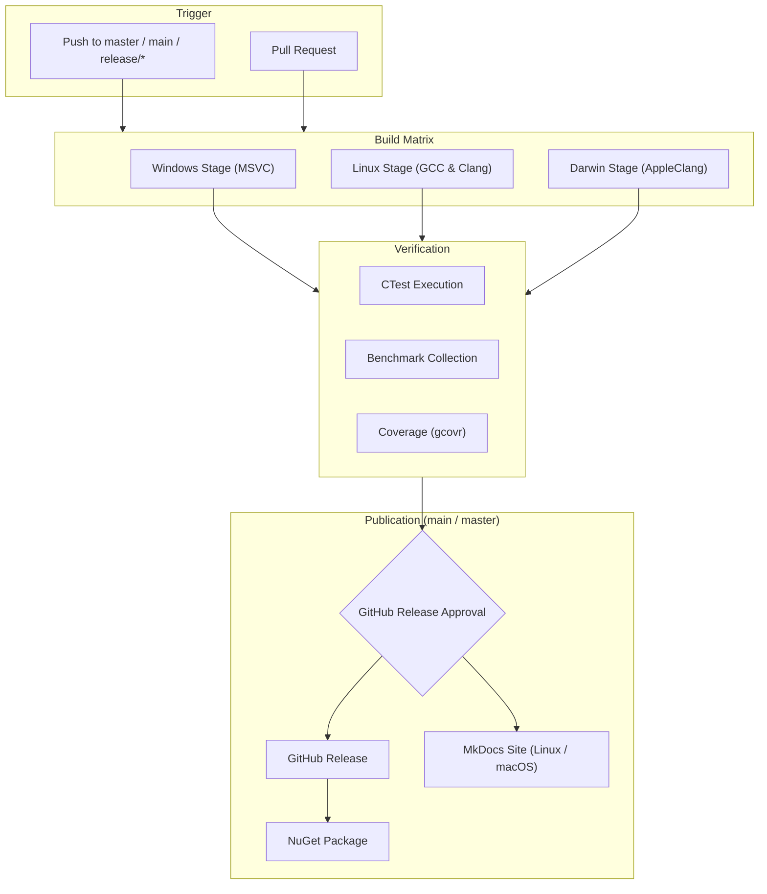

# CI/CD Pipelines

Continuous integration, multi-platform build matrix, and automated verification pipelines for `siddiqsoft::sip2json`.

---

## Pipeline Architecture

Defined in [`azure-pipelines.yml`](https://github.com/SiddiqSoft/sip2json/blob/master/azure-pipelines.yml) on self-hosted agents (`Default` pool):

---

## Build Stages & Platform Matrix

The build matrix targets Windows, Linux, and macOS (Darwin) across `x64` and `arm64` architectures:

| Platform Stage | Target Architectures | Compilers | CMake Presets Prefix | CI Template | Artifacts Published |
| :--- | :--- | :--- | :--- | :--- | :--- |
| **Windows** | `x64`, `arm64` | MSVC (Visual Studio 2022) | `Windows-${arch}-${buildType}` | `.azure/az-build-windows.yml` | Binaries, CTest JUnit XML, Benchmarks |
| **Linux** | `x64`, `arm64` | Clang (17+), GCC (13+) | `Linux-${compiler}-${buildType}` | `.azure/az-build-unix.yml` | Binaries, CTest JUnit XML, Benchmarks, Coverage XML |
| **Darwin (macOS)** | `x64`, `arm64` | AppleClang (Xcode / CLT) | `Darwin-Clang-${buildType}` | `.azure/az-build-unix.yml` | Binaries, CTest JUnit XML, Benchmarks |

> [!NOTE]
> **Unified Unix Pipeline**: The Linux and Darwin stages share the parameterized template `.azure/az-build-unix.yml`. It dynamically adapts agent OS demands, compiler flags, and preset names based on the target platform.

---

## Pipeline Parameters Reference

When manually triggering a pipeline in Azure DevOps, maintainers can customize:

| Parameter | Type | Default | Allowed Values | Purpose |
| :--- | :--- | :--- | :--- | :--- |
| `Platforms` | `stringList` | `[ Windows, Linux, Darwin ]` | `Windows`, `Linux`, `Darwin` | Target OS platforms to build |
| `Architectures` | `stringList` | `[ arm64 ]` | `arm64`, `x64` | Target CPU architectures |
| `Compilers_Windows` | `stringList` | `[ MSVC ]` | `MSVC` | Windows compiler toolsets |
| `Compilers_Linux` | `stringList` | `[ Clang ]` | `Clang`, `GCC` | Linux compiler toolsets |
| `Compilers_Darwin` | `stringList` | `[ Clang ]` | `Clang` | macOS compiler toolsets (AppleClang) |
| `BuildTypes` | `stringList` | `[ Release ]` | `Release`, `Debug` | Build configurations |
| `RunTests` | `boolean` | `true` | `true`, `false` | Execute unit and compliance test suites |
| `RunBenchmarks` | `boolean` | `true` | `true`, `false` | Execute performance benchmark harnesses |
| `PublishNuGet` | `boolean` | `false` | `true`, `false` | Trigger NuGet Release (auto on `master`/`main`) |
| `PublishGitHub` | `boolean` | `false` | `true`, `false` | Trigger GitHub Release (auto on `master`/`main`) |
| `PublishDocs` | `boolean` | `false` | `true`, `false` | Publish documentation site via Linux or macOS agent (auto on `master`/`main`) |
| `Cleanup` | `boolean` | `false` | `true`, `false` | Run cache and workspace cleanup only |

---

## Related Topics

* [**Maintainer Guide**](maintainer_guide.md): Codebase architecture, source mapping, and bulk formatting
* [**CMake Presets**](cmake_presets.md): Presets executed across each build stage
* [**Build Agent Requirements**](build_agents.md): Agent demands, OS setup, and toolchain versions
* [**Release Lifecycle**](releases.md): Publishing packages and release approvals
