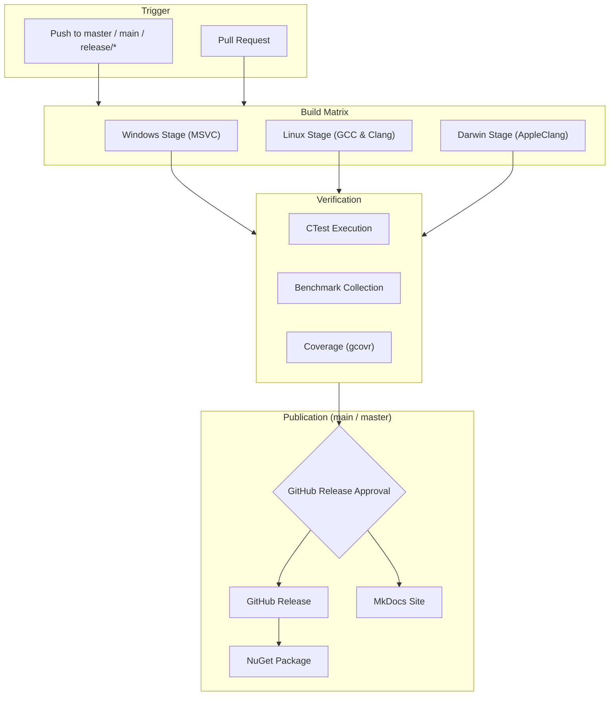
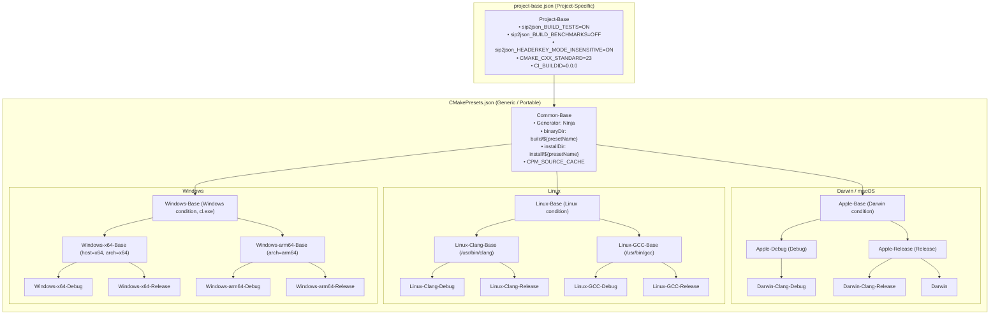
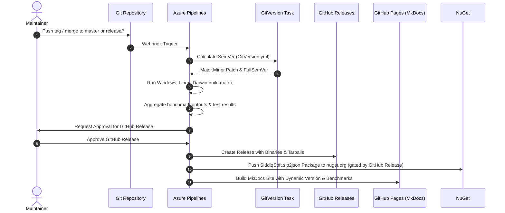

# Maintainer Guide

CI/CD architecture, CMake presets, and release workflows.

---

## Pipeline Architecture

Defined in [`azure-pipelines.yml`](https://github.com/SiddiqSoft/sip2json/blob/master/azure-pipelines.yml) on self-hosted agents (`Default` pool):



---

## Build Stages & Platform Matrix

The build matrix targets Windows, Linux, and macOS (Darwin) across `x64` and `arm64` architectures:

| Platform Stage | Target Architectures | Compilers | CMake Presets Prefix | CI Template | Artifacts Published |
| :--- | :--- | :--- | :--- | :--- | :--- |
| **Windows** | `x64`, `arm64` | MSVC (Visual Studio 2022) | `Windows-${arch}-${buildType}` | `.azure/az-build-windows.yml` | Binaries, CTest JUnit XML, Benchmarks |
| **Linux** | `x64`, `arm64` | Clang (17+), GCC (13+) | `Linux-${compiler}-${buildType}` | `.azure/az-build-unix.yml` | Binaries, CTest JUnit XML, Benchmarks, Coverage XML |
| **Darwin (macOS)** | `x64`, `arm64` | AppleClang (Xcode / CLT) | `Darwin-Clang-${buildType}` | `.azure/az-build-unix.yml` | Binaries, CTest JUnit XML, Benchmarks |

!!! note "Unified Unix Pipeline"
    The Linux and Darwin stages share the parameterized template `.azure/az-build-unix.yml`. It dynamically adapts agent OS demands, compiler flags, and preset names based on the target platform.

---

## CMake Presets Architecture

The repository employs a decoupled, highly reusable CMake Presets structure separated across two files:



### Architectural Separation of Concerns

1. **[`project-base.json`](https://github.com/SiddiqSoft/sip2json/blob/master/project-base.json)**:
   - Holds all **per-project settings** (e.g. `sip2json_BUILD_TESTS`, `sip2json_HEADERKEY_MODE_INSENSITIVE`, `CMAKE_CXX_STANDARD: 23`, `CI_BUILDID: 0.0.0`).
   - Project maintainers configure project-specific variables here without altering toolchain presets.

2. **[`CMakePresets.json`](https://github.com/SiddiqSoft/sip2json/blob/master/CMakePresets.json)**:
   - Contains **zero project-specific names or flags**.
   - Fully portable and reusable across any C++20/23 library or service repository.
   - Defines platform bases (`Apple-Base`, `Linux-Base`, `Windows-Base`) and standardized `Test-Base` execution rules.

---

## Available Presets Quick Reference

### Configure Presets

| Preset Name | Platform | Compiler | Build Type | Notes |
| :--- | :--- | :--- | :--- | :--- |
| `Apple-Debug` | macOS | AppleClang | Debug | Native Xcode / Command Line Tools |
| `Apple-Release` | macOS | AppleClang | Release | Native Xcode / Command Line Tools |
| `Darwin-Clang-Debug` | macOS | AppleClang | Debug | Inherits `Apple-Debug` |
| `Darwin-Clang-Release` | macOS | AppleClang | Release | Inherits `Apple-Release` |
| `Darwin` | macOS | AppleClang | Release | Default macOS alias (inherits `Apple-Release`) |
| `Linux-Clang-Debug` | Linux | Clang (`/usr/bin/clang++`) | Debug | Clang toolchain |
| `Linux-Clang-Release` | Linux | Clang (`/usr/bin/clang++`) | Release | Clang toolchain |
| `Linux-Clang` | Linux | Clang (`/usr/bin/clang++`) | Release | Clang release alias |
| `Linux-GCC-Debug` | Linux | GCC (`/usr/bin/g++`) | Debug | GCC toolchain |
| `Linux-GCC-Release` | Linux | GCC (`/usr/bin/g++`) | Release | GCC toolchain |
| `Linux-GCC` | Linux | GCC (`/usr/bin/g++`) | Release | GCC release alias |
| `Windows-x64-Debug` | Windows | MSVC (`cl.exe`) | Debug | x64 architecture, host=x64 |
| `Windows-x64-Release` | Windows | MSVC (`cl.exe`) | Release | x64 architecture, host=x64 |
| `Windows-x64` | Windows | MSVC (`cl.exe`) | Release | Windows x64 release alias |
| `Windows-arm64-Debug` | Windows | MSVC (`cl.exe`) | Debug | ARM64 cross/native compilation |
| `Windows-arm64-Release` | Windows | MSVC (`cl.exe`) | Release | ARM64 cross/native compilation |
| `Windows-arm64` | Windows | MSVC (`cl.exe`) | Release | Windows ARM64 release alias |

---

## Local Development & Maintainer Workflow

### 1. Configure, Build, and Test

Maintainers can build and execute the full test suite (320+ unit and compliance tests) with standard CMake commands:

```bash
# Configure with desired preset (e.g. Darwin-Clang-Release, Linux-GCC-Release, Windows-x64-Release)
cmake --preset <preset-name>

# Build all targets
cmake --build --preset <preset-name>

# Execute test suite (use -j 4 or higher for fast parallel execution)
ctest --preset <preset-name> -j 4
```

!!! tip "Test Execution Parallelism"
    Specifying `-j <num_workers>` (e.g. `-j 4`) with `ctest` runs tests efficiently across worker threads without hitting operating system process limits.

### 2. Standalone Validation Subproject Testing

To test `sip2json` against historical versions or external CPM consumers, use the subproject located in `tests/validation/`:

```bash
# Configure standalone validation client
cd tests/validation
cmake --preset Apple-Release

# Build and run client test suite
cmake --build --preset Apple-Release
ctest --preset Apple-Release -j 4
```

---

## Self-Hosted Build Agent Requirements

All build agents must be registered in the `Default` pool and expose the required `Agent.OS` demand:

### Darwin (macOS) Agents
* Demand: `Agent.OS -equals Darwin`
* OS: macOS Sonoma (14+) on Apple Silicon (`arm64`) or Intel (`x64`).
* Toolchain: Xcode 15+ / Command Line Tools (`AppleClang 15+`).
* Utilities: CMake 3.29+, Ninja 1.11+, Python 3.10+.
* *Note: No external Homebrew LLVM installation required.*

### Linux Agents
* Demand: `Agent.OS -equals Linux`
* OS: Ubuntu 22.04+ or Debian 12+ on `x64` or `arm64`.
* Toolchain: GCC 13+ (`/usr/bin/gcc`, `/usr/bin/g++`) or Clang 17+ (`/usr/bin/clang`, `/usr/bin/clang++`).
* Utilities: CMake 3.29+, Ninja, Python 3.10+, `gcovr` (for coverage).

### Windows Agents
* Demand: `Agent.OS -equals Windows_NT`
* OS: Windows 11 / Windows Server 2022 (`x64` or `arm64`).
* Toolchain: Visual Studio 2022 (MSVC v143+), Windows 11 SDK.
* Prerequisites: Execute [`scripts/prep_windows_machine.ps1`](https://github.com/SiddiqSoft/sip2json/blob/master/scripts/prep_windows_machine.ps1) as Administrator to configure `LongPathsEnabled = 1` and `git config --system core.longpaths true`.

---

## Release & Publication Lifecycle



### Dynamic Versioning & Documentation Hooks
1. **[`docs/hooks.py`](https://github.com/SiddiqSoft/sip2json/blob/master/docs/hooks.py)**: Dynamically injects GitVersion SemVer into site metadata (`config['extra']['version']`) and replaces `{{ version }}` / `{{ tag_version }}` placeholders across markdown files.
2. **[`scripts/publish_benchmarks.py`](https://github.com/SiddiqSoft/sip2json/blob/master/scripts/publish_benchmarks.py)**: Collects benchmark outputs across build matrix platforms, extracts CPU architecture and core count, and renders responsive platform-grouped benchmark tables and visual comparison charts into [`docs/architecture/benchmarks.md`](../architecture/benchmarks.md).
3. **NuGet Packaging & Publication**: NuGet packaging (`NuGetCommand@2 pack`) runs during the Windows Release job to package header files, `.natvis`, and `.targets`. Publication (`Stage 5: PublishNuGet`) is auto-enabled on `main`/`master` releases and strictly gated behind the manual review and successful completion of `Stage 4: PublishGitHub` before pushing to `nuget.org` via the `sqs-nuget` service connection.

---

## Building & Previewing Documentation Locally

Maintainers can preview and validate documentation changes locally before pushing:

### 1. Live-Reload Development Server

```bash
# Activate Python environment and install requirements
source venv/bin/activate
pip install -r docs/requirements.txt

# Start live-reloading server
mkdocs serve
```

* **Local URL**: Open [`http://127.0.0.1:8000/`](http://127.0.0.1:8000/) in your browser.
* **Live Reload**: Any edits saved in `docs/` files update automatically in real time.

### 2. Strict Build Validation

Verify there are zero broken links or markdown syntax issues:

```bash
mkdocs build --strict
```

The output compiles into `site/`. Open `site/index.html` directly in any browser.

### 3. Updating Benchmark Data Prior to Serving

```bash
python3 scripts/publish_benchmarks.py
mkdocs serve
```

---

## Pipeline Parameters Reference

When manually triggering a pipeline in Azure DevOps, maintainers can customize:

| Parameter | Type | Default | Allowed Values | Purpose |
| :--- | :--- | :--- | :--- | :--- |
| `Platforms` | `stringList` | `[ Windows, Linux, Darwin ]` | `Windows`, `Linux`, `Darwin` | Target OS platforms to build |
| `Architectures` | `stringList` | `[ arm64 ]` | `arm64`, `x64` | Target CPU architectures |
| `Compilers_Windows` | `stringList` | `[ MSVC ]` | `MSVC` | Windows compiler toolsets |
| `Compilers_Linux` | `stringList` | `[ Clang ]` | `Clang`, `GCC` | Linux compiler toolsets |
| `Compilers_Darwin` | `stringList` | `[ Clang ]` | `Clang` | macOS compiler toolsets (AppleClang) |
| `BuildTypes` | `stringList` | `[ Release ]` | `Release`, `Debug` | Build configurations |
| `RunTests` | `boolean` | `true` | `true`, `false` | Execute unit and compliance test suites |
| `RunBenchmarks` | `boolean` | `true` | `true`, `false` | Execute performance benchmark harnesses |
| `PublishNuGet` | `boolean` | `false` | `true`, `false` | Trigger NuGet Release (auto on `master`/`main`) |
| `PublishGitHub` | `boolean` | `false` | `true`, `false` | Trigger GitHub Release (auto on `master`/`main`) |
| `PublishDocs` | `boolean` | `false` | `true`, `false` | Publish documentation site (auto on `master`/`main`) |
| `Cleanup` | `boolean` | `false` | `true`, `false` | Run cache and workspace cleanup only |

