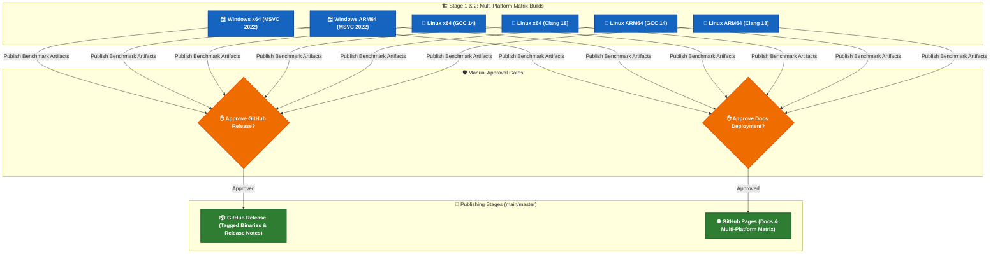

# Azure Pipelines CI/CD & Secrets Management

This guide covers the architecture, orchestration, self-hosted agent setup, and external secret management for the `sip2json` CI/CD pipeline on **Azure DevOps**.

---

## 1. CI/CD Architecture Overview

The `sip2json` continuous integration and deployment pipeline is orchestrated by [`azure-pipelines.yml`](https://github.com/SiddiqSoft/sip2json/blob/master/azure-pipelines.yml) across 5 modular stages:



---

## 2. Pipeline Stages Explained

| Stage | Trigger Condition | Tasks Performed | Template |
| :--- | :--- | :--- | :--- |
| **`Windows`** | PR or Branch Push | Build matrix (x64 / ARM64, MSVC), executes 321 CTests, runs stream benchmarks, publishes benchmark artifacts. | `.azure/az-build-windows.yml` |
| **`Linux`** | PR or Branch Push | Build matrix (x64 / ARM64, GCC / Clang), executes 321 CTests, runs stream benchmarks, publishes benchmark artifacts. | `.azure/az-build-linux.yml` |
| **`PublishGitHub`** | Main/Master branch (Manual Approval) | Creates GitHub release tag, attaches release notes and build artifacts. | `.azure/az-publish-github.yml` |
| **`PublishDocs`** | Main/Master branch (Manual Approval) | Downloads benchmark artifacts from all matrix jobs, runs `publish_benchmarks.py`, builds strict MkDocs, and deploys to `gh-pages` branch. | `.azure/az-publish-docs.yml` |

---

## 3. Self-Hosted Build Agent Requirements

The pipeline uses the self-hosted **`Default`** agent pool (`pool: name: Default`) and targets specific OS demands:

### Linux Agent Demands (`Agent.OS -equals Linux`)
- **OS**: Ubuntu 22.04 / 24.04 LTS (x64 and arm64).
- **Tools**: GCC 14+, Clang 18+, CMake 3.29+, Ninja 1.11+, Python 3.10+, Git 2.40+.
- **User Permissions**: Agent process must have read/write access to `$(Agent.HomeDirectory)/.cpmcache`.

### Windows Agent Demands (`Agent.OS -equals Windows_NT`)
- **OS**: Windows Server 2022 / Windows 11 (x64 and arm64).
- **Tools**: Visual Studio 2022 (MSVC v143 toolchain), Windows SDK, CMake, Ninja, Git with `core.longpaths = true`, Windows Registry `LongPathsEnabled = 1`.
- **Setup Script**: Run [`scripts/prep_windows_machine.ps1`](https://github.com/SiddiqSoft/sip2json/blob/master/scripts/prep_windows_machine.ps1) on the agent host prior to running builds.

---

## 4. Required Azure DevOps Secrets & Variables

To configure a new Azure DevOps organization or project pipeline for `sip2json`, maintainers must set up the following secrets and service connections:

### 1. Secret Variables & Variable Groups
In **Azure DevOps** $\rightarrow$ **Pipelines** $\rightarrow$ **Library** $\rightarrow$ create a Variable Group (e.g., `sip2json-secrets` or Pipeline Variables):

| Variable Name | Type | Description & Required Permissions |
| :--- | :---: | :--- |
| **`GITHUB_TOKEN`** | **Secret** (Locked 🔒) | GitHub Personal Access Token (PAT) used by `ghp-import` and release publishers. **Required Scopes**: `repo` (Full control of private/public repositories) and `workflow` (Update GitHub Action workflows). |
| **`GITHUB_USER`** | Plain Text | Email / Name for Azure Pipelines git commit actor (e.g. `azure-pipelines[bot]@siddiqsoft.com` or maintainer email). |
| **`System.AccessToken`** | System Secret | Automatically provided by Azure Pipelines; used for downloading build artifacts across jobs (`OAuthToken: $(System.AccessToken)`). |

### 2. GitHub Service Connection
In **Project Settings** $\rightarrow$ **Pipelines** $\rightarrow$ **Service connections** $\rightarrow$ **New service connection**:
1. Select **GitHub**.
2. Authentication method: **Personal Access Token (PAT)** or **Azure Pipelines GitHub App**.
3. Service connection name: `SiddiqSoft-GitHub` (or configure default GitHub connection).
4. Grant access permission to all pipelines.

---

## 5. Semantic Versioning & Branch Workflow (`GitVersion.yml`)

`sip2json` uses [GitVersion](https://gitversion.net/) for automated semantic versioning calculated directly from git history and branch names:

```yaml
mode: ContinuousDelivery
branches:
  master:
    regex: ^master$|^main$
    mode: ContinuousDelivery
    tag: ''
    increment: Patch
  release:
    regex: ^release?[/-]
    mode: ContinuousDelivery
    tag: beta
    increment: Minor
  feature:
    regex: ^feature?[/-]
    mode: ContinuousDelivery
    tag: alpha
    increment: Inherit
```

### Release Procedure for Maintainers:
1. Create a release branch: `git checkout -b release/2.6.0`
2. Push commits and open Pull Request to `master`.
3. Azure Pipelines builds the full Linux & Windows matrix and runs the 321-test suite.
4. Once PR is merged to `master`, Azure Pipelines triggers `PublishGitHub` and `PublishDocs`.
5. Maintainers approve the manual validation gates in the Azure DevOps portal to publish the official GitHub Release and update `gh-pages`.
