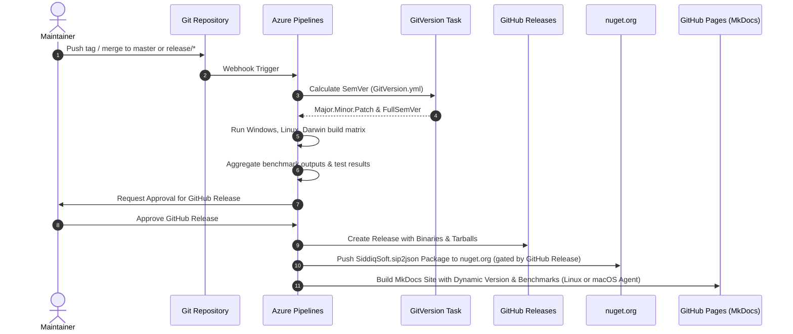

# Release & Publication Lifecycle

Version calculation, GitHub release automation, NuGet packaging, and documentation deployment.

---

## Release Workflow



---

## 1. Dynamic Versioning & Documentation Hooks

Version computation is managed dynamically using GitVersion and custom MkDocs hooks:

1. **[`docs/hooks.py`](https://github.com/SiddiqSoft/sip2json/blob/master/docs/hooks.py)**:
   Dynamically injects GitVersion SemVer into site metadata (`config['extra']['version']`) and replaces `{{ version }}` and `{{ tag_version }}` placeholders across all markdown files.

2. **[`scripts/publish_benchmarks.py`](https://github.com/SiddiqSoft/sip2json/blob/master/scripts/publish_benchmarks.py)**:
   Collects benchmark outputs across build matrix platforms, extracts CPU architecture and core count, and renders responsive platform-grouped benchmark tables and visual comparison charts into [`docs/architecture/benchmarks.md`](../architecture/benchmarks.md).

### GitVersion Configuration & Major Version Updates

Version calculation is driven by [`GitVersion.yml`](https://github.com/SiddiqSoft/sip2json/blob/master/GitVersion.yml) located at the repository root:

* **Automated Increments**: Minor and patch increments are computed dynamically by GitVersion based on branch types and commit message pragmas (`+semver: feature|minor`, `+semver: fix|patch`).
* **Manual Major Version Reflection**: For breaking changes or major milestone increments (e.g. transitioning from `3.x` to `4.0.0`), maintainers **must manually update the `next-version:` field in [`GitVersion.yml`](https://github.com/SiddiqSoft/sip2json/blob/master/GitVersion.yml)**:
  ```yaml
  next-version: 4.0.0
  ```
  This explicit declaration is required because GitVersion relies on the `ConfiguredNextVersion` strategy to establish the new major version baseline. Without updating `next-version:` in `GitVersion.yml`, GitVersion will continue incrementing against the previous major baseline across all CI/CD build stages, NuGet package generation, GitHub release creation, and MkDocs site publication.

---

## 2. NuGet Packaging & Publication

NuGet packaging (`NuGetCommand@2 pack`) runs during the Windows Release job:
* Packages header files, `.natvis` visualizers, and `.targets` integration files into `SiddiqSoft.sip2json.<version>.nupkg`.
* Publication (`Stage 5: PublishNuGet`) is auto-enabled on `main`/`master` releases and strictly gated behind the manual review and successful completion of `Stage 4: PublishGitHub` before pushing to `nuget.org` via the `sqs-nuget` service connection.

---

## 3. MkDocs Site Publication (`gh-pages`)

MkDocs documentation publication is strictly supported on **Linux and macOS (Darwin)** machines:
* **Stage `PublishDocs`** (via [`.azure/az-publish-docs.yml`](https://github.com/SiddiqSoft/sip2json/blob/master/.azure/az-publish-docs.yml)) runs exclusively on Linux or macOS runners. Windows build agents cannot run MkDocs and are strictly excluded via pool demands (`Agent.OS -equals Linux` or `Agent.OS -equals Darwin`) and pipeline stage conditions.
* The preflight verification script enforces Linux or macOS execution and fails with an error if invoked on Windows.
* If `mkdocs` is not installed on the runner, the documentation build step is safely skipped without failing the pipeline.
* In addition, the Unix matrix build pipeline ([`.azure/az-build-unix.yml`](https://github.com/SiddiqSoft/sip2json/blob/master/.azure/az-build-unix.yml)) validates the documentation site on Linux and Darwin whenever `mkdocs` is present, skipping gracefully if uninstalled.

---

## Related Topics

* [**CI/CD Pipelines**](pipelines.md): Pipeline execution stages and parameters
* [**Documentation Architecture**](documentation.md): Local documentation previews and custom tokens
* [**Maintainer Guide**](maintainer_guide.md): Core maintainer guide and checklist
