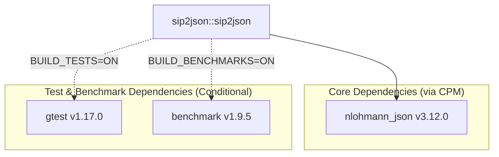

# Project Dependencies

This document is automatically generated from `CMakeLists.txt` files for `sip2json`.

## Dependency Diagram

## Dependency Breakdown

| Dependency | Repository / Target | Version | Type | Scope |
| :--- | :--- | :--- | :--- | :--- |
| **nlohmann_json** | [`nlohmann/json`](https://github.com/nlohmann/json) | v3.12.0 | `CPM` | All Platforms (`INTERFACE`) |
| **gtest** | [`google/googletest`](https://github.com/google/googletest) | v1.17.0 | `CPM` | Tests only (`sip2json_BUILD_TESTS=ON`) |
| **benchmark** | [`google/benchmark`](https://github.com/google/benchmark) | v1.9.5 | `CPM` | Benchmarks only (`sip2json_BUILD_BENCHMARKS=ON`) |
