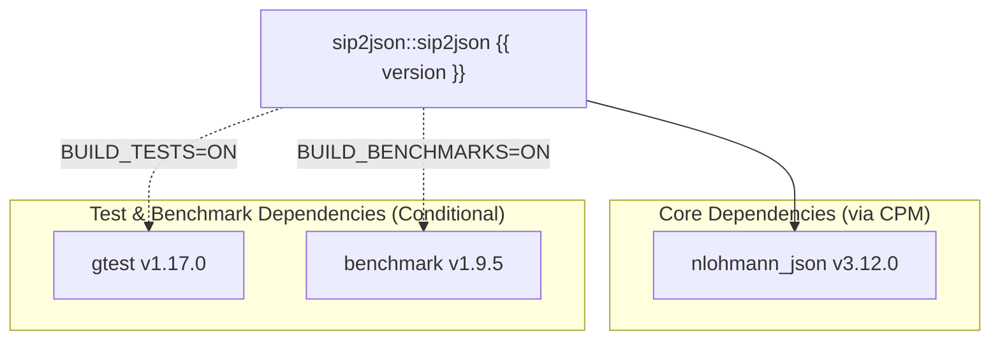

# Getting Started

`sip2json` { version } is a header-only C++20 library for parsing and serializing SIP messages into structured JSON.
Add it via CPM, CMake `FetchContent`, NuGet, or by copying the `include/` directory directly.

## System Requirements

| Category | Specification |
| :--- | :--- |
| **Language Standard** | C++20 minimum (`/std:c++20` or `/std:c++23` on MSVC; `-std=c++20` or `-std=c++23` on Clang/GCC) |
| **Windows** | Microsoft Visual Studio 2022+ (MSVC v143+), architectures: `x64`, `arm64` |
| **macOS (Darwin)** | AppleClang (Xcode CommandLineTools / LLVM Clang), architecture: `arm64` |
| **Linux** | GCC 13+ or Clang 17+, architectures: `x64`, `arm64` |
| **Build Tools** | CMake 3.31+ with CMake Presets (v8) and Ninja |
| **Target Type** | `INTERFACE` (Header-only) |

## Dependencies

<!-- deps:start -->
The following table is auto-generated from `CMakeLists.txt` at build time.



| Dependency | Repository / Target | Version | Type | Scope |
| :--- | :--- | :--- | :--- | :--- |
| **nlohmann_json** | [`nlohmann/json`](https://github.com/nlohmann/json) | v3.12.0 | `CPM` | All Platforms (`INTERFACE`) |
| **gtest** | [`google/googletest`](https://github.com/google/googletest) | v1.17.0 | `CPM` | Tests only (`sip2json_BUILD_TESTS=ON`) |
| **benchmark** | [`google/benchmark`](https://github.com/google/benchmark) | v1.9.5 | `CPM` | Benchmarks only (`sip2json_BUILD_BENCHMARKS=ON`) |

<!-- deps:end -->

## Installation & Integration

=== "CPM.cmake (Recommended)"

    Add `sip2json` to your `CMakeLists.txt` using [CPM.cmake](https://github.com/cpm-cmake/CPM.cmake):

    ```cmake
    include(cmake/CPM.cmake)

    CPMAddPackage("gh:SiddiqSoft/sip2json#{ tag_version }")
    target_link_libraries(my_target PRIVATE sip2json::sip2json)
    ```

    **Build options** (pass via `-D` or `cmake-presets`):

    | Option | Default | Description |
    | :--- | :--- | :--- |
    | `sip2json_BUILD_TESTS` | `OFF` | Build unit tests (requires GoogleTest). |
    | `sip2json_BUILD_BENCHMARKS` | `OFF` | Build benchmark suite. |

=== "CMake FetchContent"

    ```cmake
    include(FetchContent)

    FetchContent_Declare(
        sip2json
        GIT_REPOSITORY https://github.com/SiddiqSoft/sip2json.git
        GIT_TAG        { tag_version }
    )
    FetchContent_MakeAvailable(sip2json)
    target_link_libraries(my_target PRIVATE sip2json::sip2json)
    ```

    **Build options** (pass via `-D` or `cmake-presets`):

    | Option | Default | Description |
    | :--- | :--- | :--- |
    | `sip2json_BUILD_TESTS` | `OFF` | Build unit tests (requires GoogleTest). |
    | `sip2json_BUILD_BENCHMARKS` | `OFF` | Build benchmark suite. |

=== "NuGet"

    Package: [`SiddiqSoft.sip2json`](https://www.nuget.org/packages/SiddiqSoft.sip2json) (header-only, native C++20).

    **Package Manager Console**:
    ```powershell
    Install-Package SiddiqSoft.sip2json
    ```

    **MSBuild (.vcxproj)**:
    ```xml
    <ItemGroup>
      <PackageReference Include="SiddiqSoft.sip2json" Version="{ version }" />
    </ItemGroup>
    ```

    Set **C++ Language Standard** to **C++20 (`/std:c++20`)**.
    Dependency [`nlohmann.json`](https://www.nuget.org/packages/nlohmann.json) (v3.12+) is resolved automatically.
    Includes `siddiqsoft.sip2json.natvis` for Visual Studio debugger inspection.

=== "Header-Only Include"

    Include the `include/` directory directly:

    ```cmake
    target_include_directories(my_target PRIVATE path/to/sip2json/include)
    ```

    Ensure that [`nlohmann/json`](https://github.com/nlohmann/json) v3.12.0+ is also in your include path.

## Basic Usage

Include `<siddiqsoft/sip2json.hpp>`:

```cpp
#include <iostream>
#include <siddiqsoft/sip2json.hpp>

int main() {
    std::string_view sipData =
        "INVITE sip:alice@example.com SIP/2.0\r\n"
        "Via: SIP/2.0/UDP 192.0.2.1:5060;branch=z9hG4bK-1\r\n"
        "From: <sip:bob@example.com>;tag=12345\r\n"
        "To: <sip:alice@example.com>\r\n"
        "Call-ID: c3@example.com\r\n"
        "CSeq: 1 INVITE\r\n"
        "Content-Length: 0\r\n\r\n";

    // Parse first message from string view
    auto msg = siddiqsoft::sip2json::parseFromBuffer(sipData);

    std::cout << "Method:  " << msg.getMethodView() << "\n";
    std::cout << "URI:     " << msg.getUriView() << "\n";
    std::cout << "Call-ID: " << msg.getCallIDView() << "\n";

    return 0;
}
```

## Building and Running Tests Locally

The repository provides presets configured in `CMakePresets.json`:

=== "macOS (Darwin)"

    ```bash
    # Configure and build Release
    cmake --preset Darwin-Clang-Release
    cmake --build --preset Darwin-Clang-Release

    # Run unit tests
    ctest --preset Darwin-Clang-Release
    ```

=== "Linux"

    ```bash
    # GCC toolchain
    cmake --preset Linux-GCC-Release
    cmake --build --preset Linux-GCC-Release
    ctest --preset Linux-GCC-Release

    # Clang toolchain
    cmake --preset Linux-Clang-Release
    cmake --build --preset Linux-Clang-Release
    ctest --preset Linux-Clang-Release
    ```

=== "Windows"

    ```powershell
    # Visual Studio 2022 (MSVC x64)
    cmake --preset x64-Release
    cmake --build --preset x64-Release
    ctest --preset x64-Release
    ```

## Related Topics

<div class="grid" markdown="1">

<div class="card" markdown="1">

### [API Reference](../api/index.md)

Detailed documentation for `siddiqsoft::sip2json` and `siddiqsoft::sipmessage`.

[API Reference :octicons-arrow-right-24:](../api/index.md)

</div>

<div class="card" markdown="1">

### [Code Examples](../api/examples/index.md)

Ready-to-compile examples for stream parsing, message construction, and serialization.

[Code Examples :octicons-arrow-right-24:](../api/examples/index.md)

</div>

<div class="card" markdown="1">

### [Architecture](../architecture/index.md)

Design rationale, stream mechanics, and optimization notes.

[Architecture :octicons-arrow-right-24:](../architecture/index.md)

</div>

</div>
