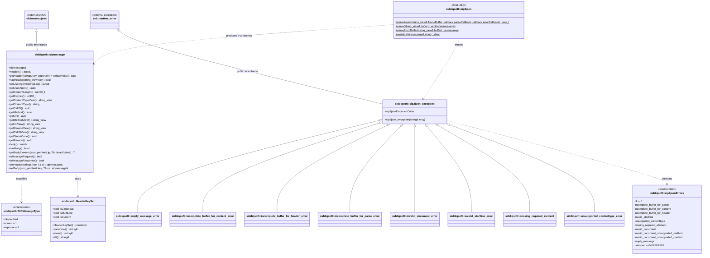

```mermaid
classDiagram
    direction TB

    classDef coreClass fill:rgba(35,73,109,0.08),stroke:#23496d,stroke-width:2px;
    classDef utilityClass fill:rgba(15,118,110,0.08),stroke:#0f766e,stroke-width:2px;
    classDef exceptionClass fill:rgba(185,28,28,0.06),stroke:#b91c1c,stroke-width:1.5px;
    classDef enumClass fill:rgba(109,40,217,0.06),stroke:#6d28d9,stroke-width:1.5px;
    classDef externalClass fill:rgba(100,116,139,0.06),stroke:#64748b,stroke-width:1.5px,stroke-dasharray: 4 3;
    classDef highlightClass fill:rgba(2,132,199,0.18),stroke:#0284c7,stroke-width:3px;

    class json["nlohmann::json"] {
        <<external DOM>>
    }
    class json:::externalClass

    class runtime_error["std::runtime_error"] {
        <<external exception>>
    }
    class runtime_error:::externalClass

    class sip2json["siddiqsoft::sip2json"] {
        <<final utility>>
        +parseAsync(string_view& frameBuffer, callback parseCallback, callback errorCallback)$ size_t
        +parse(string_view& buffer)$ vector~sipmessage~
        +parseFromBuffer(string_view& buffer)$ sipmessage
        +serialize(sipmessage& sipm)$ string
    }
    class sip2json:::utilityClass

    class sipmessage["siddiqsoft::sipmessage"] {
        +sipmessage()
        +headers() auto&
        +getHeader(string& key, optional~T~ defaultValue) auto
        +hasHeader(string_view key) bool
        +setUserAgent(string& ua) auto&
        +getUserAgent() auto
        +getContentLength() uint32_t
        +getExpires() uint32_t
        +getContentTypeView() string_view
        +getContentType() string
        +getCallID() auto
        +getMethod() auto
        +getUri() auto
        +getMethodView() string_view
        +getUriView() string_view
        +getReasonView() string_view
        +getCallIDView() string_view
        +getStatusCode() auto
        +getReason() auto
        +body() auto&
        +hasBody() bool
        +getBodyElement(json_pointer& jp, T& defaultValue) T
        +isMessageRequest() bool
        +isMessageResponse() bool
        +setHeader(string& key, T& v) sipmessage&
        +setBody(json_pointer& key, T& v) sipmessage&
    }
    class sipmessage:::coreClass

    class HeaderKeySet["siddiqsoft::HeaderKeySet"] {
        +bool isCanonical
        +bool isMultiLine
        +bool isCustom
        +HeaderKeySet() constexpr
        +canonical() string&
        +lower() string&
        +alt() string&
    }
    class HeaderKeySet:::coreClass

    class SIPMessageType["siddiqsoft::SIPMessageType"] {
        <<enumeration>>
        notspecified
        request = 1
        response = 2
    }
    class SIPMessageType:::enumClass

    class sip2jsonErrors["siddiqsoft::sip2jsonErrors"] {
        <<enumeration>>
        ok = 0
        incomplete_buffer_for_parse
        incomplete_buffer_for_content
        incomplete_buffer_for_header
        invalid_startline
        unsupported_contenttype
        missing_required_element
        invalid_document
        invalid_document_unsupported_method
        invalid_document_unsupported_content
        empty_message
        unknown = 0xFFFFFFFF
    }
    class sip2jsonErrors:::enumClass

    class sip2json_exception["siddiqsoft::sip2json_exception"] {
        +sip2jsonErrors errCode
        +sip2json_exception(string& msg)
    }
    class sip2json_exception:::exceptionClass

    class empty_message_error["siddiqsoft::empty_message_error"]
    class empty_message_error:::exceptionClass
    class incomplete_buffer_for_content_error["siddiqsoft::incomplete_buffer_for_content_error"]
    class incomplete_buffer_for_content_error:::exceptionClass
    class incomplete_buffer_for_header_error["siddiqsoft::incomplete_buffer_for_header_error"]
    class incomplete_buffer_for_header_error:::exceptionClass
    class incomplete_buffer_for_parse_error["siddiqsoft::incomplete_buffer_for_parse_error"]
    class incomplete_buffer_for_parse_error:::exceptionClass
    class invalid_document_error["siddiqsoft::invalid_document_error"]
    class invalid_document_error:::exceptionClass
    class invalid_startline_error["siddiqsoft::invalid_startline_error"]
    class invalid_startline_error:::exceptionClass
    class missing_required_element["siddiqsoft::missing_required_element"]
    class missing_required_element:::exceptionClass
    class unsupported_contenttype_error["siddiqsoft::unsupported_contenttype_error"]
    class unsupported_contenttype_error:::exceptionClass

    json <|-- sipmessage : public inheritance
    runtime_error <|-- sip2json_exception : public inheritance
    sip2json_exception <|-- empty_message_error
    sip2json_exception <|-- incomplete_buffer_for_content_error
    sip2json_exception <|-- incomplete_buffer_for_header_error
    sip2json_exception <|-- incomplete_buffer_for_parse_error
    sip2json_exception <|-- invalid_document_error
    sip2json_exception <|-- invalid_startline_error
    sip2json_exception <|-- missing_required_element
    sip2json_exception <|-- unsupported_contenttype_error

    sip2json ..> sipmessage : produces / consumes
    sip2json ..> sip2json_exception : throws
    sipmessage ..> SIPMessageType : classifies
    sipmessage ..> HeaderKeySet : uses
    sip2json_exception ..> sip2jsonErrors : contains

    link sip2json "https://github.com/SiddiqSoft/sip2json/blob/master/include/siddiqsoft/sip2json.hpp" "Source: include/siddiqsoft/sip2json.hpp"
    link sipmessage "https://github.com/SiddiqSoft/sip2json/blob/master/include/siddiqsoft/sipmessage.hpp" "Source: include/siddiqsoft/sipmessage.hpp"
    link HeaderKeySet "https://github.com/SiddiqSoft/sip2json/blob/master/include/siddiqsoft/private/sip2json_header_keys.hpp" "Source: include/siddiqsoft/private/sip2json_header_keys.hpp"
    link sip2json_exception "https://github.com/SiddiqSoft/sip2json/blob/master/include/siddiqsoft/private/sip2json_exception.hpp" "Source: include/siddiqsoft/private/sip2json_exception.hpp"
    link SIPMessageType "https://github.com/SiddiqSoft/sip2json/blob/master/include/siddiqsoft/sipmessage.hpp" "Source: include/siddiqsoft/sipmessage.hpp"
    link sip2jsonErrors "https://github.com/SiddiqSoft/sip2json/blob/master/include/siddiqsoft/private/sip2json_exception.hpp" "Source: include/siddiqsoft/private/sip2json_exception.hpp"
    link empty_message_error "https://github.com/SiddiqSoft/sip2json/blob/master/include/siddiqsoft/private/sip2json_exception.hpp" "Source: include/siddiqsoft/private/sip2json_exception.hpp"
    link incomplete_buffer_for_content_error "https://github.com/SiddiqSoft/sip2json/blob/master/include/siddiqsoft/private/sip2json_exception.hpp" "Source: include/siddiqsoft/private/sip2json_exception.hpp"
    link incomplete_buffer_for_header_error "https://github.com/SiddiqSoft/sip2json/blob/master/include/siddiqsoft/private/sip2json_exception.hpp" "Source: include/siddiqsoft/private/sip2json_exception.hpp"
    link incomplete_buffer_for_parse_error "https://github.com/SiddiqSoft/sip2json/blob/master/include/siddiqsoft/private/sip2json_exception.hpp" "Source: include/siddiqsoft/private/sip2json_exception.hpp"
    link invalid_document_error "https://github.com/SiddiqSoft/sip2json/blob/master/include/siddiqsoft/private/sip2json_exception.hpp" "Source: include/siddiqsoft/private/sip2json_exception.hpp"
    link invalid_startline_error "https://github.com/SiddiqSoft/sip2json/blob/master/include/siddiqsoft/private/sip2json_exception.hpp" "Source: include/siddiqsoft/private/sip2json_exception.hpp"
    link missing_required_element "https://github.com/SiddiqSoft/sip2json/blob/master/include/siddiqsoft/private/sip2json_exception.hpp" "Source: include/siddiqsoft/private/sip2json_exception.hpp"
    link unsupported_contenttype_error "https://github.com/SiddiqSoft/sip2json/blob/master/include/siddiqsoft/private/sip2json_exception.hpp" "Source: include/siddiqsoft/private/sip2json_exception.hpp"
    link json "https://github.com/nlohmann/json" "External: nlohmann/json"
    link runtime_error "https://en.cppreference.com/w/cpp/error/runtime_error" "Standard Library: std::runtime_error"
```
