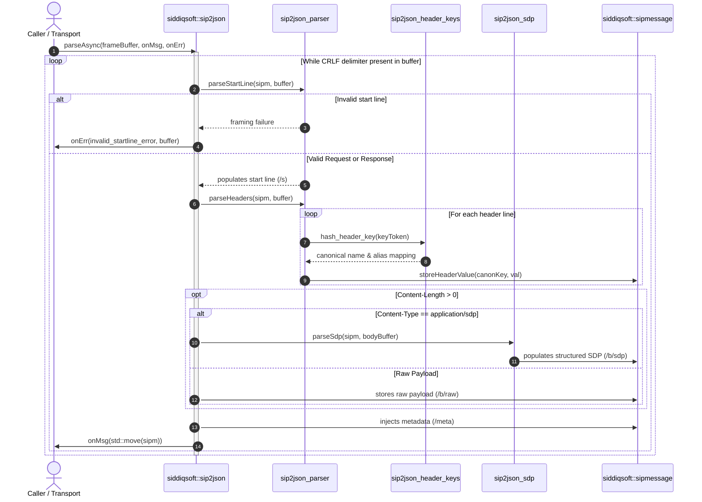

```mermaid
sequenceDiagram
    autonumber
    actor App as Caller / Transport
    participant S2J as siddiqsoft::sip2json
    participant Parser as sip2json_parser
    participant HKS as sip2json_header_keys
    participant SDP as sip2json_sdp
    participant Msg as siddiqsoft::sipmessage

    App->>S2J: parseAsync(frameBuffer, onMsg, onErr)
    activate S2J
    loop While CRLF delimiter present in buffer
        S2J->>Parser: parseStartLine(sipm, buffer)
        alt Invalid start line
            Parser-->>S2J: framing failure
            S2J->>App: onErr(invalid_startline_error, buffer)
        else Valid Request or Response
            Parser-->>S2J: populates start line (/s)
            S2J->>Parser: parseHeaders(sipm, buffer)
            loop For each header line
                Parser->>HKS: hash_header_key(keyToken)
                HKS-->>Parser: canonical name & alias mapping
                Parser->>Msg: storeHeaderValue(canonKey, val)
            end
            opt Content-Length > 0
                alt Content-Type == application/sdp
                    S2J->>SDP: parseSdp(sipm, bodyBuffer)
                    SDP->>Msg: populates structured SDP (/b/sdp)
                else Raw Payload
                    S2J->>Msg: stores raw payload (/b/raw)
                end
            end
            S2J->>Msg: injects metadata (/meta)
            S2J->>App: onMsg(std::move(sipm))
        end
    end
    deactivate S2J
```
