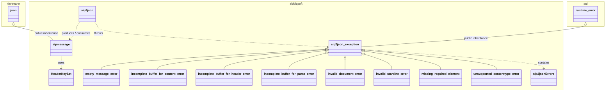

```mermaid
classDiagram
    direction TB

    classDef coreClass fill:rgba(35,73,109,0.08),stroke:#23496d,stroke-width:2px;
    classDef utilityClass fill:rgba(15,118,110,0.08),stroke:#0f766e,stroke-width:2px;
    classDef exceptionClass fill:rgba(185,28,28,0.06),stroke:#b91c1c,stroke-width:1.5px;
    classDef enumClass fill:rgba(109,40,217,0.06),stroke:#6d28d9,stroke-width:1.5px;
    classDef externalClass fill:rgba(100,116,139,0.06),stroke:#64748b,stroke-width:1.5px,stroke-dasharray: 4 3;

    namespace siddiqsoft {
        class sip2json
        class sipmessage
        class HeaderKeySet
        class sip2jsonErrors
        class sip2json_exception
        class empty_message_error
        class incomplete_buffer_for_content_error
        class incomplete_buffer_for_header_error
        class incomplete_buffer_for_parse_error
        class invalid_document_error
        class invalid_startline_error
        class missing_required_element
        class unsupported_contenttype_error
    }

    namespace nlohmann {
        class json
    }

    namespace std {
        class runtime_error
    }

    json <|-- sipmessage : public inheritance
    runtime_error <|-- sip2json_exception : public inheritance
    sip2json_exception <|-- empty_message_error
    sip2json_exception <|-- incomplete_buffer_for_content_error
    sip2json_exception <|-- incomplete_buffer_for_header_error
    sip2json_exception <|-- incomplete_buffer_for_parse_error
    sip2json_exception <|-- invalid_document_error
    sip2json_exception <|-- invalid_startline_error
    sip2json_exception <|-- missing_required_element
    sip2json_exception <|-- unsupported_contenttype_error

    sip2json ..> sipmessage : produces / consumes
    sip2json ..> sip2json_exception : throws
    sipmessage ..> HeaderKeySet : uses
    sip2json_exception ..> sip2jsonErrors : contains

    class sip2json:::utilityClass
    class sipmessage:::coreClass
    class HeaderKeySet:::coreClass
    class sip2jsonErrors:::enumClass
    class sip2json_exception:::exceptionClass
    class empty_message_error:::exceptionClass
    class incomplete_buffer_for_content_error:::exceptionClass
    class incomplete_buffer_for_header_error:::exceptionClass
    class incomplete_buffer_for_parse_error:::exceptionClass
    class invalid_document_error:::exceptionClass
    class invalid_startline_error:::exceptionClass
    class missing_required_element:::exceptionClass
    class unsupported_contenttype_error:::exceptionClass
    class json:::externalClass
    class runtime_error:::externalClass

    link sip2json "https://github.com/SiddiqSoft/sip2json/blob/master/include/siddiqsoft/sip2json.hpp" "Source: include/siddiqsoft/sip2json.hpp"
    link sipmessage "https://github.com/SiddiqSoft/sip2json/blob/master/include/siddiqsoft/sipmessage.hpp" "Source: include/siddiqsoft/sipmessage.hpp"
    link HeaderKeySet "https://github.com/SiddiqSoft/sip2json/blob/master/include/siddiqsoft/private/sip2json_header_keys.hpp" "Source: include/siddiqsoft/private/sip2json_header_keys.hpp"
    link sip2json_exception "https://github.com/SiddiqSoft/sip2json/blob/master/include/siddiqsoft/private/sip2json_exception.hpp" "Source: include/siddiqsoft/private/sip2json_exception.hpp"
    link sip2jsonErrors "https://github.com/SiddiqSoft/sip2json/blob/master/include/siddiqsoft/private/sip2json_exception.hpp" "Source: include/siddiqsoft/private/sip2json_exception.hpp"
    link empty_message_error "https://github.com/SiddiqSoft/sip2json/blob/master/include/siddiqsoft/private/sip2json_exception.hpp" "Source: include/siddiqsoft/private/sip2json_exception.hpp"
    link incomplete_buffer_for_content_error "https://github.com/SiddiqSoft/sip2json/blob/master/include/siddiqsoft/private/sip2json_exception.hpp" "Source: include/siddiqsoft/private/sip2json_exception.hpp"
    link incomplete_buffer_for_header_error "https://github.com/SiddiqSoft/sip2json/blob/master/include/siddiqsoft/private/sip2json_exception.hpp" "Source: include/siddiqsoft/private/sip2json_exception.hpp"
    link incomplete_buffer_for_parse_error "https://github.com/SiddiqSoft/sip2json/blob/master/include/siddiqsoft/private/sip2json_exception.hpp" "Source: include/siddiqsoft/private/sip2json_exception.hpp"
    link invalid_document_error "https://github.com/SiddiqSoft/sip2json/blob/master/include/siddiqsoft/private/sip2json_exception.hpp" "Source: include/siddiqsoft/private/sip2json_exception.hpp"
    link invalid_startline_error "https://github.com/SiddiqSoft/sip2json/blob/master/include/siddiqsoft/private/sip2json_exception.hpp" "Source: include/siddiqsoft/private/sip2json_exception.hpp"
    link missing_required_element "https://github.com/SiddiqSoft/sip2json/blob/master/include/siddiqsoft/private/sip2json_exception.hpp" "Source: include/siddiqsoft/private/sip2json_exception.hpp"
    link unsupported_contenttype_error "https://github.com/SiddiqSoft/sip2json/blob/master/include/siddiqsoft/private/sip2json_exception.hpp" "Source: include/siddiqsoft/private/sip2json_exception.hpp"
    link json "https://github.com/nlohmann/json" "External: nlohmann/json"
    link runtime_error "https://en.cppreference.com/w/cpp/error/runtime_error" "Standard Library: std::runtime_error"
```
